# Grid Path Challenge: problem setup and EDA

**Date:** 2026-10-04 · **Repo:** [sidnuti/grid-path-challenge](https://github.com/sidnuti/grid-path-challenge) @ `23dc8a5` (cloned to `explore_eda/grid-path-challenge/`) · **Scripts:** `explore_eda/eda/` · **Charts:** `explore_eda/figures/`

The clone is identical to our working copy `grid-path-challenge/` (`gpc/` and `data/` diff clean), so every earlier finding applies to it.

**Data provenance.** Everything in `data/` is the **baseline traversal's** trajectory on the dev scenario: days 0–27 are warm-up (3–30 Aug 2026), days 28–69 are its 6 weekly runs. That means the eval-period data shows what the baseline did. It does not show the market's untouched behaviour.

---

## 1. The problem in one paragraph

A fictional brand, **Aurel** (Bath & Body), buys sponsored-search ads on Blinkit for 5 SKUs in 5 cities. Every week a policy reads an `Observation` (everything observed so far, plus current campaigns and bids) and returns actions. The actions pass through **guardrails G0–G8**, are applied, and the hidden market simulates 7 days. **Objective:** maximise total SKU offtake (ad + organic units × selling price) over 6 runs. **Constraint:** portfolio direct ROAS over the 6 runs ≥ warm-up ROAS × 0.98 (≈ 4.54×). Missing the floor scores zero. Scoring is against the baseline in the same world, on dev **and a private eval scenario** with different true parameters and shocks moved in place and time.

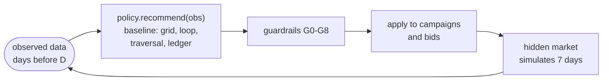

| Reference (dev) | Offtake ₹/day | vs no-op | Direct ROAS | Floor 4.54× |
|---|---:|---:|---:|---|
| No-op | 4,09,146 | — | 4.60× | met |
| Baseline traversal | 4,09,517 | +0.1% | 4.97× | met |
| Naive scaler | 4,22,505 | +3.3% | 3.99× | fails |

The brief judges three things equally: lift on the unseen scenario, understanding why the baseline falls short, and a cost analysis that holds up (including 100+ campaigns).

## 2. Entities and hierarchy

```
Category: Bath & Body (brand Aurel; competitors Velora, Nimbus)
└── Sub-category ── SKU ───────────────────── keywords it bids on (relevance)
    Soap        ── S1 Sandal Glow  ₹172 ASP ── K01 K02 (brand) · K03 K04 K07 (generic) · K09 velora (comp)
                ── S3 Aloe Fresh   ₹149     ── K01 K02 · K03 K04 · K09
    Body Wash   ── S2 Charcoal     ₹279     ── K01 · K05 K06 · K10 nimbus body wash
    Shower Gel  ── S4 Lime         ₹424     ── K01 · K05 K06 · K10
    Kids Soap   ── S5 Bubble Bar   ₹126     ── K01 · K03 K08 (no competitor keyword; 45 days old)
```

| Unit | Count | Notes |
|---|---:|---|
| SKUs × cities = campaigns | 5 × 5 = 25 | one Product Booster campaign per SKU × city |
| Keywords | 10 | 2 brand, 6 generic, 2 competitor |
| **Cells** (campaign × keyword) | **110** | each has its own CPM bid and a plan line (₹/day, goal dROAS, marginal floor, evidence tier) |
| Grid points | 110 × 4 slots × 4 dayparts = 1,760 | slots 1/5/9/13; night/morning/afternoon/evening |
| Markets (city × keyword) | 50, **40 contested** | up to 5 Aurel SKUs bid on the same query (K01 "aurel") |

**Plan by keyword type:** brand 35 cells, median goal 8.9×; generic 55 cells, goal 3.1×; competitor 20 cells, goal 1.6×. Evidence tiers: 40 high, 45 medium, 25 low.

## 3. Levers and guardrails (the action space)

| Lever | Scope | Range | Count of decisions |
|---|---|---|---:|
| `increase_cpm` / `reduce_cpm` | cell | ₹200–10,000; ±50% per move (G1, G2) | 110 |
| `pause_keyword` | cell | on/off | 110 |
| `increase_budget` / `reduce_budget` | campaign | +50% / −30%, min ₹300 (G6) | 25 |
| `set_dayparts` | campaign | any subset of 4 dayparts | 25 × 15 combinations |

| Guardrail | Blocks / clamps |
|---|---|
| G0 | schema: unknown ids, two actions on one lever, wrong direction |
| G1 / G2 | bid bounds / bid step |
| G3 | raise on a cell already ≥ 80% slot-1 share |
| G4 | any increase when 3-day OSA < 60% |
| G5 | budget raise unless the campaign ran out on ≥ 2 of 7 days |
| G6 | budget step |
| G7 | raise on a tier A/B MISSES cell; budget raise when spend-weighted ROAS < 90% of goal |
| G8 | portfolio: drop increases (worst marginal first) until projected 7-day dROAS ≥ floor |

**What the baseline uses:** 21–44 proposals per run, 17–37 shipped. Mostly `reduce_cpm`, a few `increase_cpm` and `increase_budget`. It **never** pauses a keyword, cuts a budget or changes dayparts in this trajectory. Of 176 proposals, 28 were blocked (27 by G3 top slot, 1 by G7).

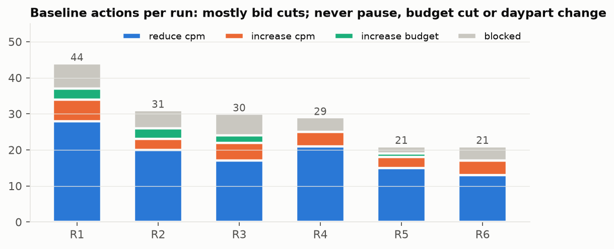

## 4. Where the money goes (warm-up, per day)

| Keyword type | Spend ₹ | Spend share | Ad revenue ₹ | Direct ROAS | CPM ₹ | Orders / impression |
|---|---:|---:|---:|---:|---:|---:|
| brand | 2,097 | 11% | 35,257 | **16.8×** | 204 | 1.65% |
| generic | 12,315 | 65% | 47,084 | 3.8× | 287 | 0.53% |
| competitor | 4,507 | 24% | 5,210 | **1.2×** | 406 | 0.21% |

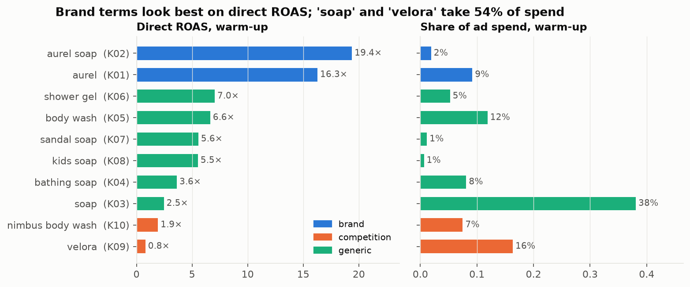

- **"soap" (K03) alone takes 38% of spend at 2.5×**, and "velora" (K09) 16% at 0.8×. Together they are 54% of spend.
- By sub-category (dROAS: brand / competitor / generic): Soap 15.3 / 0.8 / 3.2, Body Wash 18.3 / 1.5 / 5.8, Shower Gel 24.9 / 2.3 / 7.9, Kids Soap 7.6 / — / 1.7. Premium SKUs (S4 ₹424, S2 ₹279) convert spend best. Soap and kids soap are the weakest.

| SKU | Spend ₹/day | Direct ROAS | Offtake ₹/day | Ad share of units |
|---|---:|---:|---:|---:|
| S1 Sandal soap | 4,818 | 4.2× | 1,55,347 | 13% |
| S2 Body wash | 2,734 | 6.6× | 76,994 | 23% |
| S3 Aloe soap | 6,098 | 3.5× | 1,00,192 | 21% |
| S4 Shower gel | 2,657 | 8.5× | 64,736 | 35% |
| S5 Kids bar (new) | 2,612 | 2.1× | 10,665 | 51% |

| City | Spend ₹/day | Direct ROAS | Offtake ₹/day |
|---|---:|---:|---:|
| DEL | 5,671 | 4.9× | 1,32,040 |
| MUM | 5,299 | 4.1× | 98,798 |
| BLR | 4,040 | 4.5× | 88,412 |
| HYD | 2,329 | 5.0× | 52,235 |
| PUN | 1,580 | 5.4× | 36,447 |

## 5. Direct ROAS is not incrementality

Fixed-effects regression of organic units on ad orders by keyword type (SKU × city and day effects, all 70 days):

| Keyword type | Organic units lost per ad order | Implied share of ad orders that are incremental |
|---|---:|---:|
| brand | 0.90 | ~10% |
| generic | 0.49 | ~51% |
| competitor | 0.01 | ~99% |

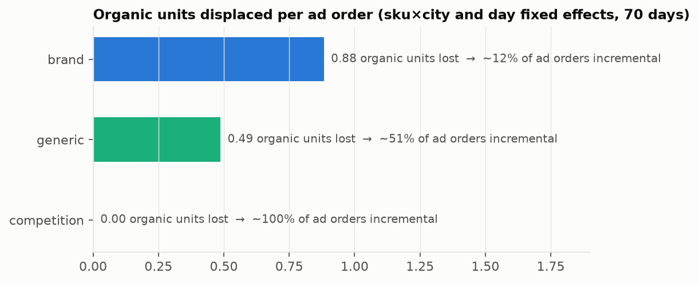

Per SKU, brand displacement ranges 0.65 (S2) to 1.08 (S1), and generic 0.30 (S2) to 0.71 (S3). S3 ranks organically 3rd–4th on soap queries, so its generic ads mostly displace organic sales.

**Why it matters:** the ROAS floor is measured on *direct* ROAS, which rewards brand terms (16.8×) that add ~10% real orders. Competitor terms look worst (1.2×) yet are nearly all incremental. A policy that optimises what it can see on direct ROAS moves money in the wrong direction for offtake. This is the gap the brief asks candidates to find ("the two can disagree").

## 6. Budget run-out

- Campaigns ran out of budget on **30% of warm-up campaign-days**; 13% in the eval period after the baseline's raises.
- **Six campaigns ran out on all 28 warm-up days**: C-S1-BLR, C-S5-DEL, C-S5-BLR, C-S2-MUM, C-S3-BLR, C-S1-DEL. Run-outs hit the evening (215) and afternoon (134), almost never the morning.
- Warm-up budget utilisation is 78% overall. Money sits idle in some campaigns while others are capped.
- Run-out is not local. When a campaign runs out, the market re-shares impressions to its sibling SKUs in later dayparts.

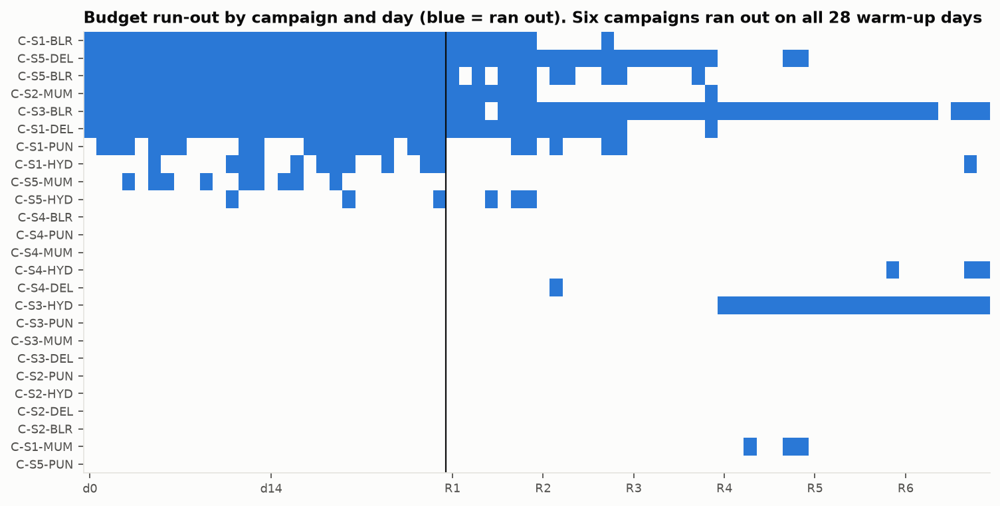

## 7. Slots and dayparts

| Slot | Impression share | CPM ₹ | Orders / impression | Direct ROAS |
|---|---:|---:|---:|---:|
| 1 | 72% | 287 | 0.70% | 5.0× |
| 5 | 19% | 320 | 0.62% | 4.2× |
| 9 | 5% | 296 | 0.43% | 3.1× |
| 13 | 3% | 306 | 0.27% | 2.0× |

| Daypart | Spend share | Direct ROAS |
|---|---:|---:|
| night | 13% | 4.2× |
| morning | 29% | 4.5× |
| afternoon | 33% | 4.7× |
| evening | 25% | 4.9× |

Most impressions already come from slot 1, which is why G3 (top slot) blocks raises. Dayparts differ only modestly (4.2–4.9×). Daypart switch-offs are a small lever here.

## 8. Trends and anomalies (what shocks look like in the data)

Slot-1-equivalent reach (impressions ÷ slot view ratio), indexed to the warm-up average:

| Cell | First moves | Peak change | Reading |
|---|---|---:|---|
| BLR · K07 sandal soap | run 1 | +48% | demand surge |
| BLR · K08 kids soap | run 2 | +65% | demand surge, growing |
| DEL · K07 sandal soap | run 3 | +64% | surge, later than BLR |
| DEL · K08 kids soap | run 3 | **+108%** | demand roughly doubles |
| MUM · K05 body wash | run 1 | +42%, then −31% | up then down; **confounded** with the baseline's own bid cuts |
| MUM · K06 shower gel | run 1 | +30%, then −41% | same |
| HYD · K05 body wash | — | CPM +11% while reach +33% | price vs demand ambiguous |

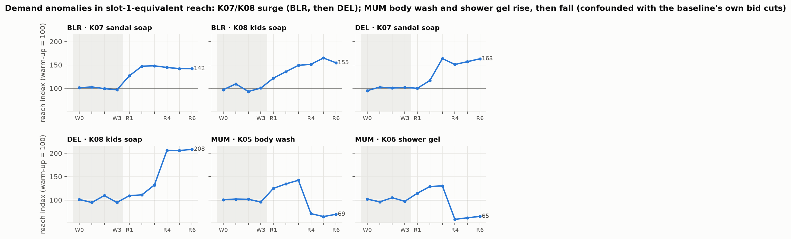

- **Availability shock:** S2 (charcoal body wash) in HYD drops to 0.42 on-shelf availability on days 42–48. G4 blocks increases below 60%.
- **Competitor CPMs** (K09, K10) drift *down* slightly (−3% to −4%) over the trajectory. No visible competitor bid-up in dev, although the scenario lists one among its hidden shocks.
- **Own-action confounding:** the biggest raw reach jump (BLR K03, z ≈ 160 against a near-constant warm-up) came after the baseline made 13 bid cuts there. A detector must exclude cells the policy itself changed.

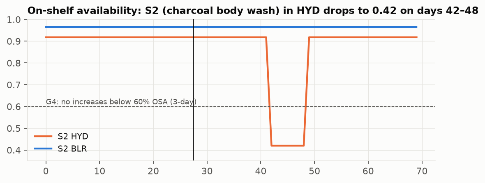

## 9. What the baseline actually does

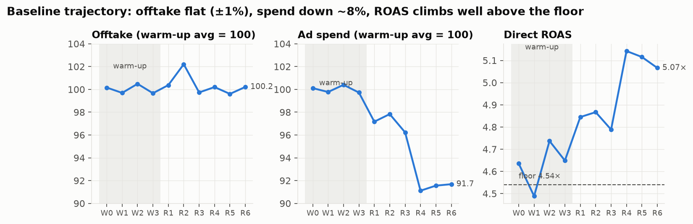

- Offtake stays within ±1% of warm-up. **Spend falls ~8%**, and direct ROAS climbs from 4.65× to 5.07×, well above the 4.54× floor.
- Verdicts in run 1: 66 CLEARS, 18 MISSES, 26 THIN. By run 6: 75 / 13 / 22. Cuts follow the patience ladder (3 / 5 / 7 miss-days → 10 / 25 / 50% of spend).
- The growth pool never opens in run 1 (`growth_pool_open: false`), so freed money is not redeployed to growth.
- Net: the baseline protects ROAS and leaves roughly 0.4–0.5 ROAS points of headroom unused. That headroom is the room to buy offtake.

## 10. Top vs bottom SKUs: which SKUs and SKU × city cells deserve the next rupee

Script: `eda/eda_tiers.py` (output in `eda/eda_tiers_output.txt`; tables in `eda/sku_tiers.csv`, `eda/sku_city_tiers.csv`, `eda/contested_markets.csv`).

**Incremental ROAS (iROAS) estimate.** Ad revenue counts only the share of ad orders that did not displace an organic sale. Displacement is estimated per SKU × keyword type, with the same fixed-effects regression as §5, then clipped to 0–1:

```
iROAS = Σ_type  ad_orders_type × (1 − displacement_sku,type) × ASP  ÷  spend
```

These are estimates from the baseline's own trajectory. They are good enough to rank SKUs, not to quote exact levels (S1's brand displacement comes out at 1.08 and is clipped to 1). A harness has to re-estimate them online from its own observation, since the eval scenario's true values differ.

### 10.1 By SKU: top by offtake is not top by where ads help

| SKU | Sub-category | ASP ₹ | Age (days) | Offtake share | Spend share | Spend ÷ offtake share | Ad share of units | Direct ROAS | **iROAS** | Generic organic rank | Run-out days | Keyword reach trend |
|---|---|---:|---:|---:|---:|---:|---:|---:|---:|---:|---:|---:|
| S1 Sandal soap | Soap | 172 | 900 | **38%** | 25% | 0.67 | 13% | 4.2× | 1.5× | 4.7 | 61% | **+21%** |
| S3 Aloe soap | Soap | 149 | 1,200 | 25% | **32%** | 1.31 | 21% | 3.5× | **1.0×** | 3.5 | 20% | −6% |
| S2 Body wash | Body Wash | 279 | 540 | 19% | 14% | 0.77 | 23% | 6.6× | **3.8×** | 6.5 | 20% | +1% |
| S4 Shower gel | Shower Gel | 424 | 300 | 16% | 14% | 0.88 | 35% | 8.5× | **3.3×** | 6.0 | 0% | −1% |
| S5 Kids bar | Kids Soap | 126 | 45 | 3% | 14% | **5.28** | 51% | 2.1× | 1.0× | 13.0 | 49% | −7% |

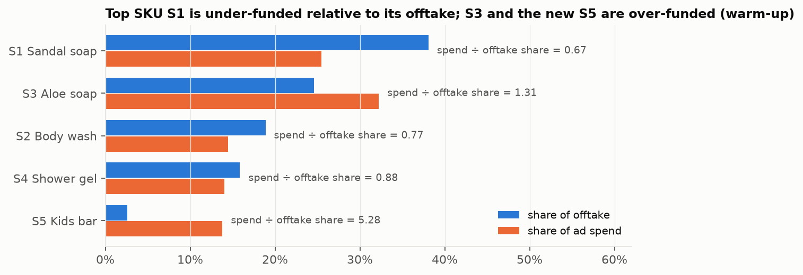

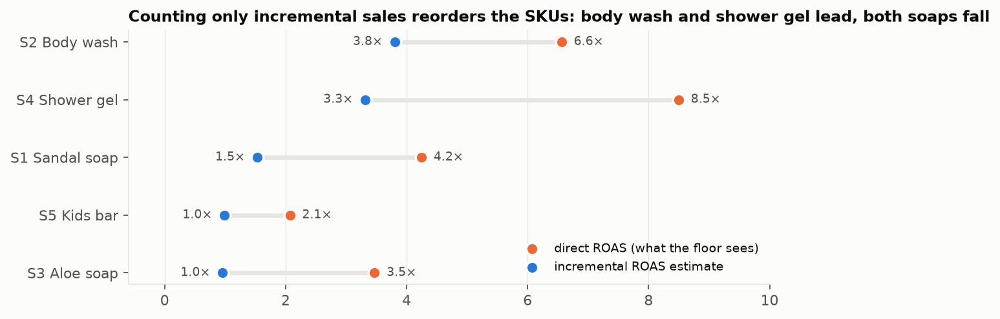

- **The top SKU is under-funded and capped.** S1 makes 38% of offtake on 25% of spend, runs out of budget on 61% of days, and its keywords' demand is rising (+21%, mostly the "sandal soap" surge it alone bids on).
- **The second soap is over-funded and barely incremental.** S3 takes the largest share of spend (32%) for 25% of offtake. Its generic ads mostly displace its own organic sales (displacement 0.71, organic rank 3–4), so iROAS ≈ 1.0×.
- **Mid-tier premium SKUs are where ads add most.** Body wash (S2) and shower gel (S4) have the highest iROAS (3.8×, 3.3×), weak organic ranks (6–6.5) and room to grow. By direct ROAS, S4 looks best; by incremental ROAS, S2 does.
- **The new SKU is a deliberate bet, not a performer yet.** S5 gets 14% of spend for 3% of offtake (ratio 5.3) at iROAS ≈ 1.0×. Half its units come from ads. Whether that is worth it is a launch-strategy judgment, not something a ROAS rule can decide.

| Sub-category × keyword type: iROAS | Brand | Competitor | Generic |
|---|---:|---:|---:|
| Soap | 1.1× | 0.7× | 1.5× |
| Body Wash | 6.4× | 1.4× | 4.1× |
| Shower Gel | 5.4× | 1.5× | 3.8× |
| Kids Soap | 1.6× | — | 0.9× |

Soap is the largest sub-category and the least incremental on every keyword type. Body wash and shower gel are incremental even on brand terms, because those SKUs rank weakly organically.

### 10.2 By SKU × city: concentration and roles

- **Concentration:** the top 5 of 25 SKU × city cells make 44% of offtake on 39% of spend. S1-DEL alone makes 12% of offtake on 5% of spend, and it is capped every day.
- **Capped cells split in two.** Of the 7 cells capped on ≥ 50% of days, three are efficient (S1-DEL, S1-BLR, S2-MUM: iROAS 1.6–3.3) and four are below the median (S3-BLR, S1-PUN, S5-DEL, S5-BLR: iROAS 0.8–1.6). Budget raises should go to the first group only. G5 and G7 do not tell them apart.
- **Bid headroom differs.** S3's DEL and BLR cells are already at slot 1 with no gain from higher bids (0 of 5 cells). S4-HYD and S1-DEL still gain from bidding up on 3–4 cells.

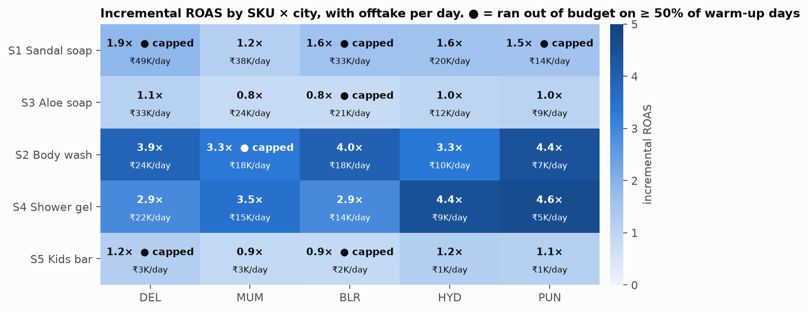

A simple rule (capped ≥ 50% of days; iROAS vs the median 1.58×; any bid headroom) sorts the 25 cells into four roles:

| Role | Rule | Cells | Offtake share | Spend share | Median iROAS | Examples |
|---|---|---:|---:|---:|---:|---|
| **fund budget** | capped, iROAS ≥ median | 3 | 25% | 13% | 1.9× | S1-DEL, S1-BLR, S2-MUM |
| **hold budget** | capped, iROAS < median | 4 | 10% | 13% | 1.0× | S3-BLR, S1-PUN, S5-DEL, S5-BLR |
| **scale bids / keywords** | not capped, iROAS ≥ median, bid headroom | 10 | 35% | 32% | 3.7× | S2 and S4 in every city except S2-MUM; S1-HYD |
| **trim / re-mix** | not capped, iROAS < median | 8 | 30% | **42%** | 1.1× | S3 in DEL/MUM/HYD/PUN, S1-MUM, S5-MUM/HYD/PUN |

The "trim / re-mix" group takes the most spend (42%) for the least incremental return. That includes S1-MUM, a top cell for offtake whose ads are mostly cannibalised. Trimming it means moving money elsewhere, not abandoning the SKU.

### 10.3 Sibling SKUs fighting over the same query

In **15 of 40 contested markets**, the SKU that spends most is not the one with the highest iROAS:

| Pattern | Markets | Spend leader → more incremental sibling |
|---|---|---|
| Soap generic queries ("soap", "bathing soap") | BLR K04, DEL K03, DEL K04, MUM K04, PUN K03 | S3 (iROAS 0.8–1.2) → S1 (1.5–2.2) |
| New SKU on "soap" | MUM K03 | S5 (0.8) → S1 (1.7) |
| Brand query "aurel" | DEL, HYD, PUN K01 | S3 / S1 (0–1.6) → S2 (6.3–7.7) |
| Body wash vs shower gel, and soap on "velora" | HYD/PUN K05, DEL/HYD/PUN K10, PUN K09 | mixed: near-ties on K05 (4.5 vs 5.1, 5.2 vs 5.3) and DEL K10 (1.3 vs 1.4); clear gaps on HYD/PUN K10 (S2 → S4, 1.4–1.8 vs 2.8–3.5) and PUN K09 (S1 → S3, 0.8 vs 1.4) |

Clear gaps are deterministic: lead with the more incremental SKU. Near-ties are where an LLM tiebreak with brand context is defensible.

### 10.4 Decision stance by SKU role and keyword type

This combines §5 (keyword-type incrementality) with the tiers above. It is the policy table a harness would hold per sub-category.

| SKU role (this data) | Brand | Generic | Competitor | Budget |
|---|---|---|---|---|
| **Hero, strong organic** (S1) | defend at minimum: lowest bid that keeps slot 1 | lead its own queries; take over from S3 on soap | hold; trim where iROAS < 1 | **raise where capped** (DEL, BLR) |
| **Second in sub-category, cannibalised** (S3) | hold back; let the hero lead | **trim**, yield soap queries to S1 | trim (0.8×) | do not raise BLR |
| **Premium mid-tier, weak organic** (S2, S4) | lead on "aurel" (S2 most incremental) | **scale** while marginal iROAS holds | conquest (1.4–1.5×) | raise S2-MUM; others uncapped |
| **Launch / tail** (S5) | low | own discovery query only ("kids soap", which is surging); leave "soap" | — | capped launch budget with an explicit review date |

**What is deterministic and what needs judgment.** Computing roles, iROAS, caps and leaders is deterministic L0 work. These need judgment (L1/L2):
- whether a launch SKU keeps its budget;
- when a role changes (a trend lifts a tail SKU, or a hero's organic rank slips);
- near-ties between siblings;
- explaining a stance to a brand manager.

## 11. Implications for the next design (L0 / L1 / L2 expressiveness and scale)

| Observation | Design implication |
|---|---|
| The decision grain is SKU × city × keyword type, and 40/50 markets are contested by sibling SKUs | Reason per **market** (city × keyword): pick a leader SKU, hold followers |
| Brand ≈ 10% incremental, generic ≈ 50%, competitor ≈ 99% | Keyword-type (brand / competitor / generic) **policy per sub-category**, scored on estimated incremental offtake, with direct ROAS only as the constraint |
| 6 campaigns permanently capped, 78% utilisation | Budget moves between campaigns (raise capped, trim idle) are the cleanest offtake lever |
| Surges are local (city × keyword) and lagged across cities (BLR → DEL) | Trend / anomaly tools with an own-action-confound flag; cross-city propagation is a real signal for an LLM to reason about |
| OSA dips are SKU × city, short | Hold increases in a dip; don't cut after it |
| The baseline never pauses, never cuts budgets, never uses dayparts | Under-used levers; each needs its own trigger and evidence check |
| Top SKU S1 is under-funded (38% of offtake, 25% of spend) and capped; S3 and S5 are over-funded | Allocate by **SKU role**, scored on iROAS, not by direct ROAS or by plan budget |
| Capped cells split into efficient (fund) and cannibalised (hold) | Budget raises gated on iROAS as well as run-out; G5/G7 alone do not separate them |
| In 15/40 contested markets the spend leader is not the most incremental sibling | Leader pick by iROAS; LLM only on near-ties |
| Sub-category decides incrementality (Soap ≈ 1×, Body Wash / Shower Gel ≈ 4×) | Keep the brand / competitor / generic stance table **per sub-category × SKU role** (§10.4) |
| Floor headroom ~0.4–0.5 ROAS points is unused | A spend allowance tied to banked headroom (our state-dependent minimum) |
| Eval scenario moves the shocks | Nothing can be keyed to dev's cells or weeks; LLM prompts must see only derived signals |

**Scale note for the next report:** today 110 cells and 25 campaigns. SKU roles compress the problem: at scale, roles and stances are computed deterministically per brand × sub-category, and the LLM reviews role changes and launches, not individual cells. At 100s of SKU × city combinations and 500+ brands, the natural unit for LLM calls is the **market × keyword type** (or sub-category) slice with an anomaly or a near-tie. Calls happen only where deterministic tools flag ambiguity. That keeps LLM calls proportional to *events*, not to cells.

## 12. What the next system did with this, and results so far (2026-10-04)

The findings above became **L2′**, an expressive LLM arm. The LLM reads a state brief built from these same quantities (roles, incremental ROAS, keyword-type stance, contested markets, anomalies) and proposes intents. A deterministic L0 compiler turns the intents into guardrail-safe actions. Full report: `system_design_proposals/03_l2prime_expressiveness_and_scale.md`. Updated system description: `presentations/harness-system-deep-dive.v2.md`.

| EDA finding | Used as | Did it pay off? (X8, 6 dev worlds, vs L0) |
|---|---|---|
| Incrementality differs by keyword type (§5) | ι and iROAS in the brief; keyword-type scopes | Oracle intents that choose cells by true incremental return: **+0.88% / +0.96%**, 6/6 worlds, floor 6/6 |
| SKU roles, top vs bottom (§10) | role table; fund / hold / scale / trim | the rules planner built on the stance table: +0.11% / +0.21%, not significant |
| Wrong sibling leads 15/40 markets (§10.3) | lead_market / yield_market | works only when the leader can take slot 1. Without that guard, the first rules run projected −₹34.7K/day of ad revenue |
| Run-out and misallocated budgets (§6) | raise_budget / cut_budget | oracle intents funded 15–17 capped budgets per world |
| Anomalies and own-action confounds (§8) | anomaly section with the confound flag | not separately measured; demand-shock recall in L0's detector is low (0.12) |
| Unused headroom (§9) | allowance + slack freed by intent cuts | the oracle's floor margin stayed 0.44–0.60, so room remains |
| Random choices through the same compiler | — | **−0.62% / −0.86%**, floor still 6/6: the compiler keeps actions safe, the choices carry the value |

The real-LLM runs (qwen3.7-flash, 3 replicates) are reported in the L2′ report §4.3.
