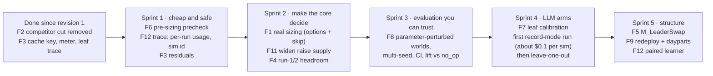

# Runtime feedback: what the runs say, and what to fix next

> **Revision 2 (2026-10-03).** Re-measured after the correctness pass that followed revision 1.
> Five bugs from that revision were fixed, and M5 (trace + System 2 hooks) and M6 (docs) were
> completed. Every number below is from a fresh run of the fixed code. Revision 1 and its raw
> results are kept in `results/pre_fix_2026-10-02/`.

**Scope.** Findings from instrumented runs of the System 1 harness (`grid-path-challenge/harness/`)
and its offline evaluation (`harness_eval/`), turned into a prioritised list of changes. Everything
here comes from running the code: no LLM was called, so every run was cost-free. Milestones M0–M6
are all recorded as done. The suite is 116 fast tests (re-run for this revision, all passing) plus
8 slow tests (reported passing in the build log).

**Companion documents:**
- [../presentations/harness-system-deep-dive.md](../presentations/harness-system-deep-dive.md): how the system works.
- [../presentations/harness-vs-procllm-paper.md](../presentations/harness-vs-procllm-paper.md): comparison with the paper.
- [../presentations/harness-vs-procllm-critique.md](../presentations/harness-vs-procllm-critique.md): review of the M1 claims.

**Reproduce:** `bash runtime_feedback_improvement/scripts/run_all.sh` from the repo root takes about 35 min and costs $0.

---

## 1. Summary

**What changed since revision 1:**

| Revision 1 finding | Status now | Verified how |
|---|---|---|
| F2 `M_CompetitorCut` rationale inverted | **Fixed.** The method was removed; competitor MISSES cells take the same ladder-paced cut as everything else | Code read; `comp_cuts = 0` in every run; S2 is now a regression guard |
| F3 replay cache key ignored the model | **Fixed** (model is in the key) | Code read; new tests |
| F3 leaf results discarded | **Fixed.** Each leaf's meta, usage and raw response go into `trace["leaf_calls"]`; usage is kept even when validation fails | Code read |
| F3 per-run budget never reset | **Fixed.** `Meter.run_usage` resets at the start of each `recommend()` | Code read; new tests |
| F3 replayed calls reported $0 | **Fixed.** Cache hits credit the meter | Code read; new tests |
| F1, F4–F9 | **Still open** | Re-measured below |

**The fix helped.** Removing the competitor cut raised the harness's lift in **every one of the 12
worlds**. That is consistent with the cut having destroyed value, as revision 1 argued.

| Lift of the L0 harness (`tools_only`), 6 independent seeds | Before the fixes | **After the fixes** |
|---|---|---|
| vs. baseline, mean (95% bootstrap CI) | +0.77% (+0.55 … +0.96) | **+0.82% (+0.61 … +0.99)** |
| vs. no-op, mean (95% CI) | +0.60% (+0.46 … +0.74) | **+0.66% (+0.53 … +0.79)** |
| held-out seeds 101 / 202, vs. baseline | +0.88% / +1.08% | **+0.94% / +1.12%** |
| ≈ ₹/day of offtake vs. baseline / vs. no-op | 3.2K / 2.5K | **3.4K / 2.7K** |

The floor was met in all 12 worlds, with zero guardrail blocks and zero fallbacks.

**What still doesn't work as designed:**

| # | Finding | Severity | Evidence (post-fix) |
|---|---|---|---|
| F1 | **Sizing doesn't size.** The allowance is an on/off gate | P0 | Raises shipped at **17–33×** the allowance in the first run with headroom, on all 4 search seeds |
| F11 | **New: late runs can't spend the headroom they've banked.** Raise candidates, not the allowance, are the binding constraint | P0 | Final run: allowance ₹3.4K–11.4K/day; candidates worth ₹0.1K–1.2K/day |
| F4 | Runs 1–2 can never raise, by construction | P1 | Allowance 0 in run 1 on all seeds, and in run 2 on seed 7 |
| F5 | Half the portfolio is frozen by the sibling hold rule; wrong leaders are never fixed | P1 | 56–60 of 110 cells held; 10–24 wrong-leader markets per run |
| F6 | Raises proposed on cells already at slot 1, then dropped after sizing | P1 | 1–5 G3 drops per run |
| F7 | LLM leaves mis-calibrated before their first real run | P1 | L6: 0 calls; L1 blank context; L2 mostly suppressed; L4 call count unbounded |
| F12 | **New: M5 trace and System 2 stubs have gaps** that will mislead the first learner | P1 | Code read (§4) |
| F8 | Evaluation is narrower than it looks | P1 | P1–P6 land within ±0.06 pp of seed 7 |
| F3 | Residual instrumentation gaps | P2 | Code read (§4) |
| F9 | Levers left on the table: dayparts, pauses, redeploy of freed spend | P2 | Code read |
| F10 | Hygiene | P2 | — |

**If you do only three things next:**
- **F1 + F11 together:** give sizing real choices (several bid levels + a skip option), which also creates more raise supply for late runs.
- **F6:** filter slot-1 cells before sizing (an hour's work).
- **F7:** calibrate the leaves, then make the first paid `record` run. The instrumentation is now good enough to trust.

---

## 2. What was run

| Run | Script (`scripts/`) | Worlds | Output (`results/`) |
|---|---|---|---|
| Sizing + sibling probe: allowance vs. selected Δspend, hold-set size, wrong-leader markets, precheck drops | `sizing_siblings_probe.py` | seeds 7, 11, 23, 42 (dev) | `rerun_sizing_siblings_seed_*.txt` |
| Decision funnel per run | `decision_funnel.py` | seed 7 | `rerun_decision_funnel_seed_7.txt` |
| LLM leaf traffic at L2: counting mock LLM, permissive answers, explore on (3 cells, ₹500/day) | `leaf_traffic_profile.py` | seeds 7, 42 | `rerun_leaf_traffic_seed_*.txt` |
| Evaluation matrix, cost-free arms (`no_op`, `baseline`, `tools_only`) | `harness_eval.run_matrix` | 12 worlds: search 7/11/23/42, held-out 101/202, perturbed P1–P6 | `matrix_full/` |
| Evidence probes E1–E10 from `data/` | `harness_eval.probes` | the baseline's shipped trajectory | `rerun_probes.json` (unchanged from revision 1; it reads only `data/`) |
| Test suite | `pytest -q tests -m "not slow"` | — | 116 passed, 8 slow deselected |
| Revision 1 outputs (pre-fix) | — | — | `pre_fix_2026-10-02/` |

---

## 3. Outcome: how much better than the baseline?

**Setup:** `harness_eval.run_matrix` with `LLM_MODE=off`: 12 worlds × 3 arms = 36 full
simulations under common random numbers. Raw rows: `results/matrix_full/matrix.csv`.

| World | Baseline ₹/day | No-op ₹/day | **Tools-only ₹/day** | Lift vs. baseline (pre-fix) | Lift vs. no-op | Baseline vs. no-op | Tools-only ROAS / floor (margin) | Actions shipped = proposed |
|---|---|---|---|---|---|---|---|---|
| search_7 | 409,517 | 409,146 | **410,972** | **+0.36%** (+0.33) | +0.45% | +0.09% | 4.79 / 4.54 (+5.7%) | 64 |
| search_11 | 414,098 | 414,881 | **416,994** | **+0.70%** (+0.56) | +0.51% | −0.19% | 4.61 / 4.01 (+15.0%) | 103 |
| search_23 | 409,934 | 410,440 | **413,572** | **+0.89%** (+0.82) | +0.76% | −0.12% | 4.46 / 4.09 (+9.0%) | 99 |
| search_42 | 408,565 | 410,228 | **412,448** | **+0.95%** (+0.93) | +0.54% | −0.41% | 5.17 / 4.72 (+9.4%) | 74 |
| heldout_101 | 407,198 | 407,316 | **411,009** | **+0.94%** (+0.88) | +0.91% | −0.03% | 4.72 / 4.50 (+5.0%) | 82 |
| heldout_202 | 417,976 | 419,367 | **422,640** | **+1.12%** (+1.08) | +0.78% | −0.33% | 5.17 / 4.83 (+7.0%) | 68 |
| P1 OSA moved | 409,984 | 409,498 | **411,364** | **+0.34%** (+0.31) | +0.46% | +0.12% | 4.79 / 4.54 (+5.7%) | 64 |
| P2 bigger price shock | 409,968 | 409,527 ✗ | **411,498** | **+0.37%** (+0.34) | +0.48% | +0.11% | 4.65 / 4.54 (**+2.6%**) | 64 |
| P3 demand moved, earlier | 409,313 | 408,957 | **410,617** | **+0.32%** (+0.30) | +0.41% | +0.09% | 4.82 / 4.54 (+6.4%) | 66 |
| P4 all shocks earlier | 409,507 | 409,169 | **411,206** | **+0.42%** (+0.39) | +0.50% | +0.08% | 4.73 / 4.54 (+4.4%) | 67 |
| P5 severe OSA dip | 407,691 | 407,379 | **409,152** | **+0.36%** (+0.34) | +0.44% | +0.08% | 4.79 / 4.54 (+5.5%) | 64 |
| P6 brand demand shock | 409,380 | 409,109 | **410,705** | **+0.32%** (+0.30) | +0.39% | +0.07% | 4.98 / 4.54 (+9.7%) | 65 |

✗ = the no-op arm **failed the ROAS floor** (4.494 < 4.535). Every other arm met the floor in every world.

**Across the 6 independent seed worlds** (P1–P6 all use seed 7, so they aren't independent samples):

| Comparison | Mean | SD | Range | 95% bootstrap CI | ≈ ₹/day |
|---|---|---|---|---|---|
| Tools-only vs. baseline | **+0.82%** | 0.27 | +0.36 … +1.12 | **+0.61 … +0.99%** | ~₹3.4K/day |
| Tools-only vs. no-op | **+0.66%** | 0.18 | +0.45 … +0.91 | +0.53 … +0.79% | ~₹2.7K/day |
| Baseline vs. no-op | **−0.17%** | 0.19 | −0.41 … +0.09 | −0.30 … −0.03% | the baseline loses value on 5 of 6 seeds |

**What this says:**
1. **The L0 harness reliably beats the baseline: 12 of 12 worlds, CI clear of zero**, including both held-out seeds. It ships 100% of what it proposes.
2. **The competitor-cut removal was a real improvement**, not just a cleaner rationale: lift rose in all 12 worlds, by +0.02 to +0.14 pp.
3. **About a fifth of the "lift vs. baseline" is avoiding the baseline's own harm.** Report lift vs. no-op (+0.66%) alongside it.
4. **The perturbed worlds barely perturb.** P1–P6 sit within ±0.06 pp of search_7 with near-identical action counts (64–67). **P2 is the exception worth keeping:** its ROAS margin is the thinnest anywhere, **+2.6%** (down from +3.4% pre-fix), and no-op fails the floor there.
5. **ROAS margins got slightly thinner after the fix** (e.g. search_11 +20.1% → +15.0%, P2 +3.4% → +2.6%), because the harness no longer cuts competitor spend fast. The floor is still safe, but with sizing acting as a gate (F1) nothing actively protects it except portfolio slack and G8.
6. **Absolute size is small:** ₹2.7–3.4K/day on a ~₹410K/day base. Paired designs and CIs are needed to detect the effect of any further change (F8).

**Caveats:**
- These are seeds of the **dev** scenario. The real eval scenario has different true parameters *and* shocks, which none of these worlds vary.
- No LLM arm has been run inside a simulation.

---

## 4. Findings, with the fix for each

### F1 · Sizing is an on/off gate, not a budget (P0, open)

**Observed (post-fix):**

| seed | first run with allowance > 0 | allowance ₹/day | raises selected, Δspend ₹/day | ratio |
|---|---|---|---|---|
| 7 | run 3 | 141 | 4,218 (19 of 19) | 30× |
| 11 | run 2 | 158 | 2,663 (12 of 12) | 17× |
| 23 | run 2 | 124 | 4,112 (19 of 19) | 33× |
| 42 | run 2 | 125 | 3,702 (17 of 17) | 30× |

- Every `(campaign, keyword, action_type)` group has **exactly one** option, so the multiplier μ never changes the pick.
- G8 trimmed nothing on any world.

**Why it matters:** the headroom ledger is the harness's answer to the cumulative-floor coupling. Today it only gates. With margins now thinner (§3 point 5), a tighter scenario would hand floor protection entirely to G8, which trims by worst marginal ROAS and ignores ι.

**Fix** (`harness/tools/sizing.py`, `harness/htn/methods.py`):
1. Emit **several bid levels per cell** from `diag.options`, plus a **Δ = 0 "skip" row per group**.
2. Or, as a first step, a **ratio-greedy fill** by `ι·Δrev / Δspend` up to the allowance.
3. Give budget raises options too (×1.1, ×1.25, ×1.5) instead of a fixed ×1.5.

**Tests:** `Σ selected Δspend ≤ allowance` whenever feasible; a larger allowance never selects less; seed 7 run 3 fits ₹141.

**Effort:** S–M. **Expected effect:** fewer, better-chosen raises early. Lift may fall at first if the slack was being used productively; measure it against §3.

### F11 · New: banked headroom goes unspent in late runs (P0, open)

**Observed** (final run, where allowance = the whole remaining headroom):

| seed | run-6 allowance ₹/day | raise candidates available, Δspend ₹/day | share of allowance used |
|---|---|---|---|
| 7 | 3,365 | 536 | 16% |
| 11 | 11,444 | 410 | 4% |
| 23 | 6,399 | 1,204 | 19% |
| 42 | 6,825 | 104 | 2% |

- Raise candidates shrink run by run (seed 42: 17 → 8 → 3 → 3 → 3), while headroom grows.
- By runs 4–6 the allowance never binds: there is nothing left to buy.

**Why it matters:** the objective is offtake subject to the floor. Finishing the window with ROAS 5–15% above the floor means offtake was left on the table. The front-loaded schedule and the "spend it all in run 6" rule can't help if there are no candidates.

**Why supply dries up:**
- M_Reprice only proposes the engine's single chosen bid, which requires marginal dROAS ≥ the plan's marginal floor per cell.
- 56–60 cells are held by the sibling rule (F5), and ~26 are THIN.
- 1–5 candidates per run sit on cells already at slot 1 (F6).
- Budget raises need ≥ 2 run-out days.

**Fix:**
- When the allowance exceeds the candidate pool, **relax the per-cell marginal floor** toward the portfolio floor for the best-ι cells: the constraint that matters is the portfolio's, not each cell's.
- Unhold followers that have a profitable *lower* slot (F5).
- Let exploration draw on surplus allowance (F7).

**Test:** in a run where headroom > Σ candidates, the candidate pool grows until either the allowance or the portfolio-floor projection binds.

**Effort:** M. This is probably the largest remaining lever on lift.

### F2 · `M_CompetitorCut` (fixed)

The method was removed, and lift rose in all 12 worlds. One follow-up worth considering, not a bug:
cuts are now ladder-paced regardless of ι. The mirror-image opportunity is to cut **low-ι** cells
faster (brand keywords, ι ≈ 0.12, where a cut really is nearly free). Trigger on
`ι × droas_shrunk` vs. goal, and test it in the matrix before keeping it.

### F3 · Instrumentation (mostly fixed; residuals, P2)

| Residual | Where | Fix |
|---|---|---|
| Cache key has the model but **not the provider**; and when `LLM_MODEL` is unset the key holds `""` while the provider silently uses `DEFAULT_MODEL` | `llm/__init__.py` builds `Meter(…, model or "")`; `replay.py` reads `inner.model` | Resolve the effective model once and pass it to both; add the provider to the key |
| A leaf call that **raises** records no usage, though a failed repair-retry still spent tokens | `providers.py` raises `ValueError` after two attempts; `leaf()`'s except branch has no usage | Attach usage to the exception, or return it alongside |
| No price row for `glm-*`; `LLM_MODEL_L1…L6` overrides unimplemented | `llm/meter.py`, `llm/__init__.py` | Add the row (queued as a background task); read per-leaf models |
| The fixes are tested with mocks only | — | The first real `record` → `replay` cycle should assert replayed cost == recorded cost |

### F4 · Runs 1–2 can never raise (P1, open)

**Observed** (seed 7): run 1 allowance is 0 by construction; run 2 is 0 because dROAS-to-date
(4.616) is under floor × 1.02 (4.626). 31 raise candidates (Σ ₹6.3K/day) were discarded across the
two runs. On seeds 11/23/42 only run 1 is affected.

**Fix options:**
- **(a)** Seed run 1's headroom from the warm-up surplus (the floor is warm-up × 0.98).
- **(b)** Replace the hard 2% margin with a probabilistic one: P(cumulative dROAS ≥ floor) ≥ 0.95.
- **(c)** Count cuts' freed spend as allowance within the same run (F9).

**Effort:** S.

### F5 · Siblings: half the cells are held, wrong leaders are never fixed (P1, open)

**Observed:**
- **56–60 of 110 cells** are held every run.
- **10–24 of 40** contested markets per run have a slot-1 holder that isn't the top `leader_score`.
- The score-leader gets raised in up to 5–8 of them in a run, but by a grid-sized step that ignores the incumbent's bid.
- No method makes the incumbent yield; `contested_markets()` is not on the policy path.

**Fix:** add `M_LeaderSwap` on wrong-leader markets with a material score gap: cut the incumbent to just below the challenger's target, and raise the challenger above the incumbent's live bid. Let held followers still be repriced *down* to a profitable lower slot.

**Effort:** M.

### F6 · Raises proposed on cells already at slot 1 (P1, open)

**Observed:** 1–5 precheck drops per run once raises are allowed (all G3 on seed 7, where reasons were logged), after sizing has counted them.

**Fix:** filter G3/G4/G7-blocked cells inside `m_reprice_raises`, or run `filter_precheck` before `select_raises`. Keep the post-sizing precheck as a second line.

**Effort:** XS.

### F7 · LLM leaves are mis-calibrated before their first real run (P1, open)

**Observed** (`depth=L2`, mock LLM, explore on, post-fix):

| | L1 Value | L2 Shock | L3 Sibling | L4 Explore | L6 Review | Total | Prompt chars |
|---|---|---|---|---|---|---|---|
| calls / 6-run sim, seed 7 | 2 | 8 | 24 | 18 | **0** | 52 | 74.0K |
| calls / 6-run sim, seed 42 | 3 | 2 | 24 | 18 | **0** | 47 | 65.6K |

| Issue | Evidence | Fix |
|---|---|---|
| L6 never fires | threshold ₹2,000/day; largest single raise ≈ ₹724/day | Set it from the raise distribution (~₹300/day), or review the *set* when Σ Δspend > allowance |
| L4 calls grow with "no" answers | asks every THIN cell (~26/run) until `max_thin_cells` accept | Cap calls per run; pre-rank THIN cells by relevance |
| L1 sees blank or constant context | `keyword_type=""`, `goal_droas=""`, `z_reach=0.0` hard-coded | Pass the real values; bump the prompt to v2 |
| L2 mostly suppressed | own-action confound uses the full 28-day window: 4 of 6 and 6 of 7 surges suppressed in two runs | Use the recent 7-day window, or days ≥ action day + lag |
| Shock detector noisy | probe E4: 17–35 cells flagged per run, no multiple-testing control | Benjamini–Hochberg across cells; score recall against the injected dev shocks offline |
| Explore spend bypasses the allowance | explore candidates are added after `select_raises` | Reserve an explore slice, or include probes in sizing |
| L3 is the biggest caller (24 per sim) | near-tie threshold 10% of `leader_score` | Check whether near-tie leader choice changes outcomes at all before paying for it (leave-one-out arm) |

**Estimated cost per 6-run simulation at L2:** ~$0.10 at $3/$15 per M tokens; ~$0.35 in the L4 worst case. Cost is not the constraint; calibration is.

### F12 · New: M5 trace and System 2 stubs (P1)

| Gap | Where | Consequence | Fix |
|---|---|---|---|
| `RunTrace.usage` is the **lifetime** total; per-run usage (`Meter.run_usage`) isn't recorded | `trace/schema.py` | Per-run cost needs diffing consecutive lines; nothing does it | Record both `usage_run` and `usage_cumulative` |
| The schema's docstring is stale: it says the meter only tracks a running total and that `s2/reward.py` diffs traces. Neither is true now | `trace/schema.py` | Misleads the next reader | Update it |
| No simulation id, seed or scenario in `RunTrace`; the writer **appends** to `<policy>.jsonl` | `trace/writer.py` | Traces from different simulations interleave in one file and can't be separated | Add `sim_id`/seed; one file per simulation |
| Rendered prompt text isn't traced | `leaves/run.py` | Can't audit what the model saw | Queued as a background task |
| 4 of the 11 arms equal the default (`headroom_front_load`, `shock_z_2.5`, `explore_off`, `depth_L0`) | `s2/arms.py` | The learner compares duplicates | De-duplicate; add arms for things that matter (allowance schedule, margin, sibling threshold) |
| `headroom_back_load` selects the branch that assumes 7 runs (there are 6) | `tools/headroom.py` | That arm is evaluated on a bug | Use `N_RUNS` |
| The learner picks the **max mean lift** with no uncertainty | `s2/learner_stub.py` | Between-arm differences will be ~0.05 pp against a between-seed SD of ~0.27 pp, so it will chase noise | Compare arms **paired per world**; require the paired CI to exclude 0 before switching |
| No sweep produces the learner's input | — | The stub has never run on real rewards | Build the arms × worlds sweep (acknowledged open item) |

### F8 · The evaluation is narrower than it looks (P1, open)

- **Held-out seeds (101, 202) use the dev scenario's truth.** Only the random draws differ.
- **P1–P6 move only the shock schedule, all on seed 7.** Measured: lift +0.32 … +0.42% against search_7's +0.36%.
- **`report.md` has no CI and no lift vs. no-op**, though the baseline is below no-op on 5 of 6 seeds.

**Fix:** add parameter-perturbed worlds (ι ±30% per type, auction σ, appeal), run P-worlds on several seeds, report mean ± bootstrap CI and lift vs. no-op, and add a "should not regress" gate (`tools_only` ≥ baseline − 0.1% on every world). Whether self-authored scenarios are acceptable is still an open question for Gobblecube.

**Effort:** M.

### F9 · Levers and money flows left on the table (P2, open)

- The harness reuses only the baseline's bid choice (3a). It has no transport step (3b) redeploying money freed by cuts, and no daypart switch-offs (3c). It never emits `set_dayparts` or `pause_keyword`.
- Freed rupees just lower spend. That raises ROAS (adding to the unspent headroom of F11) but buys no offtake.

**Fix:** count cuts' projected savings as allowance in the same run; port 3c as a method gated on ι-adjusted marginal ROAS per daypart.

**Effort:** M.

### F10 · Hygiene (P2)

| Item | Status / fix |
|---|---|
| S2 test | **Resolved.** It is now an explicit regression guard that competitor cuts follow the ladder |
| `markets()` refits ι instead of reusing the policy's | Open: pass `iota` in |
| `leader_score` reads only the first daypart's slot-1 grid row | Open: aggregate across dayparts |
| `MethodRegistry` (`htn/tasks.py`) is unused; `decomposed` never resets | Open: delete or use |
| `probes.py` always rewrites `harness_eval/out/probes.json`, even when its output is redirected | Open: add an `--out` option |

---

## 5. Suggested sequence

| Sprint | Acceptance criteria |
|---|---|
| 1 | Zero G3 precheck drops. Trace lines carry per-run usage and a simulation id. Provider in the cache key. All tests green |
| 2 | Σ shipped raise Δspend ≤ allowance (± one candidate). Final-run allowance use ≥ 50% or the portfolio projection binding. Run 1 allowance > 0 when warm-up beats the floor. Floor met on all 12 worlds. Lift re-measured against §3 |
| 3 | Matrix over ≥ 20 worlds incl. parameter perturbations. Report shows mean lift ± 95% CI and lift vs. no-op per group |
| 4 | L1/L2 arms recorded once and replayable for free, with replayed cost == recorded cost. Leave-one-out table shows each leaf's marginal lift and cost. Leaves with ≤ 0 marginal lift dropped |
| 5 | Wrong-leader markets get paired actions. The learner switches arms only on a paired CI that excludes 0 |

---

## 6. Appendix: key raw numbers (post-fix)

**Decision funnel, seed 7, `HTNToolsOnly`** (`results/rerun_decision_funnel_seed_7.txt`):

| run (day) | CLEARS / MISSES / THIN | held | raise cands (reprice + budget) | Σ raise Δspend | headroom | allowance | cuts (all ladder-paced) | precheck drops | shipped |
|---|---|---|---|---|---|---|---|---|---|
| 1 (28) | 66 / 18 / 26 | 60 | 10 + 5 | 2,861 | 0 | 0 | 5 | 0 | 5 |
| 2 (35) | 68 / 16 / 26 | 58 | 11 + 5 | 3,480 | 0 | 0 | 8 | 0 | 8 |
| 3 (42) | 68 / 16 / 26 | 57 | 13 + 6 | 4,218 | 704 | 141 | 9 | 5 (G3) | 23 |
| 4 (49) | 69 / 14 / 27 | 60 | 5 + 3 | 1,408 | 1,438 | 288 | 7 | 5 (G3) | 10 |
| 5 (56) | 71 / 12 / 27 | 56 | 4 + 2 | 1,621 | 2,546 | 509 | 6 | 3 (G3) | 9 |
| 6 (63) | 71 / 14 / 25 | 56 | 5 + 1 | 536 | 3,365 | 3,365 | 6 | 3 (G3) | 9 |

₹/day throughout. Over the 42 days: offtake ₹410,972/day (warm-up ₹407,933), ad spend ₹19,368/day,
direct ROAS 4.793 vs. floor 4.535, 64 actions proposed and 64 shipped.

**Evidence probes** (`results/rerun_probes.json`):

| Evidence item | Value |
|---|---|
| E1 incrementality (ι by type) | brand 0.12 · generic 0.50 · competition 0.99 (dev truth: 0.15–0.18 · 0.50–0.70 · 0.85) |
| E2 siblings | 100/110 cells contested · 40/50 markets contested · 17 wrong-leader markets |
| E3 chronic run-outs | 6 campaigns (C-S1-BLR, C-S1-DEL, C-S2-MUM, C-S3-BLR, C-S5-BLR, C-S5-DEL) |
| E4/E5 shock scan | 1, 35, 18, 19, 19, 17 cells flagged in runs 1–6 |
| E9 baseline dROAS | 4.97 vs. floor 4.54 |
| E10 baseline blocked share | 15.9% (28 of 176) |

---

## 7. Addendum (2026-10-03, revision 3): what the slice-and-dice measurements say about F1, F4, F7, F11

Source: `experiments/RESULTS.md` and `runtime_findings/FINDINGS.md` (code hash `63196db22b74`, commit `483ea9e`, 6 dev worlds plus 20 fresh, 20 unseen).
Revision 2's numbers above were measured on the pre-`483ea9e` code. The addendum does not rewrite them; it records what changed and what is new.

| Finding | Revision 2 said | Now measured |
|---|---|---|
| Headline lift | L0 +0.82% over baseline | Today's code: **+0.23%** (t-CI 0.07..0.40, 6 worlds); +0.13% over no-op (fresh20). **W0 (old commit `0b73557` re-run from a worktree, paired): +0.824% reproduced exactly** (held-out 101/202: +0.94/+1.12 also exact). The `483ea9e` fixes cost **-0.59pp** (CI 0.40..0.78, 6/6 seeds): sizing now respects an allowance that is too tight. Revision 2's number was right for its code |
| F1 sizing as a gate | open | Fixed in `483ea9e`. The gate is now the dominant drag: removing it adds **+0.86pp** (20/20 worlds) |
| F4 runs 1-2 cannot raise | open | A minimum allowance (300) was added. The gate's cost is almost entirely this minimum: 1000/2000/3000/5000 -> +0.41/+0.70/+0.80/+0.86pp |
| F11 headroom unspent late | open | Quantified: **46-105k INR of unused slack per world** at the end of the window; allowance 300 -> 966 INR/day while banked headroom reaches 6.6k |
| Gate fix | not proposed | **State-dependent minimum** (run 1: 1500 INR/day; later: min(3000, 1.0 x banked headroom)): +0.53pp fresh20, **+0.32pp on untouched seeds 2001-2010 with floor met 10/10** (rule pre-registered). A fixed 3000 had a floor miss (void score) in 1 of 20 unseen worlds |
| F7 LLM leaves mis-calibrated | open | Recalibration (explore on, review 300) raises triggers (L4 ~30, L6 ~3 per world) but acting leaves **lower** offtake even when answering from hidden truth (L6 -0.06, L4 -0.03). L1/L2/L6 fire about 0.3/1/0.2 times per run. Paid LLM runs are not worth it as configured |
| Cuts | not examined | Cuts remove spend at marginal dROAS 1.25 vs floor ~4.34, so they raise portfolio ROAS: floor insurance, not waste (removing them breaks the floor in 2/20 worlds) |
| Module accuracy | not examined | Grid live-bid spend forecast ~1.7x high; iota ~0 within-type correlation (biased high for brand/generic); sibling leader right 70% / 56% near-tie; shock detector OSA-only (price 43% recall / 8% precision, demand 12% recall) |
| F8 narrow evaluation | open | **X7.3 done** (13 perturbed worlds x 3 seeds): state-dependent minimum +0.51 (value) / +0.57pp (shock), better and floor met in **39/39**; fixed 3000 and no-gate miss the floor in 1/39; removing cuts misses it in 6/18 shock pairs |
| Grid forecast | not examined | **X3.1:** the grid assumes slot 1 is won once the bid meets the median clearing price, so it predicts no change for raises while the true live-bid slot-1 share is 0.42-0.83. Explains the 1.7x level over-forecast and the 1.5-4x marginal under-forecast. Competition raises lower total offtake (hypothesis: budget starvation) |

Recommendation for the harness owner: adopt the state-dependent minimum allowance; keep cuts; treat the grid's level forecast and the iota estimator as the next fixes (after X3.1 and an oracle-iota test).
