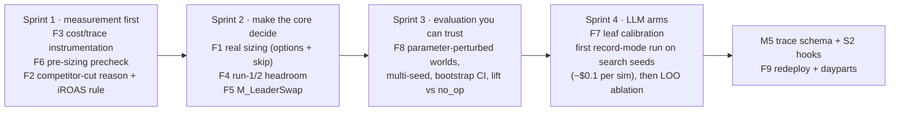

# Runtime feedback: what the runs say, and what to fix next

**Scope.** Findings from instrumented runs of the System 1 harness (`grid-path-challenge/harness/`)
and its offline evaluation (`harness_eval/`), turned into a prioritised list of changes. Everything
here comes from running the code: no LLM was called, so every run was cost-free. The code is the
snapshot of 2026-10-02, after M4 (M0–M4 done; M5 trace + System 2 hooks and M6 docs remain).

**Companion documents:**
- [../presentations/harness-system-deep-dive.md](../presentations/harness-system-deep-dive.md): how the system works.
- [../presentations/harness-vs-procllm-paper.md](../presentations/harness-vs-procllm-paper.md): comparison with the paper.
- [../presentations/harness-vs-procllm-critique.md](../presentations/harness-vs-procllm-critique.md): review of the M1 claims.

**Reproduce:** `bash runtime_feedback_improvement/scripts/run_all.sh` from the repo root takes about 35 min and costs $0.

---

## 1. Summary

The L0 (no-LLM) harness is **safe and reliably better than the baseline**.
- **Floor and fallbacks:** across 12 worlds (6 independent seeds + 6 shock perturbations) it meets the ROAS floor every time, with zero guardrail blocks and zero fallbacks.
- **Lift vs. baseline:** positive in all 12 worlds; **+0.77%** offtake on average over the 6 seeds (95% CI +0.55 … +0.96%), and +0.88% / +1.08% on the two held-out seeds.
- **Lift vs. no-op:** +0.60%. The baseline itself is slightly *worse* than doing nothing on 5 of 6 seeds (§3).

**Most of that lift comes from a narrow set of mechanisms, and several of the mechanisms the
design relies on don't yet work as intended:**

| # | Finding | Severity | Evidence |
|---|---|---|---|
| F1 | **Sizing doesn't size.** The headroom allowance is an on/off gate: allowance 0 → no raises; allowance > 0 → every raise ships | P0 | Shipped raises reach 9–31× the allowance in the first run with headroom (seeds 7/11/23/42) |
| F2 | **`M_CompetitorCut`'s rationale is inverted.** It says competitor keywords have "~0 incrementality"; they are the *most* incremental | P0 | Probe E1: estimated ι 0.99; dev truth 0.85 |
| F3 | **LLM cost and outcome data can't be trusted or collected yet:** the replay key ignores the model, leaf results are discarded, and the meter never resets | P0, blocks M4's LLM arms and M5 | Code reading + `run_matrix._usage_of` |
| F4 | **Runs 1–2 can never raise**, by construction (allowance 0) | P1 | Decision funnel, all seeds |
| F5 | **Half the portfolio is frozen by the sibling hold rule** (56–60 of 110 cells), yet nothing fixes "wrong leader" markets (17–18 of 40 contested) | P1 | Funnel + sizing probe |
| F6 | **3–5 raises per run are proposed on cells already at slot 1** and then dropped by precheck G3, after sizing has already counted them | P1 | Funnel `drop_reasons = {G3: n}` |
| F7 | **The LLM leaves are mis-calibrated before they've run once:** L6 never triggers, L4's call count grows with "no" answers, L1 gets blank context, and L2 is mostly suppressed by a 28-day confound window | P1 | Leaf traffic profile, mock LLM |
| F8 | **The evaluation is narrower than it looks:** "held-out" seeds share the dev truth; P1–P6 land within ±0.05 pp of seed 7, so they add almost no information; there is no CI or lift-vs-no-op in the generated report | P1 | §3 matrix |
| F9 | **Levers left on the table:** no daypart switch-offs, no pauses, no redeploy of money freed by cuts (the baseline does all three) | P2 | Code reading |

**If you do only three things next:**
- **F1:** make sizing real.
- **F3:** make LLM cost and outcome traceable, before spending anything on the LLM arms.
- **F2:** fix the competitor-cut reason and make that decision on iROAS.

---

## 2. What was run

| Run | Script (`scripts/`) | Worlds | Output (`results/`) |
|---|---|---|---|
| Sizing + sibling probe: wraps `select_raises`, logs allowance vs. selected Δspend, hold-set size, wrong-leader markets, precheck drops | `sizing_siblings_probe.py` | seeds 7, 11, 23, 42 (dev) | `sizing_siblings_seed_7.txt`, `sizing_siblings_seeds_11_23_42.txt` |
| Sizing inputs dump: why some candidates weren't selected | `sizing_inputs_dump.py` | seed 23, runs 5–6 | `sizing_inputs_seed_23_runs_5_6.txt` |
| Decision funnel: per run, verdicts, tiers, holds, candidates, headroom, cuts, precheck drops, shipped | `decision_funnel.py` | seed 7 | `decision_funnel_seed_7.txt` |
| LLM leaf traffic at L2: a counting mock LLM with permissive answers; explore on (3 cells, ₹500/day) | `leaf_traffic_profile.py` | seeds 7, 42 | `leaf_traffic_L2_seeds_7_42.txt` |
| Evaluation matrix, cost-free arms (`no_op`, `baseline`, `tools_only`) | `harness_eval.run_matrix` | 12 worlds: search 7/11/23/42, held-out 101/202, perturbed P1–P6 | `matrix_full/` (see §3) |
| Evidence probes E1–E10 from `data/` | `harness_eval.probes` | baseline's shipped trajectory | `probes_evidence_E1_E10.json` |
| Test suites | `pytest -m "not slow"` | — | 84 passed (8 slow deselected; the build log reports them passing) |

---

## 3. Outcome: how much better than the baseline?

**Setup:** `harness_eval.run_matrix` with `LLM_MODE=off`, so only the cost-free arms ran: 12 worlds × 3 arms = 36 full simulations, under common random numbers (each arm faces the same market draws within a world). Raw rows are in `results/matrix_full/matrix.csv`.

| World | Baseline ₹/day | No-op ₹/day | **Tools-only ₹/day** | Lift vs. baseline | Lift vs. no-op | Baseline vs. no-op | Tools-only ROAS / floor (margin) | Proposed → shipped (baseline) |
|---|---|---|---|---|---|---|---|---|
| search_7 | 409,517 | 409,146 | **410,878** | **+0.33%** | +0.42% | +0.09% | 4.82 / 4.54 (+6.3%) | 66 → 66 (176 → 148) |
| search_11 | 414,098 | 414,881 | **416,396** | **+0.56%** | +0.37% | −0.19% | 4.81 / 4.01 (+20.1%) | 109 → 109 (184 → 180) |
| search_23 | 409,934 | 410,440 | **413,294** | **+0.82%** | +0.70% | −0.12% | 4.53 / 4.09 (+10.7%) | 94 → 94 (216 → 187) |
| search_42 | 408,565 | 410,228 | **412,376** | **+0.93%** | +0.52% | −0.41% | 5.20 / 4.72 (+10.0%) | 77 → 77 (193 → 172) |
| heldout_101 | 407,198 | 407,316 | **410,793** | **+0.88%** | +0.85% | −0.03% | 4.79 / 4.50 (+6.4%) | 86 → 86 (191 → 177) |
| heldout_202 | 417,976 | 419,367 | **422,497** | **+1.08%** | +0.75% | −0.33% | 5.23 / 4.83 (+8.3%) | 70 → 70 (173 → 163) |
| P1 OSA moved | 409,984 | 409,498 | **411,270** | **+0.31%** | +0.43% | +0.12% | 4.82 / 4.54 (+6.3%) | 66 → 66 |
| P2 bigger price shock | 409,968 | 409,527 ✗ | **411,365** | **+0.34%** | +0.45% | +0.11% | 4.69 / 4.54 (**+3.4%**) | 68 → 68 |
| P3 demand moved, earlier | 409,313 | 408,957 | **410,536** | **+0.30%** | +0.39% | +0.09% | 4.85 / 4.54 (+7.0%) | 68 → 68 |
| P4 all shocks earlier | 409,507 | 409,169 | **411,113** | **+0.39%** | +0.48% | +0.08% | 4.76 / 4.54 (+5.0%) | 69 → 69 |
| P5 severe OSA dip | 407,691 | 407,379 | **409,057** | **+0.34%** | +0.41% | +0.08% | 4.81 / 4.54 (+6.2%) | 66 → 66 |
| P6 brand demand shock | 409,380 | 409,109 | **410,611** | **+0.30%** | +0.37% | +0.07% | 5.01 / 4.54 (+10.4%) | 67 → 67 |

✗ = the no-op arm **failed the ROAS floor** (4.494 < 4.535). Every other arm met the floor in every world.

**Across the 6 independent seed worlds** (P1–P6 all use seed 7, so they aren't independent samples):

| Comparison | Mean | SD | Range | 95% bootstrap CI | ≈ ₹/day |
|---|---|---|---|---|---|
| Tools-only vs. baseline | **+0.77%** | 0.27 | +0.33 … +1.08 | **+0.55 … +0.96%** | ~₹3.2K/day of offtake |
| Tools-only vs. no-op | **+0.60%** | 0.19 | +0.37 … +0.85 | +0.46 … +0.74% | ~₹2.5K/day |
| Baseline vs. no-op | **−0.17%** | 0.19 | −0.41 … +0.09 | −0.30 … −0.03% | the baseline *destroys* value on 5 of 6 seeds |

**What this says:**
1. **The L0 harness reliably beats the baseline: 12 of 12 worlds, with the CI clear of zero.** That holds on both held-out seeds (+0.88%, +1.08%), which played no part in building it. It ships 100% of what it proposes; the baseline ships 82–98%.
2. **About a fifth of the "lift vs. baseline" is avoiding the baseline's own harm.** The baseline does worse than doing nothing on 5 of 6 seeds. Report **lift vs. no-op** (+0.60%) alongside lift vs. baseline: it's the honest measure of value the harness *creates*.
3. **The perturbed worlds barely perturb.** P1–P6 land within ±0.05 pp of their parent (search_7, +0.33%), with near-identical action counts (66–69). Moving the shock schedule changes little, so they add almost no information beyond seed 7. **P2 is the exception worth keeping:** the bigger price shock cut the harness's ROAS margin to **+3.4%**, the thinnest anywhere, and made no-op fail the floor (see F8).
4. **The harness spends more of the ROAS slack than the baseline** (lower ROAS on 4 of 6 seeds) but keeps ≥ +3.4% above the floor everywhere. This happens even though sizing is a gate (F1). The floor is safe *today* because of portfolio slack, not because the allowance binds.
5. **Absolute size:** about ₹2.5–3.2K/day of offtake on a ~₹410K/day base, against ~₹19K/day of ad spend. That is small, so the evaluation needs paired designs and CIs (F8) to detect changes from the fixes below.

**Caveats:**
- These are seeds of the **dev** scenario. The real eval scenario has different true parameters *and* shocks, which these worlds don't vary (F8).
- No LLM arm has been run.
- The `report.md` that `run_matrix` writes reports `p_lift_negative` per group, but with 1–6 worlds per group it's a coarse statistic. The CIs above were computed separately.

---

## 4. Findings, with the fix for each

Each finding gives what was observed, why it matters, the change (with file), a test that should
accompany it, and a rough effort.

### F1 · Sizing is an on/off gate, not a budget (P0)

**Observed:**

| seed | first run with allowance > 0 | allowance ₹/day | raises shipped, Δspend ₹/day | ratio |
|---|---|---|---|---|
| 7 | run 3 | 159 | 4,447 (20 of 20) | 28× |
| 11 | run 2 | 277 | 2,663 (12 of 12) | 9.6× |
| 23 | run 2 | 174 | 3,797 (18 of 18) | 22× |
| 42 | run 2 | 124 | 3,798 (18 of 18) | 31× |

- Every `(campaign, keyword, action_type)` group had **exactly one** option row, so the Lagrange multiplier μ never changes the pick.
- The only candidates ever excluded were budget raises with projected Δspend = ₹0.
- G8 trimmed nothing on any seed, so the floor held through portfolio slack, not through sizing.

**Why it matters:**
- The headroom ledger is the harness's answer to the cumulative-floor coupling (Approach A gap P3), and today it does nothing beyond the gate.
- Lift can't be attributed to "spending headroom well".
- On a scenario with less slack, G8 would start trimming in worst-marginal-ROAS order, which is not ι-weighted.

**Fix** (`harness/tools/sizing.py`, `harness/htn/methods.py`):
1. Emit **several bid levels per cell** from `diag.options` (every option above the live bid that keeps avg dROAS ≥ goal and marginal ≥ floor), plus a **Δ = 0 "skip" row per group**. The multiple-choice knapsack then has real choices.
2. Alternatively, as a simpler first step: a **ratio-greedy fill**. Sort by `ι·Δrev / Δspend` and add raises until Σ Δspend reaches the allowance.
3. Treat budget raises as options too (×1.1, ×1.25, ×1.5), not a fixed ×1.5 (G6's cap).

**Tests:**
- `Σ selected.pred_delta_spend ≤ allowance` whenever a feasible subset exists.
- μ-monotonicity: a larger allowance never selects less total Δspend.
- On seed 7 run 3, the selection fits ₹159.

**Effort:** S–M. **Expected effect:** fewer, better-chosen raises in early runs. It may *lower* lift at first if the slack was being used productively. That is the right trade to measure.

### F2 · `M_CompetitorCut` cites the wrong reason (P0)

**Observed:**
- `htn/methods.py` docstring and reason string: *"misses goal on a ~0-incrementality keyword; cut now, not on the ladder"*.
- Probe E1 (pooled ι from `data/`): brand 0.12, generic 0.50, **competition 0.99**. Dev truth (offline only): K09/K10 = **0.85**, the highest of all 10 keywords.
- The "~0" in the evidence table is **β**, the cannibalisation coefficient. β ≈ 0 means ι ≈ 1.
- The problem map's own S2 row has it right: *fully incremental but low iROAS*.

**Why it matters:**
- The behaviour (a fast cut on a MISSES competitor cell) may still be right on **return**.
- But each rupee cut loses close to a full rupee of *incremental* revenue. The cut is not "free".
- The wrong reason is shipped with every action and would mislead any LLM leaf that reads it, as L6 does.

**Fix:**
- Rewrite the rationale and reason string: "competitor keyword, iROAS below goal".
- Make the trigger explicit on **ι-adjusted ROAS**: cut when `ι × droas_shrunk < goal × (1 − tolerance)`, not on keyword type alone.
- Then the same rule naturally covers a generic cell with a very low iROAS.

**Test:** a competitor MISSES cell with high ι and iROAS just under goal isn't cut past the ladder. A low-iROAS one is.

**Effort:** S.

### F3 · LLM cost and outcome instrumentation is not trustworthy yet (P0, blocks LLM arms)

| Gap | Where | Consequence |
|---|---|---|
| Replay cache key = sha256(leaf, prompt_ver, system, user, schema_ver, replicate): **no model or provider** | `harness/llm/replay.py::cache_key` | Switching `LLM_MODEL` under `record`/`replay` silently reuses another model's answers, which corrupts model comparisons |
| `leaf()` returns `(result, meta)`; **every caller discards `meta`** | `harness/htn/llm_methods.py` (5 sites) | No per-run calls, cost, latency or default-rate in the trace. M4's LLM arms and M5's trace have no data source |
| `Meter.usage` **never resets**; the stack is built once per policy | `harness/llm/meter.py`, `HTNHarness._llm` | The "$2 per run" cap is $2 per simulation; per-run cost can't be read |
| Replay hits bypass the meter | `ReplayClient` sits outside `Meter` | `run_matrix` reports **$0** for replayed runs; the cost column only works in `record`/`live` |
| No `glm` price row; `LLM_MODEL_L1…L6` overrides unimplemented | `meter.py`, `llm/__init__.py` | Cost for the configured model (`z-ai/glm-5.3-flashx`) is a $3/$15 placeholder |

**Fix:**
- Add `provider` and `model` to the cache key.
- Collect leaf metas into `trace["leaves"]`, a list of `{leaf, outcome, reason, usage}`.
- Snapshot and reset the meter at the start of each `recommend`.
- On a replay hit, add the cached `usage` to a separate "replayed" counter, so reported cost reflects what a live run would cost.
- Add the GLM price row (background task `task_861787f2` exists).

**Tests:**
- Two models produce different keys.
- The trace contains one meta per leaf call.
- Per-run usage resets.
- Replay reports non-zero cost.

**Effort:** S. **Do this before the first paid `record` run.**

### F4 · Runs 1–2 can never raise (P1)

**Observed** (seed 7 funnel):
- **Run 1:** allowance 0 by construction (no post-warm-up days yet).
- **Run 2:** dROAS-to-date 4.6244 against floor × 1.02 = 4.6258. The 2% margin zeroes the headroom.
- **Runs 1–2 together:** 31 raise candidates (15 + 16; Σ ₹6.3K/day), all discarded. 13 cuts shipped.

**Why it matters:** two of six weeks are cut-only, whatever the evidence.

**Fix options:**
- **(a)** Seed run 1's headroom from the warm-up surplus. The floor is warm-up × 0.98, so there is a 2% cushion before any eval day.
- **(b)** Replace the hard margin with a **probabilistic** one: require P(cumulative dROAS ≥ floor) ≥ 0.95, using the run-to-run variance.
- **(c)** Let cuts' freed spend fund raises within the same run (see F9).

**Test:** run 1 allowance > 0 when warm-up dROAS > floor.

**Effort:** S.

### F5 · Siblings: half the cells are held, and wrong leaders are never fixed (P1)

**Observed:**
- **56–60 of 110 cells** are held every run.
- **17–18 of 40** contested markets have a slot-1 holder that isn't the top `leader_score`.
- The harness does raise the score-leader in some of them (up to 5–8 markets in one run), but sizes the raise by the grid, which ignores the incumbent sibling's bid. So the raise may not displace the incumbent.
- **No method makes the incumbent yield.**
- `contested_markets()` (the `wrong_leader` flag) is computed only in tests and probes, not on the policy path.

**Fix:**
- Add `M_LeaderSwap` on `wrong_leader` markets: **cut the incumbent** to just below the challenger's target bid, and **raise the challenger above the incumbent's live bid** (the simulator gives the slot to the higher Aurel bid).
- Gate it on the score gap being material (e.g. > 10%, which is also the L3 near-tie threshold).
- Also re-examine the hold rule. A held follower whose own grid says a *lower* slot is profitable could still be repriced *down*.

**Test:** a scenario fixture with a 90%-share incumbent and a higher-scoring challenger produces a paired cut + raise.

**Effort:** M.

### F6 · Raises proposed on cells already at slot 1 (P1)

**Observed:**
- Precheck drops 3–5 raises per run, **all G3**: the cell already holds ≥ 80% of slot-1 impressions.
- `choose_bids` sees more revenue at a higher bid, but G3 forbids raising a slot-1 cell.
- Precheck runs **after** sizing, so these candidates would consume allowance once F1 is fixed.

**Fix:**
- Filter G3/G4/G7-blocked cells **inside** `m_reprice_raises`, or run `filter_precheck` before `select_raises`.
- Keep the post-sizing precheck as a second line.

**Test:** no G3 drops in the funnel.

**Effort:** XS.

### F7 · The LLM leaves are mis-calibrated before their first real run (P1)

**Observed** (`depth=L2`, mock LLM, explore on):

| | L1 Value | L2 Shock | L3 Sibling | L4 Explore | L6 Review | Total |
|---|---|---|---|---|---|---|
| calls / 6-run sim, seed 7 | 2 | 8 | 16 | 18 | **0** | 44 |
| calls / 6-run sim, seed 42 | 3 | 2 | 17 | 18 | **0** | 40 |

| Issue | Evidence | Fix |
|---|---|---|
| L6 never fires | threshold ₹2,000/day of Δspend; largest single raise seen ≈ ₹724/day | Set the threshold from the raise distribution (e.g. the 90th percentile, ~₹300/day), or review the *set* when Σ Δspend > allowance |
| L4 calls grow with "no" answers | the loop asks every THIN cell (~26/run) until `max_thin_cells` accept | Cap *calls* per run (e.g. 2 × `max_thin_cells`); pre-rank THIN cells by relevance |
| L1 sees blank or constant context | `keyword_type=""`, `goal_droas=""`, `z_reach=0.0` hard-coded in `adjust_raise_sizes` | Pass the real values (already available from `kt`, `verdicts`, `shocks`) and bump the prompt to v2 |
| L2 mostly suppressed | own-action confound = *any* own bid change in the full 28-day window; 4 of 6 and 6 of 7 surges suppressed in two runs | Confound only if the own change falls inside the *recent* 7-day window, or within N days before the shift |
| The shock detector is noisy | probe E4: 17–35 cells flagged per run (of ~110), with no multiple-testing control | Benjamini–Hochberg across cells, or raise the z threshold for CPM flags; measure recall against the injected dev shocks offline |
| Explore spend bypasses the allowance | explore candidates are added *after* `select_raises` | Reserve an explore slice of the allowance, or include probes in sizing |

**Effort:** S each.

**Estimated cost per 6-run simulation at L2:** ~$0.09 at $3/$15 per M tokens, rising to ~$0.35 in the L4 worst case. That is well within budget, so calibration matters more than cost here.

### F8 · The evaluation can't yet tell signal from noise (P1)

**Observed** (`harness_eval/worlds.py`, `run_matrix.py`):
- The **held-out seeds (101, 202) use the dev scenario's truth** (same incrementality, appeal, auction σ, shock schedule); only the random draws differ. The real eval scenario changes *parameters and shocks*.
- **The perturbed worlds P1–P6 move only the shock schedule, and all run on seed 7.**
- **Measured:** P1–P6 lift (+0.30 … +0.39%) and action counts (66–69) sit right on search_7's (+0.33%, 66), so moving shocks around on one seed barely tests anything. Only P2 (the bigger price shock) moved the ROAS margin noticeably (+3.4% vs. +6.3%), and it was the one world where no-op failed the floor.
- **Cost-free arms run once per world** (deterministic under common random numbers). `p_lift_negative` is computed over 1–6 worlds per group, so its resolution is coarse.
- **No confidence interval on lift**, and lift vs. `no_op` isn't reported, though the baseline itself is close to no-op (§3).

**Fix:**
- Add **parameter-perturbed worlds**: incrementality ±30% per keyword type, auction σ 0.2/0.45, appeal shuffled. These are offline only, like P1–P6. Whether self-authored scenarios are acceptable is still an open question for Gobblecube.
- Run every P-world on several seeds.
- Report the mean lift with a **bootstrap CI across worlds**, plus lift vs. `no_op`.
- Add a "should not regress" check: `tools_only` ≥ baseline − 0.1% on every world.

**Effort:** M.

### F9 · Levers and money flows left on the table (P2)

- The harness reuses only the baseline's step 3a (bid choice). It drops:
  - **3b**, the transport LP that redeploys money freed by cuts into the best raises and budget-bound campaigns;
  - **3c**, daypart switch-offs.
- It never emits `set_dayparts` or `pause_keyword`.
- Cuts free ₹/day that nothing redeploys. The freed rupees just lower spend, which raises ROAS but doesn't buy offtake.

**Fix:**
- Count projected savings from cuts (−Δspend) as **additional allowance** within the same run.
- Port 3c as a method, gated on ι-adjusted marginal ROAS per daypart.
- Test S2's missing half ("redeployed").

**Effort:** M.

### F10 · Test-quality and hygiene items (P2)

| Item | Fix |
|---|---|
| S2 test now re-implements `m_competitor_cuts`' selection rule, so it can't catch a wrong rule | Assert a behaviour instead: a competitor MISSES cell under a 1-day streak is cut while an equivalent generic cell waits (use a perturbed fixture) |
| `markets()` refits ι (two OLS passes) instead of reusing the policy's | Pass `iota` in |
| `leader_score` reads only the first daypart's slot-1 grid row | Aggregate across dayparts |
| `MethodRegistry` (`htn/tasks.py`) is unused; its `decomposed` flag never resets | Delete it, or use it and reset per run |
| `headroom.py`'s non-front-loaded branch assumes 7 runs (there are 6) | Use `N_RUNS` |
| Docs: two wording fixes pending (`task_573cea0b`) | Fold into M6 |

---

## 5. Suggested sequence

| Sprint | Acceptance criteria |
|---|---|
| 1 | Trace has `leaves[]` with usage. Replay key includes the model. Per-run meter. Zero G3 precheck drops. Competitor cuts carry a correct reason and use the ι-adjusted trigger. All tests green |
| 2 | Σ shipped raise Δspend ≤ allowance (± one candidate). Run 1 allowance > 0 when warm-up beats the floor. Wrong-leader markets get paired actions. Floor met on all 12 worlds. Lift re-measured (it may fall; report it honestly) |
| 3 | Matrix over ≥ 20 worlds incl. parameter perturbations. Report shows mean lift ± 95% CI and lift vs. `no_op` per group |
| 4 | L1/L2 arms recorded once (`LLM_MODE=record`), replayable for free. LOO table shows each leaf's marginal lift and cost. Leaves with ≤ 0 marginal lift are dropped |

---

## 6. Appendix: key raw numbers

**Decision funnel, seed 7, `HTNToolsOnly`** (`results/decision_funnel_seed_7.txt`):

| run (day) | CLEARS / MISSES / THIN | held | raise cands (reprice + budget) | Σ raise Δspend | headroom | allowance | cuts (comp + base) | precheck drops | shipped |
|---|---|---|---|---|---|---|---|---|---|
| 1 (28) | 66 / 18 / 26 | 60 | 10 + 5 | 2,861 | 0 | 0 | 1 + 4 | 0 | 5 |
| 2 (35) | 68 / 16 / 26 | 58 | 11 + 5 | 3,480 | 0 | 0 | 0 + 8 | 0 | 8 |
| 3 (42) | 68 / 16 / 26 | 57 | 13 + 7 | 4,447 | 795 | 159 | 0 + 9 | 5 (G3) | 24 |
| 4 (49) | 68 / 15 / 27 | 60 | 5 + 2 | 1,108 | 1,562 | 312 | 1 + 7 | 5 (G3) | 10 |
| 5 (56) | 70 / 13 / 27 | 56 | 4 + 2 | 1,620 | 2,823 | 565 | 1 + 6 | 3 (G3) | 10 |
| 6 (63) | 71 / 14 / 25 | 56 | 5 + 1 | 535 | 3,848 | 3,848 | 0 + 6 | 3 (G3) | 9 |

₹/day throughout. Over the 42 days: offtake ₹410,878/day (warm-up ₹407,933), ad spend ₹19,233/day,
direct ROAS 4.821 vs. floor 4.535, 66 actions proposed and 66 shipped.

**Evidence probes** (`results/probes_evidence_E1_E10.json`):

| Evidence item | Value |
|---|---|
| E1 incrementality (ι by type) | brand 0.12 · generic 0.50 · competition 0.99 |
| E2 siblings | 100/110 cells contested · 40/50 markets contested · 17 wrong-leader markets |
| E3 chronic run-outs | 6 campaigns (C-S1-BLR, C-S1-DEL, C-S2-MUM, C-S3-BLR, C-S5-BLR, C-S5-DEL) |
| E9 baseline dROAS | 4.97 vs. floor 4.54 |
| E10 baseline blocked share | 15.9% (28 of 176) |
