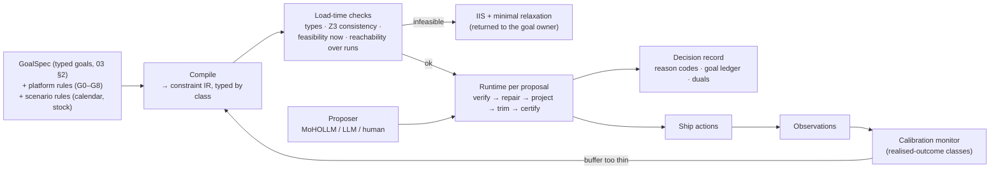

# 05 · The compiler and verifier: how binding constraints are enforced, and how we know the enforcement is right

> Part of [grid_design_simulator](README.md). Draws on Chimera's guardian (`sandbox/chimera/upstream/policies/ecommerce_guard.csl`, `src/csl_guardian.py`, `TLA+_verification/ChimeraGuardianProof.tla`) and the existing grid guardrails (`grid-path-challenge/gpc/guardrails.py`, G0–G8).
> Constraint classes and the goal ladder come from [03 §4](03_goals_macro_micro.md); the arms that use the compiler are in [04 §3.2](04_experiment_protocol.md).

---

## 0. TL;DR

- **The proposer (MoHOLLM, an LLM, a human) never ships an action. The compiler does.** It turns typed goals and platform rules into a constraint set, checks the set once when loaded, then verifies → repairs → projects → trims every proposal, and writes a decision record.
- **Four constraint classes, four different guarantees:**

| Class | Example | Guarantee |
|---|---|---|
| action | bid in [₹200, ₹10k]; North ≥ 25% of spend | **exact**, by construction |
| state-gated | no raise if 3-day OSA < 60%; no S6 ads below 2 days of stock cover | **exact**, given the observation |
| projected outcome | projected portfolio dROAS ≥ floor; K01 slot-1 ≥ 70% where conquested | exact **on the projection**; only as good as the projection |
| realised outcome | realised dROAS ≥ floor over 6 runs; sibling share ≤ 30% | **probabilistic** only: a buffered chance constraint, checked by calibration |

- **Chimera's lesson, with our replication's corrections.** Chimera's rules live in a small declarative file checked by Z3 at load; repair logic lives in Python; a TLA+ model proves the repair functions keep the invariant. Our replication found that (1) the violation-to-message map was keyed wrongly, so 4 of 6 rules returned a generic message to the LLM, and (2) integer rounding let `ad_spend = −0.4` pass (REPLICATION findings 1–2). So: verify the **repair code**, not just the rules, and use exact units (paise) with explicit buffers.
- **What the compiler cannot do:** guarantee realised outcomes, or fix a wrong projection. Those need calibration tests and holdouts, not proofs.

---

## 1. What exists today

| Source | Rules | Enforcement | Verification |
|---|---|---|---|
| Chimera `ecommerce_guard.csl` | 8 `STATE_CONSTRAINT`s on integer variables (ad cap, weekly increase cap, price change bounds, price ceiling, above cost, min margin) | `CSLGuardianEcom.repair_action`: clip to nearest valid value, then `validate_action` via CSL | Z3 consistency at load; TLA+ `RepairedPrice` / `RepairedAdSpend` model-checked with TLC (our machine had no Java, so this was skipped in replication) |
| Grid `guardrails.py` | G0 schema, G1–G2 bid bounds/step (clamp), G3 top slot, G4 availability, G5 budget realisable, G6 budget step (clamp), G7 cell goal, G8 portfolio ROAS (trim worst-marginal increases until projected dROAS ≥ floor) | Python, in a fixed order, per action then portfolio | Unit tests; no formal model; projections from the guardrail's own grid, never policy-supplied numbers |

Our grid guardrails are already the right shape (deterministic, uses its own projection, logs a rule and outcome per action). What is missing: **goals as data** (G7's goals are hard-coded from the plan), **classes** with different guarantees, **load-time consistency and feasibility**, **multi-run reachability**, and **verification of the repair functions**.

---

## 2. Architecture



### 2.1 Constraint IR

Every rule compiles to one record:

```
Constraint {
  id, class: action | state | projected | realised,
  scope: hypercube expression over S × C × K × D × T,
  expr:  linear or piecewise-linear in decision variables (action),
         a predicate on observations (state),
         a predicate on Projection(actions, obs) (projected),
         a predicate on realised metrics with chance level α and buffer b (realised),
  repair: clamp | block | trim(order) | project(norm) | none,
  priority: platform > finance > brand > operator,         # used only for conflict reports
  provenance: GoalSpec id or rule id, source quote
}
```

Decision variables are **integers in paise** (bids, budgets) and booleans (daypart on/off, keyword active). No floats in the verified core, so the CSL rounding hole cannot recur.

---

## 3. Load-time checks (once per GoalSpec change)

| Check | Tool | Output on failure |
|---|---|---|
| Typing: every scope names existing nodes; every metric has a basis ([03 §2](03_goals_macro_micro.md)) | schema | "C8 needs `basis`; 'ROAS ≥ 3' is ambiguous between direct and incremental" |
| **Consistency** of action + state constraints (no contradiction for some reachable state) | Z3 over the integer domains, like CSL's `CHECK_LOGICAL_CONSISTENCY` | the conflicting pair, with provenance |
| **Feasibility now**: exists an action set satisfying all action/state constraints and the projected ones, from the current state | small MILP | an **IIS** (irreducible infeasible subset) and the **minimal relaxation** of each soft member ("feasible at North ≥ 21%, or at B + ₹2.4k") |
| **Reachability over runs**: can the constraints be met within the step limits? E.g. North is at 18% of spend; G6 allows +50%/−30% per run per campaign; C5 asks ≥ 25% *every run* | bounded model check over k runs (TLA+/TLC, or the MILP unrolled k steps) | "C5 cannot hold in run 1; earliest is run 2 via path …" ⇒ restate C5 as 'from run 2' or relax |
| Coverage: every lever type is touched by at least one rule; no rule is dead (never binding on any reachable state) | Z3 / sampling | a warning, not a block |

The reachability check is the one Chimera's design does not need (its caps are per-week and memoryless) and our grid does: step limits make some goals **temporally** infeasible even when they are statically feasible.

---

## 4. Runtime: verify → repair → project → trim → certify

Per proposal (one action set per run):

1. **Verify** each action against action and state constraints; record pass / violation.
2. **Repair** violations by the rule's declared repair, in a declared order:
   - `clamp` (G1, G2, G6): move to the nearest bound;
   - `block` (G0, G3, G4, G5, C2, C3): drop the action, keep the reason;
   - `project` (C5, C6, linear coupled constraints): solve the small LP/QP "closest feasible action set in L1 distance to the proposal", so the repair changes as little as possible and only the violating levers.
3. **Project** outcomes with the compiler's own grid model (as G8 does today, never a policy's numbers): Δspend, Δrevenue, slot shares, stock cover.
4. **Trim** for projected constraints (C4, C7): remove or shrink increases in a declared order (worst marginal first, as G8) until all hold.
5. **Buffer** realised-outcome constraints as chance constraints on the projection: require $\widehat{\text{dROAS}} - z_{\alpha}\cdot \widehat{se} \ge R$, with $\widehat{se}$ from a bootstrap of the grid's cell estimates and α = 0.10. (Chimera's 1% price buffer is the deterministic cousin of this.)
6. **Certify**: re-verify the final set against *every* action/state/projected constraint; if anything fails, ship nothing and raise (a compiler bug, never silently shipped).

### 4.1 Interface to MoHOLLM (Track A)

```
x  ──decode──▶ actions ──compiler──▶ actions′ ──encode⁺──▶ x̃     (repaired point, fed back)
                                   └──▶ evaluate(actions′)           (the black box sees only feasible actions)
```

- `encode⁺` is the least-squares inverse of the decoder; it is approximate where the repair made a cell-level change the 12-d encoding cannot express. The gap ‖x − x̃‖ is logged (proposal drift, [04 §4.2](04_experiment_protocol.md)).
- **Compiler-box mode:** the decoder is monotone in each coordinate, so interval arithmetic on a KD leaf [l, u] gives exact bounds on decoded bids and budgets. Box-expressible action constraints (C1, C3, C6 under a fixed scale) then tighten the leaf before the LLM samples it; a leaf whose tightened box is empty is marked `infeasible(Cx)` and its score is set to −∞ with that reason code.

### 4.2 Interface to Track B (hypercube-native)

The LLM proposes hypercubes H; the compiler checks each H's scope against the constraints (a hypercube that only contains blocked levers is rejected with a reason code), derives H's envelope from the macro duals (λ, μ, ν), and the in-box MILP solves with the constraints as rows. Same IR, same record.

---

## 5. Verifying the verifier

| Property | Statement | How checked |
|---|---|---|
| **Soundness** | the certified output satisfies every action, state and projected constraint | Z3 on the repair postconditions over bounded domains; property tests (Hypothesis) on 10⁵ random proposals and states |
| **Idempotence** | repair(repair(a)) = repair(a) | property test |
| **Minimality** | repair changes no lever that was not in violation, unless a coupled constraint (C5, C6) required it; and then the L1 change is minimal | compare to an exact LP on random cases |
| **Order independence** or declared order | permuting proposal order gives the same output, or the order is fixed and documented (G8 trims by marginal, ties by id) | property test |
| **Termination** | trim loops end (finite actions, each step removes one) | proof by construction + test |
| **No-op safety** | the empty proposal is always certified (doing nothing is always allowed) — or the load-time check reports why not (e.g. C5 is violated by the current state) | Z3 / reachability check |
| **Invariant over runs** | if the rules hold at run k and the certified set is shipped, action/state rules hold at run k+1 for any market outcome | TLA+ model of the run loop with abstract market outcomes (Chimera-style), TLC on small domains |
| **Legacy equivalence** | with only G0–G8 loaded, the compiler's output equals `guardrails.apply_guardrails` on every logged action set from existing runs | differential test over `data/runs/*` |
| **Messages match rules** | every violation returns its own rule id and message | test per rule (the Chimera bug, finding 1) |
| **Calibration** (realised class) | over held-out seeds, realised violation rate of buffered constraints ≤ α + tolerance | monitor in E3; if it fails, widen the buffer or fix the projection |

Soundness, idempotence and legacy equivalence gate every change. Calibration is the only check that can fail for reasons outside the compiler (a biased projection), and it is the one that says when to trust the "projected" class.

---

## 6. The decision record

Every proposed option ends in exactly one terminal state with a reason code:

| Terminal state | Example |
|---|---|
| `shipped` | "S3 × K04 × BLR bid ₹410 → ₹470" |
| `repaired(Cx, from → to)` | "G2: ₹900 → ₹705 (±50% of ₹470)"; "C5: North share 21% → 25% by moving ₹180 from BLR K05" |
| `blocked(Cx)` | "G4: S2 × HYD availability 42% over 3 days" |
| `trimmed(C4, marginal 1.6×)` | "pulls projected dROAS below 4.54" |
| `infeasible-region(Cx)` | "KD leaf 7: every point violates C3 (K11 outside live window)" |
| `not explored(score)` | "leaf 12 not sampled this turn: score 0.21 < 0.47 cut" |
| `dominated(reduced cost)` | "MILP: −₹0.3 per ₹ vs λ" (Track B) |

Plus the goal ledger from [03 §6](03_goals_macro_micro.md): status, binding, price (dual), sentence. This is how the "why this over 100+ alternatives" question is answered: each alternative has a terminal state and a number.

---

## 7. Example rule file (sketch, CSL-like)

```
DOMAIN GridGuard {
  UNITS paise
  VARIABLES {
    bid[cell]:        20000..1000000          // ₹200–₹10,000
    live_bid[cell]:   20000..1000000
    budget[camp]:     30000..10000000
    spend_share[region]: 0..10000             // basis points
    stock_cover_days[sku, city]: 0..365
    osa3[sku, city]:  0..100
    day: 0..120
  }

  ACTION   bid_bounds   { ALWAYS THEN 20000 <= bid[c] <= 1000000 }                 REPAIR clamp
  ACTION   bid_step     { ALWAYS THEN 2*bid[c] <= 3*live_bid[c] AND 2*bid[c] >= live_bid[c] }  REPAIR clamp
  ACTION   north_min    { ALWAYS THEN spend_share[North] >= 2500 }                 REPAIR project(L1)  FROM run 2
  ACTION   comp_cap     { ALWAYS THEN spend_share[competition] <= 1000 }           REPAIR project(L1)
  ACTION   ephemeral    { WHEN kw(c) == K11 AND (day < 42 OR day > 59) THEN active[c] == false }  REPAIR block
  STATE    osa_gate     { WHEN increase(c) AND osa3[sku(c), city(c)] < 60 THEN false }           REPAIR block
  STATE    stock_gate   { WHEN sku(c) == S6 AND stock_cover_days[S6, city(c)] < 2 THEN active[c] == false }  REPAIR block
  PROJECTED droas_floor { ALWAYS THEN proj_droas >= floor }                        REPAIR trim(worst_marginal)
  PROJECTED k01_defend  { WHEN conquested(city) THEN proj_slot1_share[K01, city] >= 7000 }      REPAIR raise_min(K01)
  REALISED  droas_real  { OVER 6 runs THEN droas >= floor  WITH P >= 0.90 }        BUFFER z*se
  REALISED  sibling_cap { OVER run THEN sibling_share[nest, city] <= 3000 WITH P >= 0.90 }  ESTIMATE from holdouts
}
```

Rules are written by people, or compiled from a GoalSpec that a person confirmed. An LLM may **draft** a GoalSpec from a sentence ("grow North without hurting ROAS"), but the compiler shows a paraphrase of every compiled rule with its provenance quote and waits for confirmation, because LLMs are unreliable formalisers: they drop constraints and add wrong ones ([01 §3.6](01_landscape_and_literature.md)).

---

## Assumptions and caveats

| # | Assumption |
|---|---|
| \*1 | Linear and piecewise-linear constraints cover C1–C7. Constraints that are non-linear in decisions (e.g. a ratio of projected sums) are linearised at the current point or handled by the trim loop, which is exact for G8's form but not in general. |
| \*2 | The compiler's projection is the guardrail grid model. Its known biases (slot-1 and share-curve, linkage caveat \*13) make the "projected" class only as good as that model; the calibration monitor is the check. |
| \*3 | The chance-constraint buffer assumes the projection error is roughly normal and unbiased. A biased projection (e.g. ignoring pull-forward) defeats any buffer. |
| \*4 | TLA+ checking is on small abstract domains (as Chimera's was); it proves the repair logic, not the market. TLC needs Java, which the sandbox machine lacks. |
| \*5 | "Legacy equivalence" assumes `guardrails.py` is the intended behaviour. Where the new compiler deliberately differs (e.g. C5's `project` repair), the differential test must whitelist it. |
