# System 1, the Measurement Service, and System 2: design and coupling

**Status:** proposal, revision 2 (2026-10-04) · **Author:** Arnab Kar (drafted with Claude) · **Audience:** Siddarth, Nitesh

**Sources:** notebook pages for 14–15 Aug; email of 3 Oct; `presentations/harness-system-deep-dive.md` (System 1 as built); `runtime_findings/` (X0–X7 results); `design/measurement_evals/01,02` (measurement bench + universal measurement design); the decks in `design/**` (grids rendered by `tools/pdf_to_grid.py`); envharness.com (EnvRigger loop).

**How to read this.** Each section follows the same pattern: a small diagram, the tables that define the contract, pseudocode for the moving parts, and **scenarios** that walk through concrete cases. Numbers come from our runs unless a row or block is marked *illustrative*.

**Contents**
0. [TL;DR](#0-tldr) (incl. 0.3, the notebook redrawn)
1. [Where we are](#1-where-we-are)
2. [System 1: the runtime](#2-system-1-the-runtime)
3. [The Measurement Service](#3-the-measurement-service)
4. [System 2: the learner](#4-system-2-the-learner-light)
5. [Identity and provenance](#5-identity-and-provenance)
6. [How the systems couple](#6-how-the-systems-couple)
7. [Promotion: System 2 → System 1](#7-promotion-from-system-2-outcome-to-deterministic-system-1)
8. [Retiring rules, overrides and chains](#8-retiring-stale-rules-overrides-and-chains)
9. [Build plan](#9-build-plan)
10. [Open questions](#10-open-questions)

---

## 0. TL;DR

1. **There are three parts, not two.** System 1 is the **runtime**: the deterministic L0 core, bounded L1/L2 LLM leaves and an arbiter. System 2 is the **learner**: it reads traces and feedback and proposes changes. The **Measurement Service** sits between them. It is the only route by which a change can reach System 1. This is the EnvRigger loop (*Interact → Diagnose → Write → Validate*), with Measurement as *Validate*.
2. **The two systems share exactly one artifact: a versioned, content-hashed policy pack.** It holds System 1's rules, parameters, overrides and chain order as C-Spec. System 1 never reads System 2's state. System 2 never writes to System 1.
3. **One measurement substrate, two consumers.** For System 1, measurement is a **gate**: paired, common random numbers (CRN), oracle in simulation, deterministic. For System 2, it is **credit assignment**: noisy, confounded, fed by implicit experiment outcomes and explicit chat feedback.
4. **Promotion is a provenance chain.** Each action carries the `rule_id@version` values that produced it. Each rule version carries a `promotion_id`. That links back to `experiment_id → run_ids → (seed, world, code_hash, pack_hash, params, tool/leaf calls) → gate verdicts`.
5. **Retirement is measured.** Every rule carries a claim. A nightly **claims audit** re-measures each claim and gives it a verdict (`holds` / `partly` / `changed since` / `contradicted` / `no longer fires`). Overrides expire by default. A rule in a chain retires only after an interaction test.
6. **Build order:** Measurement Service v0 (from `experiments/lib`) → System 1 rule IDs and decision records → promotion pipeline → System 2 learner.

### 0.1 The three parts and the one shared artifact

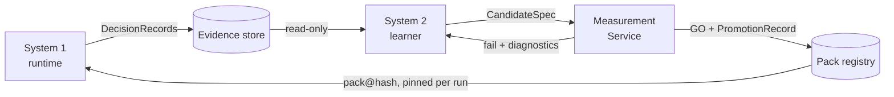

### 0.2 The same loop in EnvRigger terms

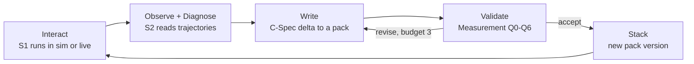

| EnvHarness concept | Here | Never modified |
|---|---|---|
| frozen environment core | `gpc/` market, runner, score | yes |
| human-built verifiers | guardrails G0–G8, ROAS floor | yes |
| `reset()` / `step()` contract | `Policy.recommend(obs) → actions` | yes |
| component (wrapper) | policy-pack rule / overlay | — (this is what changes) |
| fresh rollouts | Measurement runs on fresh, paired worlds | — |
| revision budget | 3 revise rounds or a $ cap per candidate | — |

### 0.3 The notebook, redrawn

Three diagrams, one per notebook block, then one that joins them. Solid elements are on the notebook page. **Dashed** elements were added from this design (guardrails, gates, pack registry). The full transcription, with a table per block, is in [02_notebook_diagrams.md](02_notebook_diagrams.md).

#### Block 1: Measurement (14 Aug). System-1 runtime measurement and the System-2 evaluator

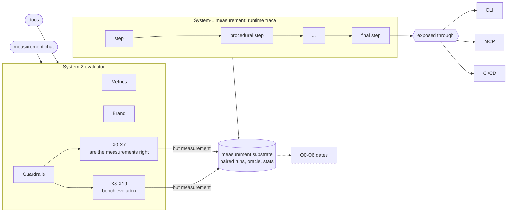

#### Block 2: System 1 (15 Aug, top). L0 → L1/L2 → L3, expert, arbiter

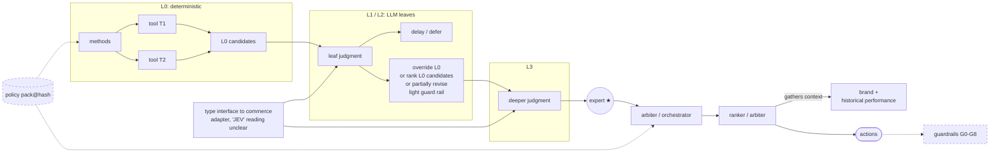

#### Block 3: System 2 (15 Aug, bottom). Ingest → expand → ReAct → propose experiment OR promote runtime

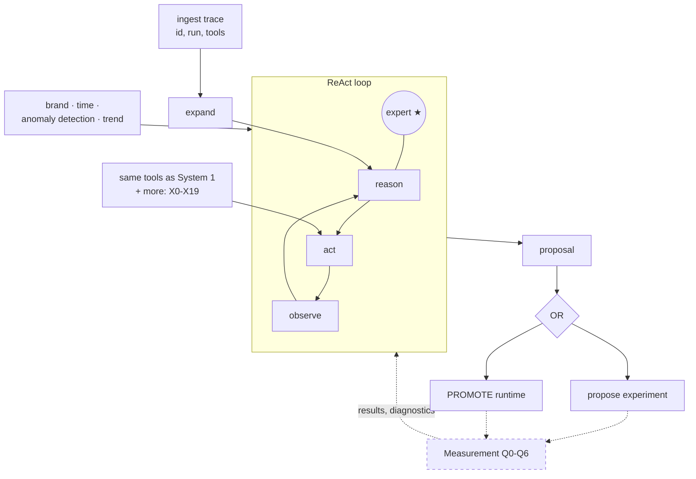

#### All three together

The notebook's long line from System 2 up to the expert / arbiter is the promotion path: Q gates → pack registry → System 1 pins the new pack.

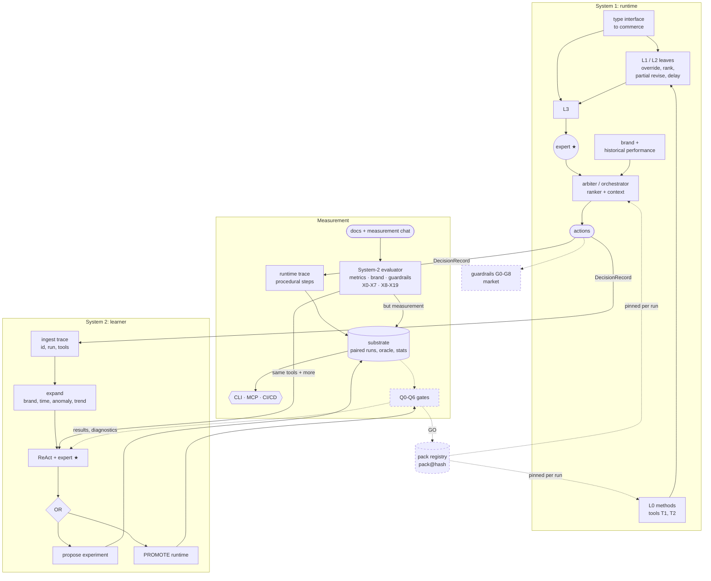

---

## 1. Where we are

These are the facts the design has to respect.

| Fact | Source | Design consequence |
|---|---|---|
| L0 tools-only beats baseline by **+0.23%** (t-CI 0.07..0.40) on current code. The old code gave +0.82%. | FINDINGS §2, claims A1 | Each claim is stamped with the code and pack it was measured on. `changed since` is a first-class verdict. |
| The headroom gate costs **~0.86pp** (20/20 fresh worlds). The state-dependent minimum `sm_r1500_c1.0` gets **+0.32pp** with the floor held in 10/10 untouched worlds. | FINDINGS §4, §8b | First real promotion candidate (§7.7). |
| Gate and cuts are **not additive**: removing both gives +1.06pp but breaks the floor in 9/20 worlds. | FINDINGS §4 | Chain-aware interaction test before retiring anything (§8.4). |
| Brand direct ROAS 16–17 vs true iROAS ~1.9. | FINDINGS §3 | Q4 checks truth-side metrics, not only the business floor. |
| Spend is under-forecast 1.5–4× at the margin. G8 never trims (442 proposed = 442 shipped). | X3.3, claims B3/C5 | Calibration monitor. "Never fires" is a retirement signal. |
| L1/L2/L6 leaves fire 0.3 / 1 / 0.2 times per run; no leaf adds offtake as configured. | X5.1 | System 2 tunes leaf *triggers*; leaves stay narrow/veto. |
| Seeds 101/202, 303–322, 1001–1010, 2001–2010 are spent. | 04-measurement-practice | Seed ledger: a hidden set is used once. |
| `harness/` is edited by another session. | 04-measurement-practice #6 | `code_hash` in every run key; System 1 changes are proposals. |
| `RunTrace` has simulation_id, per-run usage and leaf_calls, but no seed, world or rule IDs. | deep-dive §9a | DecisionRecord v2 extends it (§5.2). |
| LLM spend so far: ~$0.15. | email, 3 Oct | Cost is not the constraint today. Evidence quality is. |

---

## 2. System 1: the runtime

### 2.1 Layers

| Layer | What it does | Determinism | Can it add a lever? | Bound |
|---|---|---|---|---|
| **L0** tools + methods | diagnose → ι → siblings → reprice / budget → projection → headroom → sizing → cuts → precheck | fully deterministic | no; six guardrail levers only | guardrails G0–G8 |
| **L1/L2** LLM leaves | value multiplier, shock confirmation, sibling tiebreak, explore, review veto | replay-cached | no; narrows or vetoes an L0 candidate | clip ranges; the default is the L0 decision |
| **L3 arbiter** (to build) | ranks L0 candidates using brand context and history; may override, rank or partially revise | deterministic given inputs + pack | no | arbiter guard (§2.3) |
| **Guardrails G0–G8** | environment-side checks | deterministic | — | untouched |
| **Fail-soft** | leaf → default; run → `DeterministicTraversal` | deterministic | — | built (S9, S9b) |

#### L0 core pipeline

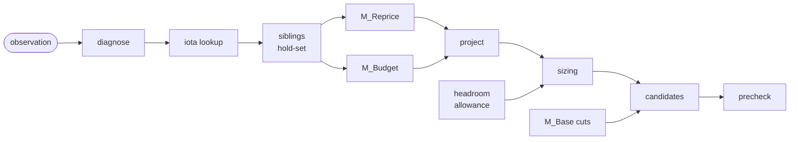

#### Where L1/L2 hook in (only when depth ≥ L1)

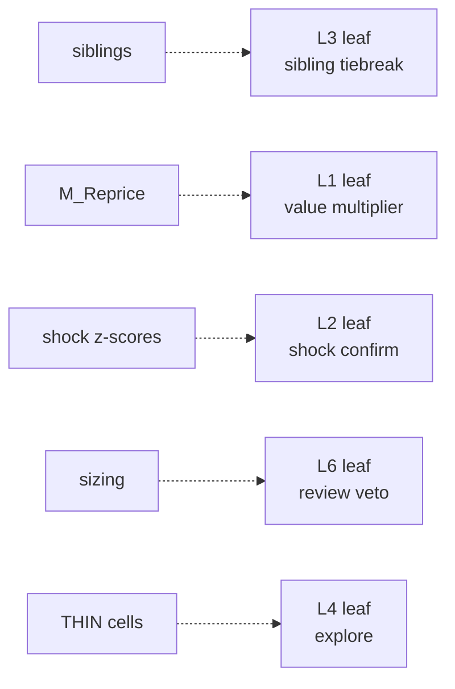

| Leaf | Trigger (mechanical) | Can change | Default on failure |
|---|---|---|---|
| L1 value | tier-B `increase_cpm` | raise size, multiplier 0.5–1.5 | multiplier 1.0 |
| L2 shock | \|z_reach\| ≥ 2.5, surge, not own-action-confounded | adds one grid raise | no shock raise |
| L3 sibling | top-2 leader scores within 10% | which sibling leads | mechanical top scorer |
| L4 explore | THIN cell, explore enabled | adds a capped probe | no probe |
| L6 review | raise Δspend ≥ ₹2,000/day | vetoes large raises | no veto |

**Invariant S1-1:** with every LLM call failing, System 1's output equals L0 on the same pack (tested as S9b). The arbiter must preserve this.

### 2.2 The runtime contract

```python
def recommend(obs, pack) -> tuple[Actions, DecisionRecord]:
    rec = DecisionRecord.start(obs, pack)                  # decision_id, obs_digest, pack hash, code hash
    try:
        ctx  = tools.diagnose(obs, rec)                    # every tool call -> rec.tool_calls
        cand = l0_methods(ctx, pack.rules, rec)            # rec.rule_firings appended per rule used
        if pack.depth >= "L1" and llm_available():
            cand = l12_leaves(cand, ctx, pack, rec)        # narrow / veto only, cached
        cand = arbiter(cand, ctx, pack, rec)               # rank / override / revise under guard
        acts = precheck(cand, rec)
    except Exception as e:
        acts = DeterministicTraversal().recommend(obs)
        rec.fallback_reason = repr(e)
    rec.actions = [a.with_lineage() for a in acts]
    return acts, rec                                       # rec -> evidence store (write-only)
```

### 2.3 The L3 arbiter

Notebook p.15: *"override L0, or rank L0 candidates, or partially revise; light guardrail"*.

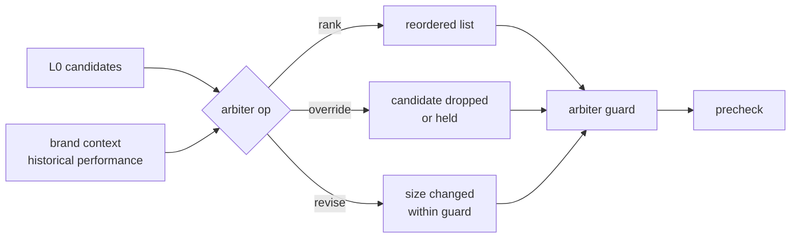

| Operation | Allowed | Not allowed | Guard check |
|---|---|---|---|
| rank | reorder candidates competing for the same allowance | add a candidate | the set is unchanged |
| override | drop or hold an L0 candidate | turn a hold into a raise | output ⊆ input |
| partial revise | scale a raise or cut size | change the lever or the cell | \|Δ\| ≤ `revise_max_pct` × L0 size; total ≤ headroom allowance |

```python
def arbiter(cands, ctx, pack, rec):
    g = pack.rules["arbiter.guard"]                        # revise_max_pct, allow_override, ...
    ranked = sorted(cands, key=lambda c: score(c, ctx.brand, ctx.history, pack))
    out = []
    for c in ranked:
        op = decide(c, ctx, pack)                          # deterministic rules; optional cached LLM
        if op.kind == "override" and g.allow_override:
            rec.fire(op.rule, c, effect="dropped")
            continue
        if op.kind == "revise":
            new = clamp(op.size, c.size * (1 - g.revise_max_pct), c.size * (1 + g.revise_max_pct))
            c = c.resized(new)
            rec.fire(op.rule, c, effect=f"resized {c.size}->{new}")
        out.append(c)
    assert {x.cell for x in out} <= {x.cell for x in cands}    # no new cells, ever
    return respect_allowance(out, ctx.headroom)
```

### 2.4 The policy pack: a domain-specific harness, just in time

Packs compose as overlays, the way EnvHarness stacks wrappers (`E″ = w₂(w₁(E))`):

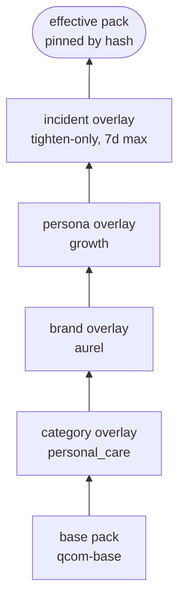

```yaml
# packs/aurel/brand.yaml   →  pack:aurel-brand@2026.10.05.1   (sha256:7c1e…)
apiVersion: harness/v1
kind: PolicyPack
metadata: {name: aurel-brand, version: 2026.10.05.1, owner: arnab}
extends: pack:qcom-base@2026.10.03.0
scope: {brand: aurel, category: personal_care, persona: growth}

rules:
  - id: rule.headroom.min_allowance
    version: 3                                # v2 = fixed 3000 (rejected), v1 = fixed 300
    kind: param
    target: headroom.min_allowance_inr_day
    value: {fn: state_min, run1_inr: 1500, cap_inr: 3000, frac_of_banked: 1.0}
    claim: {id: CLM-B1b, metric: offtake_lift_pp_vs_parent, expect: ">= +0.2", floor_met_share: 1.0}
    provenance: {promotion_id: prom_01JA…, experiment_id: exp_01J9…X2-1b}
    lifecycle: {status: active, review_by: 2026-11-05}

  - id: rule.override.brand_k03_hold
    version: 1
    kind: override
    target: {method: M_Reprice, where: {keyword: K03, city: DEL}}
    value: {action: hold}
    reason: "fb_01JB…: DEL soap launch, keep S3 as leader"
    lifecycle: {status: active, expires_at: 2026-10-19, owner: siddarth}

chain: [diagnose, iota, siblings, reprice, budget, project, headroom, sizing, cuts, precheck, arbiter]
```

| Rule kind | Targets | Example | Relax allowed in an overlay? | Needs claim | Needs expiry |
|---|---|---|---|---|---|
| `param` | a `Params` field | `headroom.min_allowance_inr_day` | only via promotion | yes | no |
| `threshold` | a trigger level | `shocks.z_reach = 2.5` | only via promotion | yes | no |
| `toggle` | a method on/off | `explore.enabled` | only via promotion | yes | no |
| `chain` | step order | arbiter before precheck | only via promotion | yes | no |
| `guard` | an extra constraint | "no raises on competitor kw" | tighten: yes | cost report | no |
| `override` | a scoped action hold/force | hold K03/DEL | tighten: yes | no | **yes** |

```python
def resolve_pack(scope, registry) -> EffectivePack:
    layers = [registry.base(scope), registry.category(scope), registry.brand(scope),
              registry.persona(scope), registry.incident(scope)]          # missing layers skipped
    eff = {}
    for layer in filter(None, layers):
        for r in layer.rules:
            if r.expired(today()):
                continue
            prev = eff.get(r.target_key)
            if prev and is_relaxation(prev, r) and not r.promoted:
                raise PackError(f"{r.id} relaxes {prev.id} without promotion")
            eff[r.target_key] = r
    pack = EffectivePack(eff, chain=layers[-1].chain or layers[0].chain)
    lint_conflicts(pack)                                                   # §8.3
    return pack.freeze()                                                   # canonical JSON -> sha256
```

### 2.5 Scenarios

| # | Scenario | What System 1 does | Evidence left behind |
|---|---|---|---|
| S1-a | **Brand anchor**: slot-1 brand cell, L0 wants a raise | precheck blocks it (G3 ≥ 80% slot-1 share) | `act_` with fate `precheck_dropped`, rule `precheck.g3@1` |
| S1-b | **LLM provider outage mid-run** | every leaf returns its default; output = L0 actions | `leaf_calls[*].outcome = default`, `reason = timeout` |
| S1-c | **Brand team hold** on K03/DEL for a launch | arbiter applies `override.brand_k03_hold@1`; S3 stays leader | `rule_firings` lists the override; it expires 2026-10-19 |
| S1-d | **Surge in BLR K07/K08** (E4) | shock z-score flags it; L2 confirms; raise goes through sizing + precheck | `tc_shocks`, `leaf_L2`, `act_` lineage includes `shock_raises` |
| S1-e | **Unexpected exception** in sizing | run falls back to `DeterministicTraversal` | `fallback_reason = exception` |
| S1-f | **Last run (run 6)** | allowance = full remaining headroom | `headroom.allowance == headroom_day` |

---

## 3. The Measurement Service

### 3.1 Planes and resources

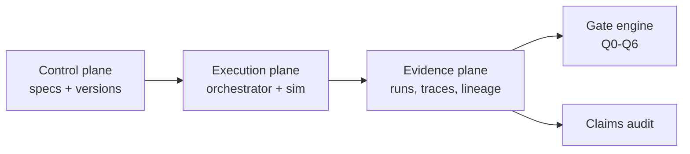

| Resource | What it defines | Example ID | Existing code |
|---|---|---|---|
| `MetricSpec` | what to measure | `metric:true_iroas@v1` | `oracle.py`, `report.py` |
| `TestSpec` | what to test (arms, metrics, evaluators) | `test:gate_sweep@v2` | `x2_ablation/` |
| `ScenarioSpec` | which world and mutations | `scenario:P07@v1` | `harness_eval/scenarios/P*.json` |
| `EvaluatorSpec` | how to compare | `evaluator:paired_t@v1` | `stats.py` |
| `GatePolicy` | what permits promotion | `gate:release@v1` | (new) |
| `SeedSet` | which seeds, and whether spent | `seedset:3001-3010` | `runs.py` constants |
| `Arm` | named subject variant | `arm:sm_r1500_c1.0` | `arms.py`, `switchable_policy.py` |

> **Naming:** doc 02 calls its promotion gates G0–G6, which clash with the market guardrails G0–G8. **Measurement gates are Q0–Q6 here.**

### 3.2 Gates Q0–Q6

| Gate | Question | Boundary (System 1 change) | On fail |
|---|---|---|---|
| Q0 integrity | can the run be trusted mechanically? | manifest resolved, code_hash stamped, replay identical, A/A = 0 | QUARANTINE |
| Q1 validity | is the apparatus right? | books balance, oracle exact on clean auctions, no truth leak | QUARANTINE |
| Q2 distinguishable | is the effect real? | t-CI excludes 0 and \|effect\| ≥ its own MDE | NOT DISTINGUISHABLE |
| Q3 business/risk | is it allowed? | floor met in **every** world; min margin ≥ parent − ε | NO-GO |
| Q4 causal | does it help on truth? | true iROAS / offtake agree in sign with the headline | NO-GO |
| Q5 hidden | does it generalise? | one-shot fresh seed set + perturbed + thin-margin worlds | NO-GO |
| Q6 governance | is the process clean? | provenance complete, no seed reuse, objective unchanged, sign-off | QUARANTINE |

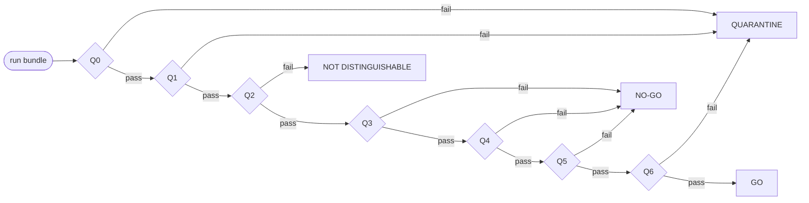

```python
def gate(bundle, policy) -> Verdict:
    if not (bundle.manifest_resolved and bundle.replay_identical and bundle.aa_diff == 0):
        return Quarantine("Q0")
    if bundle.books_error or bundle.oracle_mismatch or leak_path_exists(bundle.run_id):
        return Quarantine("Q1")
    d = paired(bundle.treat, bundle.ref)                   # one number per world, CRN
    lo, hi = t_ci(d)
    if (lo <= 0 <= hi) or abs(mean(d)) < mde(d):
        return NotDistinguishable(mean(d), (lo, hi), mde(d))
    if not all(w.floor_met for w in bundle.treat.worlds):
        return NoGo("Q3 floor", worst=min_margin(bundle.treat))
    if min_margin(bundle.treat) < min_margin(bundle.ref) - policy.eps_margin:
        return NoGo("Q3 margin")
    if sign(bundle.delta("true_iroas_offtake")) != sign(mean(d)):
        return NoGo("Q4 causal")
    if policy.requires_hidden:
        h = bundle.hidden                                  # seedset marked spent on read
        if h is None or not h.floor_all or h.lift < policy.min_hidden_lift:
            return NoGo("Q5")
    if not provenance_complete(bundle) or bundle.seed_reuse or not bundle.signed_off:
        return Quarantine("Q6")
    return Go()
```

**Gate policy per context:**

| Context | Gates | Worlds | Seeds | Time budget |
|---|---|---|---|---|
| PR (CI) | Q0–Q4 | suite-selected dev + 3 perturbed | search set | ≤ 15 min |
| Local dev (MCP) | Q0–Q3 | user-chosen | search set | interactive |
| Nightly | Q0–Q4 + claims audit | dev + all perturbed | rotating nightly set | ≤ 3 h |
| Release | Q0–Q6 | dev + perturbed + thin-margin | fresh one-shot set | ≤ 1 day |

### 3.3 Front doors: CLI, MCP, CI

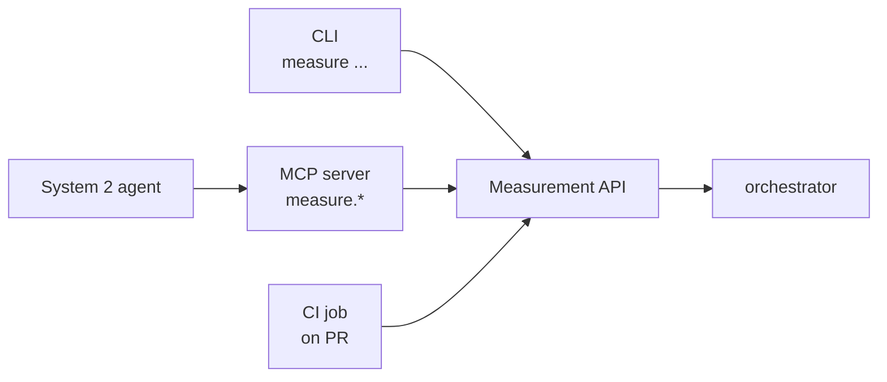

```bash
measure run     --subject pack:aurel-brand@HEAD --suite pr --budget 15m
measure compare --treat run_A --ref run_B
measure gate    --run run_A --policy gate:pr@v1
measure why     --action act_01JC…
measure impact  --rule rule.headroom.min_allowance@2
measure claims  --pack pack:aurel-brand@HEAD
```

| MCP tool | Input | Output | Oracle visible? |
|---|---|---|---|
| `measure.run` | subject (pack/arm), suite or worlds, seed set | `run_id`, status | no |
| `measure.compare` | two run IDs | paired lift, t-CI, sign-flip p, MDE, floor margins | aggregates only |
| `measure.gate` | run ID, gate policy | verdict per Q gate | verdict only |
| `measure.why` | `act_` / `dec_` ID | provenance chain | no |
| `measure.impact` | rule version | decisions, actions, claims touched | no |
| `measure.claims` | pack ref | claims audit table | verdicts only |
| `measure.propose_experiment` | hypothesis + design | `exp_` ID (queued, not run) | no |

**MCP tools never return oracle rows.** Truth-plane isolation applies to agents too.

```python
def select_suite(change_manifest, budget_s, history) -> Suite:
    touched = modules_touched(change_manifest)             # e.g. {"tools/headroom.py", "packs/aurel"}
    tests = [t for t in registry.active_tests() if t.covers & touched]
    tests += registry.always_run()                         # Q0/Q1 sanity: A/A, books, oracle match
    tests.sort(key=lambda t: history.regression_recall(t) / t.cost_s, reverse=True)
    return Suite(take_until(tests, budget_s))
```

### 3.4 Measurement for System 1 vs System 2

| | **(a) For System 1: gate + monitor** | **(b) For System 2: learn + attribute** |
|---|---|---|
| Question | is *this* change safe and better than its parent? | what should change, and did the last change cause the outcome? |
| Unit | a pack diff or code diff | a hypothesis over rules, scopes and triggers |
| Where | simulator (CRN, oracle), replay; live = health only | live outcomes, with simulator confirmation |
| Comparison | paired, same seed, same draws | holdouts, switchbacks, city splits, or sim replay |
| Truth access | oracle allowed on the evaluator side | none live; oracle only through sim confirmation |
| Signals | lift, floor margin, true iROAS, funnel, block rates | implicit outcomes, explicit chat feedback |
| Main risk | false GO (bench Goodhart, seed reuse) | own-action confounding (E5), delayed reward |
| Latency | minutes → hours | days → weeks |
| Output | GO / NO-GO / NOT DISTINGUISHABLE / QUARANTINE | hypothesis ledger update + CandidateSpec |
| Stats | t-CI, exact sign-flip at n ≤ 16, per-comparison MDE | sequential tests with a spend cap, CUPED-style variance reduction, Bayesian ledger update |

#### Runtime health monitors (System 1, live)

These detect problems. They never prove lift.

| Monitor | Formula | Alert when | Response |
|---|---|---|---|
| floor margin | dROAS-to-date − floor × 1.02 | below worst margin seen in qualifying sims | switch incident overlay: freeze raises |
| forecast calibration | realized / projected Δspend, per action type | outside [0.5, 2.0] for 2 cycles (today 1.47× / 3.95× / 2.18×) | open `exp_` on the projection |
| rule fire count | firings per rule per cycle | 0 for N cycles | claims audit flags `no longer fires` |
| guard block rate | blocked / proposed, per G-rule | G8 = 0 for N cycles, or any rule > 20% | open `exp_` |
| leaf default rate | defaults / calls, per leaf | > 30% | check provider; leaves fail soft anyway |
| fallback rate | runs with `fallback_reason` | > 0 | page owner |
| input drift | search volume, CPM, OSA vs pack's qualifying bands | outside band | mark pack `out_of_envelope`; re-qualify |

```python
def monitor_cycle(decisions, outcomes, pack):
    alerts = []
    m = floor_margin(outcomes)
    if m < pack.qualified.worst_sim_margin:
        alerts.append(Alert("floor_margin", m, action="incident_overlay:freeze_raises"))
    for typ, ratio in calibration(decisions, outcomes).items():
        if not 0.5 <= ratio <= 2.0:
            alerts.append(Alert("calibration", (typ, ratio), action="open_experiment"))
    for rule, n in fire_counts(decisions).items():
        if n == 0 and pack.rule(rule).expects_firing:
            ledger.bump_silent(rule)
    if drift(outcomes, pack.qualified.envelope):
        alerts.append(Alert("drift", action="mark_out_of_envelope"))
    return alerts                                          # alerts open experiments; they never edit packs
```

### 3.5 Feedback for System 2: implicit and explicit

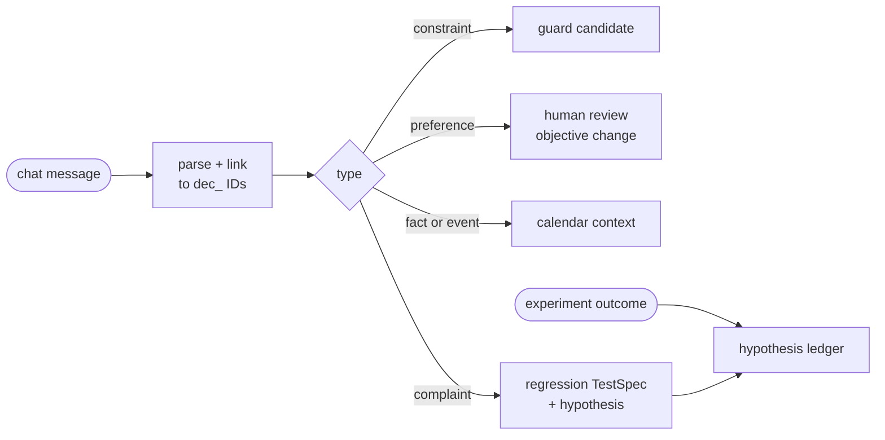

| Type | Example | Becomes | Path to System 1 |
|---|---|---|---|
| constraint | "never raise bids on competitor keywords for Aurel" | `guard` candidate (tighten-only) | fast lane: Q-static + Q0–Q3 cost report + owner sign-off |
| preference | "new-SKU reach matters more than ROAS this month" | objective weight change | **never automated** |
| fact / event | "DEL soap launch on 12 Oct" | calendar event in the observation | not a rule; public context |
| complaint / label | "that K03 cut last week was wrong" | labelled decision → regression test + hypothesis | normal promotion if a rule changes |
| implicit outcome | holdout shows K03 raises lost offtake | hypothesis ledger update | normal promotion |

```python
def ingest_feedback(msg, author):
    fb = Feedback.new(text=msg, author=author)             # fb_<ulid>
    fb.decisions = link_to_decisions(msg, window_days=14)  # dec_ / act_ IDs mentioned or implied
    fb.type, fb.parsed = classify(msg)                     # offline LLM; output is schema-validated
    match fb.type:
        case "constraint": candidates.stage(guard_from(fb.parsed), lane="fast", source=fb.id)
        case "preference": reviews.open(fb, owner="objective-owner")
        case "fact":       calendar.add(fb.parsed.event, source=fb.id)
        case "complaint":  tests.register(regression_from(fb.decisions), source=fb.id)
                           ledger.add_hypothesis(fb.parsed.claim, evidence=[fb.id])
    evidence.append(fb)
```

### 3.6 Statistical rules (learned the hard way)

| Rule | Why | Enforced at |
|---|---|---|
| Student-t CIs + exact sign-flip at n ≤ 16 | percentile bootstrap was too narrow at n = 6 | `stats.py`, Q2 |
| per-comparison MDE | each comparison has its own spread | Q2 |
| floor + margin with every lift | one missed floor voids the score | Q3, every report |
| never reuse a confirmation seed set | dev6 "cuts net-negative" didn't replicate | seed ledger, Q6 |
| judge rules on thin worlds | fixed 3000 passed on average, failed seed 1002 | Q5 world set |
| stamp results with code hash | the harness drifted during the work | Q0, run key |

### 3.7 Scenarios

| # | Scenario | Path through Measurement | Outcome |
|---|---|---|---|
| M-a | **Dev tries `shocks.z_reach = 2.0` locally** via MCP | `measure.run` → `measure.compare` vs HEAD on search seeds | NOT DISTINGUISHABLE (illustrative); nothing recorded as a claim |
| M-b | **PR edits `tools/headroom.py`** | CI suite select → headroom tests + A/A + oracle checks → Q0–Q4 | PR comment with verdict table |
| M-c | **Harness drift**: another session edits `policy.py` | equivalence test fails → Q0 QUARANTINE | runs blocked until switchable policy is re-synced |
| M-d | **Live floor margin falls** in week 5 | monitor alert → incident overlay freezes raises → `exp_` opened | pack unchanged; overlay expires in 7d |
| M-e | **Chat: "stop raising competitor keywords"** | constraint → guard candidate → cost report (Δ offtake) → sign-off | guard shipped in brand overlay with its measured cost |

---

## 4. System 2: the learner (light)

Notebook p.15: *ingest trace → expand → ReAct → propose experiment OR promote runtime*.

### 4.1 The loop

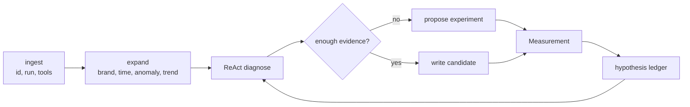

| Step | EnvRigger | Here | Tooling |
|---|---|---|---|
| Interact | rollouts | System 1 runs → DecisionRecords | `measure.run` |
| Ingest + expand | read trajectories | evidence query + brand/time/anomaly/trend context | read-only evidence API |
| Diagnose | find a systemic flaw | ReAct over S1's tools + evaluator probes (X0–X19) | `measure.*` via MCP |
| Write | write a component | C-Spec delta (C-Method later) | CandidateSpec |
| Validate | fresh rollouts | Q0–Q4 on search worlds; revise up to 3 times | ExperimentSpec |
| Promote | stack the component | Q5 → shadow → canary → active | PromotionRecord |

### 4.2 Hypothesis ledger

```yaml
hypothesis:
  id: hyp_01J8…
  statement: "the headroom gate throttles raises while floor margin goes unused"
  status: supported            # open | supported | refuted | superseded
  evidence:
    - {exp: exp_X2-gate-sweep, effect_pp: +0.86, worlds: fresh20, floor: 20/20}
    - {exp: exp_X2-1b,         effect_pp: +0.32, worlds: 2001-2010, floor: 10/10}
  competing: [hyp_01J8…cuts_are_waste]          # refuted on fresh20 (+0.05, CI spans 0)
  next_experiment: exp_X7.3-perturbed
  code_hash: 63196db22b74
```

| Field | Purpose |
|---|---|
| `statement` | falsifiable claim about System 1 |
| `competing` | rival hypotheses; acquisition prefers experiments where they disagree (X8) |
| `evidence` | experiment IDs with effect, worlds, floor |
| `next_experiment` | the most discriminating experiment not yet run |
| `code_hash` | evidence goes stale when the code moves |

### 4.3 Diagnose and write (pseudocode)

```python
def system2_cycle(window, budget_usd=55):
    traces = evidence.query(window, fields=POLICY_VISIBLE)
    ctx = expand(traces, brand=True, calendar=True, anomalies=True, trends=True)
    for hyp in react_diagnose(ctx, tools=MCP_MEASURE_TOOLS, budget=budget_usd):
        ledger.upsert(hyp)
        if hyp.needs_evidence:
            measure.propose_experiment(most_discriminating(hyp, ledger))
            continue
        cand = write_cspec_delta(hyp)                      # param / threshold / toggle / guard only
        for attempt in range(3):                           # revision budget
            v = measure.gate(measure.run(cand, suite="search"), policy="gate:candidate@v1")
            if v.ok:
                candidates.stage(cand, verdict=v)          # Q5 + rollout happen in §7
                break
            cand = revise(cand, v.diagnostics)
        else:
            ledger.mark(hyp, "candidate_failed", last=v)
```

**Fitness** (Meta-Agent deck): `F = paired lift | floor gate − α·$/run − β·blocked share − γ·risk`. A candidate that wins *only* with runtime LLM leaves turned on is reported and shipped as a tool, not claimed as "AI value".

### 4.4 What System 2 may and may not do

| May | May not |
|---|---|
| read policy-visible evidence | read W_h seeds or oracle rows |
| propose experiments and candidates | run gates on its own candidates |
| write C-Spec deltas (param, threshold, toggle, guard) | edit `gpc/`, guardrails, or `harness/` code |
| tune leaf triggers | widen leaf freedom (new levers, wider clips) |
| suggest objective changes for review | change the objective or relax the floor |
| version a metric | change metric semantics in place |

### 4.5 Scenarios

| # | Scenario | System 2 steps | Result |
|---|---|---|---|
| S2-a | **Gate throttling** (real) | X2 sweep → hypothesis → fixed-3000 candidate fails Q3 on seed 1002 → revise to state-dependent → passes on 2001–2010 | candidate in Shadow pending X7.3 |
| S2-b | **Leaf triggers too rare** (real data, illustrative fix) | L1/L2/L6 fire 0.3/1/0.2 per run → hypothesis "triggers too strict" → candidate `shocks.z_reach@2 = 2.0` | measured in sim with scripted-LLM bounds first; real slice only if bound > MDE |
| S2-c | **Complaint about a K03 cut** | fb → regression test → ledger "cuts on brand K03 hurt offtake" → X3.3 per-action counterfactual | refuted or a scoped `guard` candidate |
| S2-d | **Live calibration drift** | monitor alert → hypothesis "budget raise projection under-forecasts 3.95×" → experiment on projection | code change proposal to harness owner (not a pack change) |

---

## 5. Identity and provenance

### 5.1 IDs

All IDs are ULIDs with a type prefix: sortable, unique, readable in logs.

| Prefix | Object | Created by | Immutable fields |
|---|---|---|---|
| `hyp_` | Hypothesis | S2 / human | statement |
| `exp_` | Experiment: hypothesis + design | S2 / human | spec hash |
| `cand_` | Candidate pack diff | S2 / dev | diff hash, parent pack |
| `run_` | Measurement run (one manifest) | Measurement | manifest hash |
| `sim_` | One `simulate()` call | S1 runtime | world, seed, pack_hash, code_hash |
| `dec_` | One `recommend()` | S1 runtime | obs_digest, pack_hash |
| `act_` | One proposed action + guardrail fate | S1 runtime | rule firings, lineage |
| `tc_` / `leaf_` | Tool call / LLM leaf call | S1 runtime | input digest, cache key, usage |
| `fb_` | Feedback item | chat ingest | text, author, linked `dec_` |
| `prom_` | Promotion record | Measurement | gate verdicts, approver |
| `rule.<name>@vN` | Rule version | registry | value, claim |
| `pack:<name>@<semver>` | Pack release + sha256 | registry | content |
| `seedset:<name>` | Seed set + spent status | Measurement | seeds |

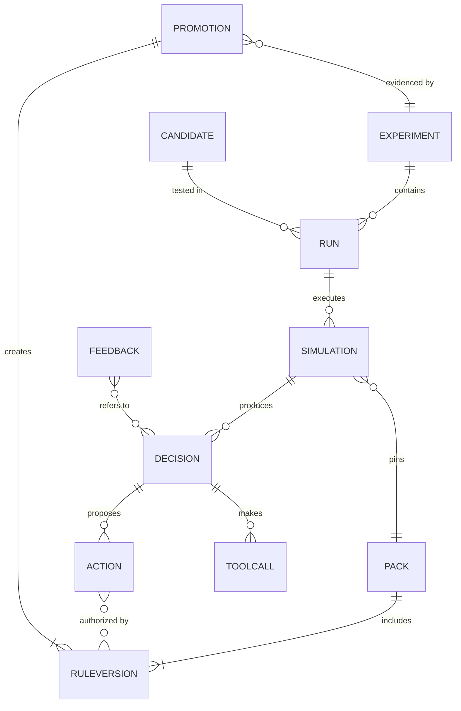

### 5.2 DecisionRecord (RunTrace v2)

| Field | Exists today | New | Why |
|---|---|---|---|
| policy, simulation_id, run, day, date | ✓ | | identity |
| params_version, depth | ✓ | | what config decided |
| obs_digest | ✓ | | replay check |
| funnel counts, headroom | ✓ | | decision funnel |
| leaf_calls, usage, fallback_reason | ✓ | | LLM accounting |
| `decision_id` | | ✓ | addressable decision |
| `world` {scenario, seed, seedset} | | ✓ | which world (missing today) |
| `code_hash`, `pack` {ref, hash} | | ✓ | which code and rules |
| `rule_firings` | | ✓ | retirement + provenance |
| per-action `action_id`, `lineage`, `guardrail.fate` | | ✓ | trajectory as a DAG |
| `tool_calls` with digests | | ✓ | "which tool produced this number?" |

```json
{
  "decision_id": "dec_01JC4…",
  "simulation_id": "sim_01JC3…",
  "world": {"scenario": "dev", "seed": 7, "seedset": "seedset:search"},
  "code_hash": "63196db22b74",
  "pack": {"ref": "pack:aurel-brand@2026.10.05.1", "hash": "sha256:7c1e…"},
  "rule_firings": [
    {"rule": "rule.headroom.min_allowance@3", "effect": {"allowance_inr_day": 1500}},
    {"rule": "rule.budget.runout_min_days@1", "matched": 6}
  ],
  "actions": [
    {"action_id": "act_01JC5…", "campaign_id": "C-S1-BLR", "action_type": "increase_budget",
     "new_value": 7290,
     "lineage": ["tc_diag_…", "M_Budget", "tc_project_…", "rule.headroom.min_allowance@3",
                 "tc_sizing_…", "tc_precheck_…"],
     "leaf_calls": [],
     "guardrail": {"fate": "shipped", "clamped_by": null}}
  ],
  "tool_calls": [{"id": "tc_sizing_…", "tool": "sizing.select_raises", "in_digest": "…", "out_digest": "…", "ms": 41}]
}
```

### 5.3 Run manifest (Measurement side)

```yaml
run_id: run_01JC7…
experiment_id: exp_01J9…            # null for plain CI runs
candidate_id: cand_01JB…            # null for baseline/regression
subject:   {pack: "pack:aurel-brand@cand_01JB…", pack_hash: sha256:…, code_hash: 63196db22b74}
reference: {pack: "pack:aurel-brand@2026.10.03.0", pack_hash: sha256:…}
worlds:    {scenario_refs: [dev, P1..P13], seedset: seedset:fresh-3001-3010, crn: true}
metrics:   [metric:offtake@v1, metric:direct_roas@v1, metric:true_iroas@v1, metric:floor_margin@v1]
gate: gate:release@v1
params_resolved: {headroom.min_allowance_inr_day: {fn: state_min, run1_inr: 1500, cap_inr: 3000}}
llm: {mode: replay, model: null, max_usd: 0}
manifest_hash: sha256:…
```

### 5.4 Provenance edges and queries

| Edge | From → To | Written by |
|---|---|---|
| `DERIVED_FROM` | act → dec, act → tc | S1 |
| `AUTHORIZED_BY` | act → rule version | S1 |
| `USED` | dec → pack, tc → dataset digest | S1 |
| `PART_OF` | run → exp, sim → run | Measurement |
| `EVIDENCED_BY` | prom → run | Measurement |
| `PROMOTED_BY` | rule version → prom | registry |
| `SUPERSEDES` | rule@v3 → rule@v2 | registry |
| `MOTIVATED_BY` | exp → hyp, hyp → fb | S2 |
| `RETIRED_BY` | rule version → prom (retirement) | registry |

#### Backward chain from one action

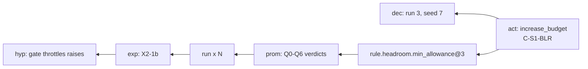

#### Forward impact from one rule

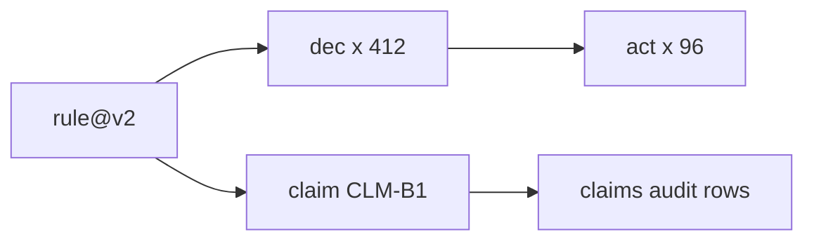

| Query | Command | Pseudocode |
|---|---|---|
| why this action? | `measure why act_…` | `walk(act, edges=[DERIVED_FROM, AUTHORIZED_BY, PROMOTED_BY, EVIDENCED_BY, PART_OF, MOTIVATED_BY])` |
| what did a rule touch? | `measure impact rule.x@v2` | `walk_reverse(rule, edges=[AUTHORIZED_BY])` grouped by dec, act, claim |
| did truth leak? | nightly Q1 job | `exists_path(oracle_only_entities, any dec input)` → incident |
| which rules came from user feedback? | `measure query` | `rules where path(rule → prom → exp → hyp → fb)` |

```python
def why(action_id):
    chain, node = [], graph.get(action_id)
    while node:
        chain.append(node)
        node = graph.first(node, edges=["AUTHORIZED_BY", "PROMOTED_BY", "EVIDENCED_BY", "PART_OF", "MOTIVATED_BY"])
    return chain                                           # act -> rule -> prom -> run -> exp -> hyp (-> fb)

def leak_check(run_id):
    oracle = graph.entities(visibility="oracle_only", run=run_id)
    policy_inputs = graph.entities(kind=["dec", "tc"], run=run_id)
    return [p for p in graph.paths(oracle, policy_inputs)]  # any path = Q1 incident
```

Storage follows doc 02 §25: relational edges (`provenance_edge(src, type, dst, run_id, at)`), Parquet for run results, JSONL for traces, content-addressed artifacts on disk now and S3 later. No graph DB in v1.

### 5.5 Scenario: "why did C-S1-BLR's budget go up 1.5× on day 42?"

| Hop | Answer |
|---|---|
| action | `act_01JC5…` increase_budget 4,860 → 7,290, shipped |
| decision | `dec_01JC4…`, run 3, seed 7, pack `aurel-brand@2026.10.05.1` |
| rules fired | `budget.runout_min_days@1` (ran out 6/7 days), `headroom.min_allowance@3` (allowance 1,500) |
| tool calls | `sizing.select_raises` chose it at a projected ratio of 1.9 |
| promotion | `prom_01JA…` promoted `min_allowance@3` with Q0–Q4 pass, Q5 partial |
| experiment | `exp_X2-1b`, runs on seeds 2001–2010, floor 10/10, +0.32pp |
| hypothesis | "gate throttles raises", from the X2 gate sweep |

*Values in this table are illustrative of the chain's shape.*

---

## 6. How the systems couple

### 6.1 Contracts (the only coupling)

| # | From → To | Artifact | Rule |
|---|---|---|---|
| C1 | S1 → Evidence | DecisionRecord | append-only; S1 write-only |
| C2 | Env → Evidence | outcomes (facts, campaign_daily, sku_city_daily) | append-only |
| C3 | Chat → Evidence | `fb_` items | append-only |
| C4 | Evidence → S2 | read-only query (policy-visible fields) | no oracle |
| C5 | S2 → Measurement | CandidateSpec + ExperimentSpec | S2 requests; it does not gate |
| C6 | Measurement → Registry | PromotionRecord (or rejection) | only Measurement writes promotions |
| C7 | Registry → S1 | `pack@hash` (signed) | S1 pulls and pins per run |

### 6.2 One weekly decision cycle

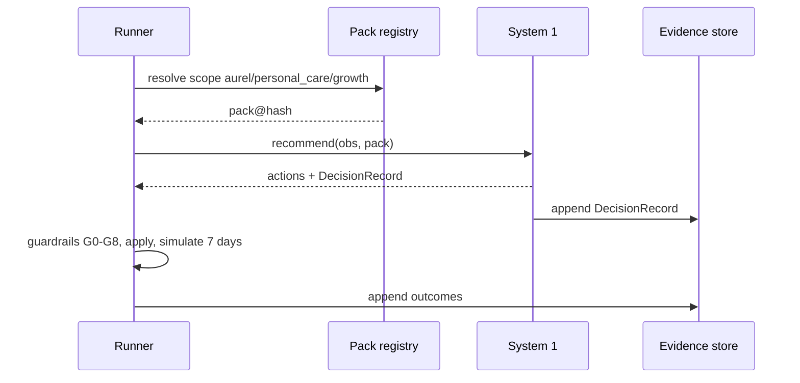

### 6.3 One promotion cycle

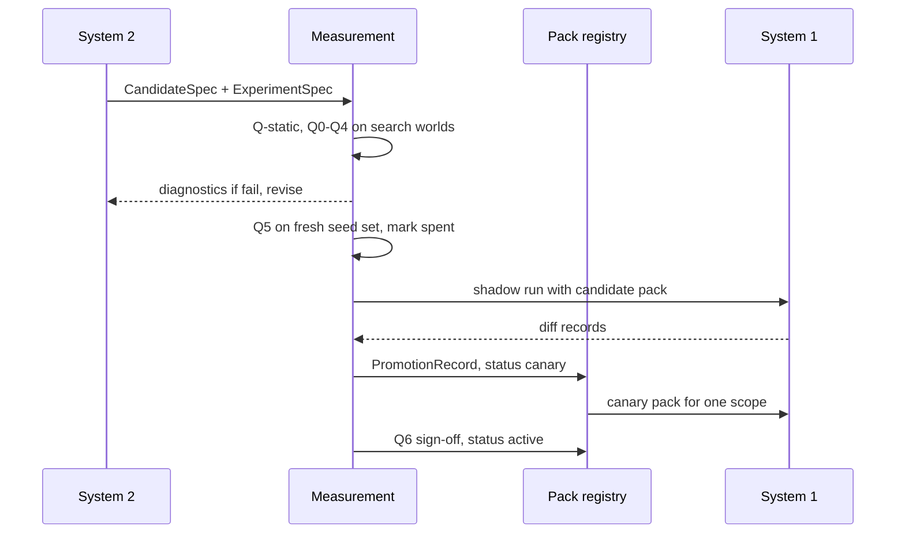

### 6.4 Coupling modes

| Mode | Cadence | Trigger | Who approves | When |
|---|---|---|---|---|
| batch | weekly at most | human or S2 run | owner | now |
| scheduled | nightly S2 run; release when Q5 seeds and canary allow | cron | owner | P4 |
| event-triggered | on monitor alert | alert opens `exp_` | owner; incident overlay is the only fast path | P5 |
| in-loop (S2 inside S1) | — | — | — | **never**: breaks determinism and replay |

### 6.5 Coupling hazards

| Hazard | Example from our runs | Guard |
|---|---|---|
| self-confounding | E5: MUM reach moved with our own bid cuts | `own_action_confound` flag in evidence; live hypotheses need a holdout or sim confirmation |
| bench Goodhart | dev6 "cuts net-negative" did not replicate on fresh20 | Q5 on one-shot seeds; claims audit |
| stale evidence | A1 +0.82% (old code) → +0.234% (current) | `code_hash` + `pack_hash` on every claim |
| parallel owners | two sessions confirmed on the same seeds | seed ledger with an owner per set |
| non-additive chains | gate + cuts removal breaks the floor in 9/20 | interaction test (§8.4) |

### 6.6 Scenario: an alert couples the systems for one week

| Day | Event | System | Artifact |
|---|---|---|---|
| D | floor margin below worst sim margin | S1 monitor | alert |
| D | incident overlay "freeze raises, 7d" applied (tighten-only) | registry | `pack:…+incident@…` |
| D+1 | S2 diagnoses: budget raises under-projected 3.95× | S2 | `hyp_…` |
| D+2 | experiment: projection with a 2× correction factor | Measurement | `exp_…`, runs |
| D+5 | candidate fails Q2 (not distinguishable) | Measurement | diagnostics → S2 |
| D+7 | incident overlay expires; pack returns to normal | registry | tombstone |

*Illustrative timeline.*

---

## 7. Promotion: from System 2 outcome to deterministic System 1

### 7.1 Before the hidden set

```mermaid
flowchart LR
    D["Draft<br/>C-Spec delta"] --> QS{"Q-static"}
    QS -- "fail" --> D
    QS -- "pass" --> SB{"Sandbox<br/>Q0-Q4 on search worlds"}
    SB -- "fail, revise up to 3" --> D
    SB -- "pass" --> HD{"Hidden<br/>Q5 on fresh seeds"}
    HD -- "fail" --> RJ["Rejected<br/>seed set spent"]
    HD -- "pass" --> SH["Shadow"]
```

### 7.2 Rollout

```mermaid
flowchart LR
    SH["Shadow<br/>compute both, ship parent"] --> RV{"diffs reviewed<br/>monitors clean"}
    RV -- "no" --> RJ["Rejected"]
    RV -- "yes" --> CN["Canary<br/>one brand or category"]
    CN --> MO{"monitor breach?"}
    MO -- "yes" --> RB["auto-revert<br/>to parent pack"]
    MO -- "no" --> Q6{"Q6 sign-off"}
    Q6 -- "yes" --> AC["Active"]
    Q6 -- "no" --> RB
```

| Stage | Entry needs | Evidence produced | Exit to | Typical time |
|---|---|---|---|---|
| Draft | hypothesis + C-Spec delta | — | Q-static | minutes |
| Q-static | — | lint report, relax/tighten class | Sandbox | seconds |
| Sandbox | static pass | paired runs on search worlds, Q0–Q4 | Hidden / revise | 15 min–3 h |
| Hidden | sandbox pass | Q5 on a one-shot seed set + perturbed + thin worlds | Shadow / Rejected | hours |
| Shadow | Q5 pass (or partial, see §7.7) | diff records vs parent, ≥ 1 cycle | Canary | 1 cycle |
| Canary | clean shadow | live outcomes in one scope + monitors | Active / revert | 1–2 cycles |
| Active | Q6 sign-off | PromotionRecord | — | — |

### 7.3 Static gate

```python
ALLOWED_TARGETS = PARAMS_FIELDS | METHOD_TOGGLES | THRESHOLDS | CHAIN_STEPS
FORBIDDEN_REFS  = {"truth", "gpc.market", "gpc.scenarios", "harness_eval", "oracle"}

def q_static(delta, parent) -> StaticReport:
    errs = schema_errors(delta, "harness/v1")
    for r in delta.rules:
        if r.target_key not in ALLOWED_TARGETS:              errs.append(f"{r.id}: unknown target")
        if refs(r) & FORBIDDEN_REFS:                         errs.append(f"{r.id}: oracle reference")
        if parent.has(r.id, r.version):                      errs.append(f"{r.id}@{r.version}: in-place edit")
        if r.kind in {"param", "threshold", "toggle", "chain"} and not r.claim:
                                                             errs.append(f"{r.id}: missing claim")
        if r.kind == "override" and not r.expires_at:        errs.append(f"{r.id}: override without expiry")
        if introduces_lever(r):                              errs.append(f"{r.id}: new lever")
    cls = "relax" if any(is_relaxation(parent.get(r.target_key), r) for r in delta.rules) else "tighten"
    return StaticReport(ok=not errs, errors=errs, change_class=cls)
```

### 7.4 Shadow diff

Shadow is cheap because actions are deterministic and replayable. System 1 runs both packs on the same observation and ships only the parent's actions.

```python
def shadow_cycle(obs, parent, cand):
    a_par, rec_par = system1.recommend(obs, parent)
    a_can, rec_can = system1.recommend(obs, cand)
    diff = ShadowDiff(
        decision_id=rec_par.decision_id, candidate=cand.ref,
        added=a_can - a_par, removed=a_par - a_can,
        resized=[(x, y) for x, y in matched(a_par, a_can) if x.new_value != y.new_value],
        proj_delta_spend=proj(a_can) - proj(a_par),
    )
    evidence.append(diff)
    return a_par                                           # the market only ever sees the parent's actions
```

| Diff field | Review question |
|---|---|
| `added` | are new actions on the expected cells, for the stated reason? |
| `removed` | is anything protective (cuts, holds) disappearing? |
| `resized` | are size changes inside the claim's expected range? |
| `proj_delta_spend` | does the projected spend stay inside the allowance? |

### 7.5 Canary and auto-revert

```python
def canary(cand, scope, cycles=2):
    registry.pin(scope, cand)                              # one brand or category only
    for _ in range(cycles):
        alerts = monitor_cycle(*evidence.cycle(scope), cand)
        if any(a.kind in {"floor_margin", "fallback"} for a in alerts):
            registry.pin(scope, cand.parent)               # revert is a pin change, no deploy
            return Verdict("reverted", alerts)
    return Verdict("ready_for_q6")
```

### 7.6 PromotionRecord

```yaml
promotion_id: prom_01JA…
candidate_id: cand_01JB…
rule_changes: [{id: rule.headroom.min_allowance, from: 2, to: 3}]
pack: {from: "pack:qcom-base@2026.10.03.0", to: "pack:qcom-base@2026.10.05.1", to_hash: sha256:…}
experiment_id: exp_01J9…
evidence:
  search:    {run_ids: [run_…], worlds: dev6, lift_pp: +0.80, floor_met: 6/6}
  hidden:    {run_ids: [run_…], seedset: seedset:2001-2010, lift_pp: +0.32, floor_met: 10/10}
  perturbed: {run_ids: [run_…], worlds: P1–P13, status: pending}     # blocks Active, allows Shadow
gates: {Q0: pass, Q1: pass, Q2: pass, Q3: pass, Q4: pass, Q5: partial, Q6: pending}
claim: {id: CLM-B1b, expect: ">= +0.2pp vs parent, floor 100%", measured_on: {code_hash: 63196db22b74}}
approver: null
status: shadow
```

### 7.7 Worked example: the state-dependent minimum allowance (real)

| Step | What happened | Gate | IDs |
|---|---|---|---|
| Diagnose | removing the headroom gate gives +0.86pp on 20/20 fresh worlds; margin unused | — | `exp_X2-gate-sweep`, `hyp_gate_throttles` |
| Write v2 | fixed minimum 3,000 INR/day | Q-static pass | `cand_fixed3000` |
| Validate | +0.8pp, but missed the floor on seed 1002 (1/10 unseen) | **Q3 fail** | `seedset:1001-1010` spent |
| Revise | run 1 = 1,500; later = min(3,000, 1.0 × banked headroom) | Q-static pass | `cand_sm_r1500_c1.0` |
| Hidden | seeds 2001–2010: floor 10/10, +0.32pp | Q5 pass (dev-structure) | `seedset:2001-2010` spent |
| Open | X7.3 perturbed worlds outstanding | Q5 partial | **Shadow only** |
| Promote | harness owner applies `rule.headroom.min_allowance@3`; v1 retired | Q6 | `prom_…`, `SUPERSEDES` |

Today this chain lives in prose in `runtime_findings`. The proposal makes it machine-readable.

### 7.8 Deterministic after promotion: distilling LLM judgments into rules

Even when an LLM proposed a rule (System 2) or takes part at runtime (L1/L2), the promoted artifact is deterministic:
- C-Spec values are literals or named deterministic functions (`state_min`);
- promoted packs pin `prompt_ver`, `schema_ver` and model. The leaf cache key already includes all three;
- a stable L1/L2 judgment can be **distilled** into an L0 rule. That is the notebook's "promote runtime" arrow.

```mermaid
flowchart LR
    LC["leaf_calls<br/>from many decisions"] --> FIT["fit a threshold rule<br/>on leaf inputs"]
    FIT --> AG{"agreement with leaf<br/>on held-out calls"}
    AG -- "high" --> CAND["candidate L0 rule<br/>leaf call removed"]
    AG -- "low" --> KEEP["keep the leaf"]
    CAND --> PIPE["promotion pipeline"]
```

```python
def distill(leaf="L2_shock", min_agree=0.95):
    calls = evidence.leaf_calls(leaf, outcome="ok")
    train, held = split_by_world(calls)                    # never split within a world
    rule = fit_threshold(train, feature="z_reach", target="is_shock")     # e.g. z >= 3.0
    agree = mean(rule(c.ctx) == c.result.is_shock for c in held)
    if agree >= min_agree:
        return CandidateSpec(rule=f"shocks.auto_confirm_z@1 = {rule.cut}",
                             claim="matches L2 on >= 95% of calls, $0 per call",
                             removes_leaf_trigger_above=rule.cut)
```

*Illustrative: today L2 fires about once per run, so there are not yet enough calls to distill.*

### 7.9 Scenarios

| # | Scenario | Path | Outcome |
|---|---|---|---|
| P-a | `sm_r1500_c1.0` (real) | §7.7 | Shadow until X7.3 |
| P-b | **Guard from chat**: no competitor raises for Aurel | fast lane: Q-static (tighten) → Q0–Q3 cost report → sign-off | Active in brand overlay with measured cost |
| P-c | **Relaxation disguised as a guard** (raises `revise_max_pct`) | Q-static classifies it as relax → full pipeline | no fast lane |
| P-d | **Canary breach** | canary scope floor margin alert → auto-revert pin | Rejected, diagnostics to S2 |
| P-e | **Distilled shock rule** | §7.8 → normal pipeline | removes LLM calls if it passes |

---

## 8. Retiring stale rules, overrides and chains

### 8.1 Why rules go stale

| Trigger | Detector | Example |
|---|---|---|
| superseded | newer version promoted | `min_allowance@1` (300) → `@3` |
| expired | `expires_at` passed | brand launch hold on K03/DEL |
| claim drifted | audit verdict `changed since` / `contradicted` | A1 +0.82 → +0.234 after the sizing fix |
| dead rule | fire count ≈ 0, or ablation within noise | G8 never trims; precheck / reprice / sibling holds −0.04 / −0.04 / 0.00 |
| harmful | leave-one-out negative on fresh worlds | (none yet; `M_CompetitorCut` was removed by review) |
| assumption broken | inputs outside the qualifying envelope | shock detector works for OSA only (C4) |
| dependency stale | a metric or evaluator it was qualified on was re-versioned | `metric:true_iroas@v1 → v2` |

### 8.2 Lifecycle

```mermaid
flowchart LR
    AC["Active"] --> DP["Deprecated<br/>shadow-off for 1 cycle"]
    DP --> RT["Retired<br/>tombstone kept"]
    DP -- "shadow-off shows harm" --> AC
    AC --> SU["Superseded"]
    SU --> RT
    OV["Override active"] -- "expires_at" --> EX["Expired"]
    EX --> RT
```

| State | S1 behaviour | Provenance |
|---|---|---|
| Active | rule applied | firings recorded |
| Deprecated | rule applied; diff without it logged | shadow-off diffs |
| Superseded | new version applied | `SUPERSEDES` edge |
| Expired | not applied | `expired_at` |
| Retired | not applied | tombstone + `RETIRED_BY` prom; never deleted |

### 8.3 The claims audit (nightly)

This automates the A1–D claims table.

```python
def claims_audit(pack, seedset="nightly"):
    rows = []
    for r in pack.rules_with_claims():
        on  = measure.run(pack, seedset=seedset)
        off = measure.run(pack.without(r) if r.version == 1 else pack.with_version(r, r.version - 1), seedset=seedset)
        d = measure.compare(on, off)
        fires = evidence.fire_count(r, window="14d")
        verdict = (
            "no longer fires" if fires == 0 else
            "contradicted"    if d.sign != r.claim.sign and d.distinguishable else
            "changed since"   if r.claim.measured_on.code_hash != code_hash() and not r.claim.within(d) else
            "partly"          if not d.distinguishable else
            "holds"
        )
        rows.append(AuditRow(r, d, fires, verdict))
        if verdict in {"contradicted", "no longer fires"}:
            registry.set_status(r, "deprecated")           # shadow-off next cycle; a human acks retirement
    for o in pack.overrides():
        if o.expires_at - today() <= days(3):
            notify(o.owner, o)
    return rows
```

*Illustrative rows. "Measured now" values are placeholders except where §1 cites them.*

| Rule | Claim | Measured on | Measured now | Verdict | Action |
|---|---|---|---|---|---|
| `rule.headroom.min_allowance@3` | ≥ +0.2pp, floor 100% | 63196db2 | +0.29pp, floor 10/10 | holds | keep |
| `rule.precheck.enabled@1` | > 0 effect | 63196db2 | −0.04pp (p = 0.06); 0/442 precheck-passed actions blocked | partly | review: cheap insurance |
| `rule.g8_mirror@1` | trims over-spend | — | 442 = 442, fires 0× | no longer fires | deprecate, or fix the projection it relies on |
| `override.brand_k03_hold@1` | brand ask | — | expires 2026-10-19 | expiring | owner notified D-3 |

### 8.4 Overrides: precedence and conflicts

```mermaid
flowchart LR
    INC["incident<br/>tighten-only, 7d max"] --> PER["persona"]
    PER --> BR["brand"]
    BR --> CAT["category"]
    CAT --> BASE["base<br/>promoted only"]
```

The leftmost layer wins.

```python
def lint_conflicts(pack):
    by_target = group(pack.rules, key=lambda r: (r.lever, r.cell_scope))
    for target, rules in by_target.items():
        same_level = [g for g in group(rules, key=lambda r: r.layer).values() if len(g) > 1]
        if same_level:
            raise PackError(f"conflict at {target}: {[r.id for r in same_level[0]]}")
        if len(rules) > 1:
            report.shadowed(target, winner=rules[0], losers=rules[1:])
```

| Hygiene rule | Why |
|---|---|
| every override has `expires_at` and an owner | stops "temporary" becoming permanent |
| renewal = new version | each renewal leaves a provenance record |
| audit shows override age and actions changed last cycle | makes stale overrides visible |
| incident overlays are tighten-only and ≤ 7 days | the only fast path stays safe |

### 8.5 Chains: retire with an interaction test

Rules are not additive (gate × cuts). Before a rule in the chain is retired or relaxed, run a 2×2 test with each rule it shares a target or budget with:

```mermaid
flowchart LR
    P["parent<br/>rule on, neighbor on"] --> CMP["paired compare<br/>fresh + thin worlds"]
    A["rule off"] --> CMP
    B["neighbor off"] --> CMP
    AB["both off"] --> CMP
    CMP --> DEC{"rule off keeps floor<br/>and lift >= -MDE?"}
    DEC -- "yes" --> RET["retire rule<br/>update neighbor's claim"]
    DEC -- "no" --> KEEP["keep"]
```

```python
def interaction_test(rule, neighbor, worlds):
    arms = {"parent": pack, "-r": pack.without(rule), "-n": pack.without(neighbor),
            "-rn": pack.without(rule, neighbor)}
    res = {k: measure.run(v, worlds=worlds) for k, v in arms.items()}
    ok = res["-r"].floor_met_all and measure.compare(res["-r"], res["parent"]).mean >= -mde(res)
    if ok and not res["-rn"].floor_met_all:
        registry.update_claim(neighbor, add=f"provides floor insurance once {rule.id} is retired")
    return ok, res
```

Our data, read as this test (real, fresh20):

| Arm | vs L0 | Floor met | Reading |
|---|---|---|---|
| no headroom gate | +0.86pp | 20/20 | gate is a drag |
| no cuts | +0.05pp (CI spans 0) | 18/20 | cuts are floor insurance |
| no gate and no cuts | +1.06pp | 11/20 | **not additive**: removing both voids the score |

### 8.6 Scenarios

| # | Scenario | Detector | Path | End state |
|---|---|---|---|---|
| R-a | **G8 mirror never fires** | fire count 0 | audit → Deprecated → shadow-off shows no diff → ack | Retired, or kept if the projection fix makes it fire |
| R-b | **Launch hold expires** | `expires_at` | owner notified D-3 → no renewal | Expired → Retired |
| R-c | **iROAS metric re-versioned** | dependency stale | every claim measured on v1 re-audited on v2 | claims updated; some rules `changed since` |
| R-d | **Proposal to drop cuts** | S2 candidate | interaction test with the gate → floor fails in "both off" | cuts kept; claim updated to "floor insurance" |
| R-e | **Fixed minimum 300 superseded** | promotion of @3 | `SUPERSEDES` edge | @1 Retired, tombstone kept |

---

## 9. Build plan

| Phase | Scope | Reuses | Deliverables | Done when |
|---|---|---|---|---|
| **P0 · Measurement v0** (≈1 wk) | `measure` package + CLI around `experiments/lib`; run manifests; result store; seed ledger; `compare`/`gate` Q0–Q4 | runs.py, stats.py, oracle.py, arms.py, switchable_policy.py | CLI, manifest schema, Parquet + SQLite store | `measure run --suite pr` reproduces X2 dev6 bit-for-bit from a manifest |
| **P1 · Front doors** | MCP server (policy-visible only); CI job; claims ledger v0 | P0 | MCP tools, CI workflow, `measure claims` | a PR to `harness/` gets a Q0–Q4 verdict comment |
| **P2 · System 1 IDs** (proposal to harness owner) | `Params` → policy pack; `rule_id@v`; DecisionRecord v2 | trace/schema.py, config.py | pack schema, resolver, trace v2 | `measure why act_…` reaches a rule version |
| **P3 · Promotion pipeline** | candidate registry; Q-static; shadow diff; PromotionRecord; lifecycle; nightly audit | P0–P2 | registry, shadow runner, audit job | `sm_r1500_c1.0` is promoted with a full record |
| **P4 · System 2 light** | ingest + expand; ReAct diagnose; C-Spec candidates; hypothesis ledger; feedback typing | s2/arms.py, reward.py, learner_stub.py | S2 agent, ledger, feedback ingest | one S2-written candidate reaches Shadow |
| **P5 · Live** | health monitors; canary scoping; holdout/switchback designs | P3 | monitors, canary pins | a live canary auto-reverts on a floor-margin breach |

| Acceptance test | Phase | Checks |
|---|---|---|
| A/A = 0 from a manifest | P0 | Q0 wiring |
| replaying a manifest gives identical results | P0 | determinism |
| MCP `measure.compare` returns no oracle columns | P1 | truth-plane isolation |
| S9b still holds with packs and arbiter | P2 | invariant S1-1 |
| a relaxation cannot use the fast lane | P3 | Q-static classification |
| a spent seed set cannot be read twice | P3 | seed ledger |
| an expired override is not applied | P3 | lifecycle |

---

## 10. Open questions

| # | Question | Proposal | Decision owner |
|---|---|---|---|
| 1 | Should the arbiter guard re-run precheck and sizing after a revision? | yes; revision never touches the headroom allowance | harness owner |
| 2 | Brand/persona packs multiply the worlds Q5 needs. Base + brand-perturbed worlds, or brand simulators via a typed commerce adapter? | start with base + brand-perturbed | Arnab |
| 3 | Which live holdout design: cell-level holdouts, weekly switchbacks or city splits? | sets System 2's live MDE; pick after a power calculation | Siddarth / Nitesh |
| 4 | The floor uses direct ROAS, which rewards brand cannibalisation. Gate on iROAS (Q4) only, or propose an objective change? | Q4 now; objective change is human-governed | business owner |
| 5 | Who owns the pack registry and the seed ledger while `harness/` belongs to another session? | Measurement owns both | team |

---

### Appendix A: notebook → design mapping

| Notebook (14–15 Aug) | Here |
|---|---|
| System-1 measurement: runtime (trace) → procedural → CLI / MCP / CI/CD | §3.3 front doors; §5.2 DecisionRecord |
| System-2 evaluator: metrics / brand / guardrails (X0–X7, X8–X19) | §3.4 (b); Q gates §3.2 |
| L0 tools → "override L0 or rank L0 cand. or partially revise, light guardrail" | §2.3 arbiter |
| L1/L2 "type interface to commerce" | typed leaf contracts + domain adapter (open question 2) |
| Expert → arbiter / orchestrator → ranker + context → brand + historical performance | §2.3 arbiter inputs; §4.1 expand |
| S2: ingest trace → expand (brand, time, anomaly, trend) → ReAct → propose experiment OR promote runtime | §4.1; §7; §7.8 distillation |

### Appendix B: decks rendered for this design

`tools/pdf_to_grid.py` renders each PDF (or .pptx via LibreOffice) to `<deck>_grid/{slides/, grid-NN.png (2×2), overview.png}`. Duplicates are rendered once.

```bash
.paper2code_venv/bin/python tools/pdf_to_grid.py design/
```

| Deck | Used for |
|---|---|
| Universal_Measurement_Blueprint | Q gates, manifest, provenance event, plugin protocol |
| Architecting_Next_Generation_Agent_Evaluators | trace verifier / procedure checks for DecisionRecord lineage |
| The_Architecture_of_Deterministic_Agency | L0/L1/L2 layering, fail-soft, hypothesis ledger |
| Meta_Agent_Search_Architecture | C-Spec tier, static gate, search/hidden world split, search budget |
| Cost-Aware_Operator_Routing (×2) | when the arbiter should escalate to an LLM (gain − cost) |
