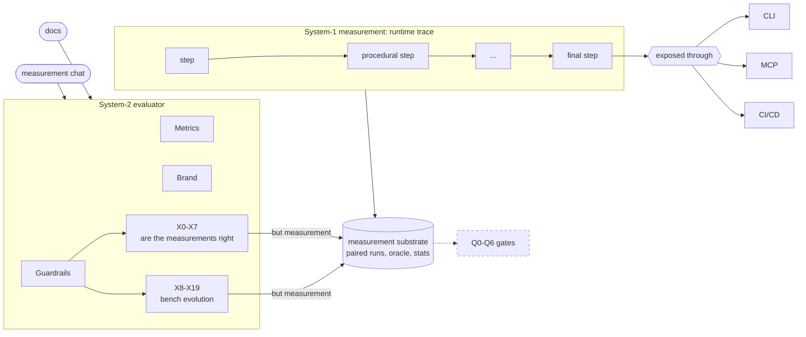
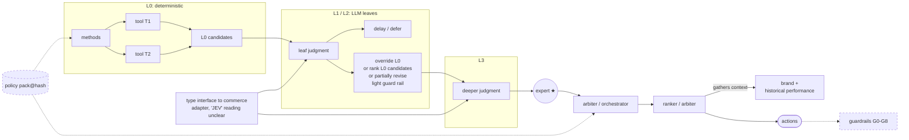
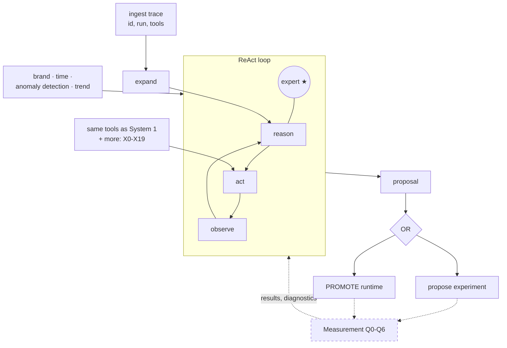
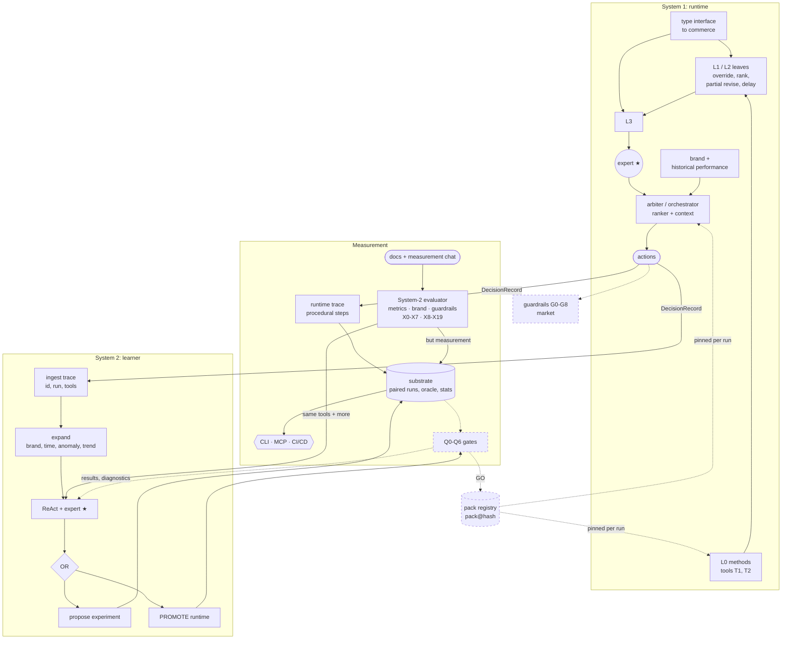

# The notebook, redrawn: System 1, Measurement, System 2

**Status:** companion to `01_system1_measurement_system2_coupling.md` · 2026-10-04 · **Source:** notebook pages for 14–15 August

This redraws the two notebook pages as mermaid: one diagram per block, then one combined diagram.

**Legend**
- **Solid** nodes and edges are on the notebook page.
- **Dashed** nodes and edges were added from the design doc so the picture is complete (guardrails, pack registry, gates).
- Where the handwriting is uncertain, the label says so.

| Block | Page | Diagram | Design doc sections |
|---|---|---|---|
| 1 · Measurement: System-1 runtime measurement + System-2 evaluator | 14 Aug (left) | §1 | 01 §3 |
| 2 · System 1: L0 → L1/L2 → L3, expert, arbiter | 15 Aug (right, top) | §2 | 01 §2 |
| 3 · System 2: ingest → expand → ReAct → propose experiment OR promote runtime | 15 Aug (right, bottom) | §3 | 01 §4, §7 |
| All three, coupled | both pages | §4 | 01 §6 |

---

## 1. Block 1: Measurement (14 Aug)

**On the page:** "System-1 Measurement: Runtime (trace)" is a procedural chain of steps, bracketed out to **CLI**, **MCP** and **CI/CD**. Below it, "System-2 evaluator", fed by **docs + measurement chat**, is a box with **Metrics**, **Brand** and **Guardrails**. Guardrails split into **X0–X7** and **X8–X19**, with the note **"But measurement"**: the evaluator is built on the same measurement substrate.

| Node | Meaning | In the design |
|---|---|---|
| runtime trace, procedural steps | each System 1 decision as a chain of tool steps | DecisionRecord lineage (01 §5.2) |
| CLI / MCP / CI/CD | three ways in to the same engine | front doors (01 §3.3) |
| Metrics / Brand / Guardrails | what the evaluator scores | MetricSpec, brand scope, floor + G0–G8 checks (01 §3.1) |
| X0–X7, X8–X19 | the experiment suites | evaluator plug-ins (Part 2 §3.9) |
| docs + measurement chat | how people talk to the evaluator | feedback typing (01 §3.5) |
| "but measurement" | the evaluator stands on the measurement substrate | one substrate, two consumers (01 §3.4) |

---

## 2. Block 2: System 1 (15 Aug, top)

**On the page:**
- **L0** calls tools **T1** and **T2**. A line runs from L0 to a **delay** box in **L1/L2**, and **L3** sits to the right.
- A note at the top reads *"(case of measurement) might need JEV adapter"*. The handwriting is unclear, possibly "JSON adapter". It points to **"type interface to commerce"**, which feeds L1/L2 and L3.
- Under L1/L2: **override L0, or rank L0 candidates, or partially revise, with a light guard rail**.
- An **expert ★** links to the **arbiter / orchestrator**. That leads to a **ranker / arbiter + gathers context**, and then to **brand + historical performance**.

| Node | Meaning | In the design |
|---|---|---|
| L0 + T1/T2 | deterministic methods calling typed tools | L0 pipeline (01 §2.1) |
| delay / defer | an L1/L2 leaf can hold a decision instead of acting | leaf default = L0 decision, fail-soft (01 §2.1) |
| override / rank / partially revise, light guard rail | what higher layers may do to L0 candidates | arbiter operations + guard (01 §2.3) |
| type interface to commerce | typed contract between leaves and the commerce domain | leaf schemas; open question 2 (01 §10) |
| expert ★ → arbiter → ranker + context | final ranking using brand and history | L3 arbiter (01 §2.3) |
| guardrails, policy pack (dashed) | added from the design | 01 §2.1, §2.4 |

---

## 3. Block 3: System 2 (15 Aug, bottom)

**On the page:**
- **Ingest trace** `[id, run, [tools]]` → **expand** → a **ReAct** loop with an **expert ★**.
- Context feeds in on the side: **brand, time, anomaly detection, trend**.
- Tools: **same tools + more (…) X0–X19**.
- Out: **propose experiment OR PROMOTE runtime**.

| Node | Meaning | In the design |
|---|---|---|
| ingest trace `[id, run, tools]` | read DecisionRecords | contract C4 (01 §6.1) |
| expand: brand, time, anomaly, trend | add context before diagnosing | System 2 loop (01 §4.1) |
| ReAct + expert ★ | diagnose with tools, guided by expert knowledge | diagnose step (01 §4.3) |
| same tools + more, X0–X19 | System 1's tools plus the evaluator suites | MCP `measure.*` (01 §3.3) |
| propose experiment | not enough evidence yet | `exp_` (01 §4.3) |
| PROMOTE runtime | candidate ready for the promotion pipeline | 01 §7 |
| Measurement (dashed) | added: every proposal goes through the gates | 01 §3.2 |

---

## 4. Everything together

The notebook draws a long line from the System 2 box up to the expert / arbiter in System 1. In the design, that line is the promotion path: candidate → Measurement gates → pack registry → System 1 pins the new pack.

The layout follows the notebook's reading order: System 1 at the top, Measurement on the left, System 2 below. The L0 and L1/L2 boxes are collapsed to single nodes here; §2 has the detail.

| Flow | On the page | In the design |
|---|---|---|
| System 1 actions → runtime trace | "runtime (trace)" | DecisionRecord, contract C1 |
| trace → System 2 ingest | "ingest trace [id, run, tools]" | contract C4 |
| evaluator suites → System 2 tools | "same tools + more X0–X19" | MCP `measure.*` |
| chat → evaluator | "docs + measurement chat" | feedback typing, contract C3 |
| propose experiment → measurement | "propose expt." | ExperimentSpec, contract C5 |
| promote runtime → System 1 | long line to expert / arbiter | Q gates → PromotionRecord → pack registry → pinned pack (contracts C6, C7) |
