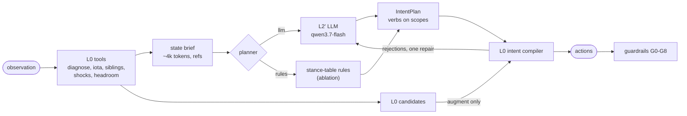
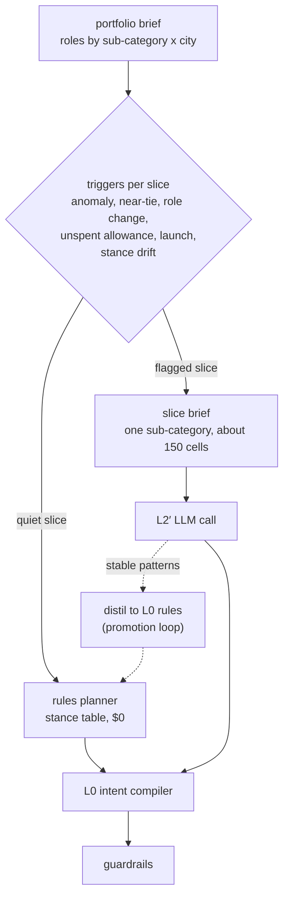

# L2′: an expressive LLM arm, the L0 interface that issues its actions, and how it scales

**Status:** built and measured, 2026-10-04 · **Code:** `grid-path-challenge/harness_l2p/` (new; `harness/` untouched) · **Experiment:** X8 (`experiments/x8_l2prime/`) · **Plan:** `plan_copies/2026-10-04-l2prime-expressive-arm-and-scale-plan.md` · **Builds on:** `explore_eda/EDA_REPORT.md` §10–11, design docs 01–02

---

## 0. TL;DR

1. **The LLM layers built so far could not help, by construction.** L1/L2 leaves only narrow or veto L0's candidates, and even perfect (oracle) answers add ≈ 0 (X5.1).
2. **L2′ is the expressive arm.** The LLM reads a ~4k-token state brief and proposes typed **intents** on any lever (bid up/down, pause, budget up/down, dayparts, lead/yield a market, hold) at any scope (SKU × city, keyword, keyword type, sub-category). The scope language covers brand / competitor / generic decisions per sub-category. A deterministic **L0 intent compiler** is the only thing that issues actions.
3. **The channel carries real value.** Oracle intents through the same compiler give **+0.88% (augment) and +0.96% (native) offtake vs L0**, better in 6/6 worlds, floor met 6/6. Random intents cost −0.6% to −0.9%, and the floor still held. Choices matter; safety holds.
4. **Rules alone are not enough.** The EDA stance table, applied mechanically, gives +0.11% / +0.21% (not significant). Converting the EDA's insight into gains needs judgment per world and run, which is the LLM's job and is under test.
5. **The real LLM (qwen3.7-flash) does not yet capture that value.** Over 6 worlds: L2′ augment **−0.09%** (CI −0.32 … 0.13), native **−0.42%** (−0.89 … 0.05) vs L0, floor 6/6. It gets the EDA's direction on brand, S3 and S4, but cuts competitor terms (~99% incremental) and sometimes the capped hero S1, and under-spends by ~6%, leaving most of the final run's allowance unused. The fixes are prompt, brief and compiler changes (§4.3.8). Real-LLM L1/L2 leaves change nothing (+0.01%).
6. **Scale.** Keep the cell math deterministic and spend LLM attention on *slices* (brand × sub-category) flagged by events. At 500 brands that costs about $10–70 per week on a flash model. **Latency, not money, is the constraint**: a reasoning plan takes 70–130 s, so plans must be computed ahead of the decision window.

---

## 1. Why L1/L2 could not add value, and what L2′ changes

L1/L2 leaves can only **narrow or veto** a candidate L0 already produced. They can rescale a tier-B raise, confirm a shock, pick between two near-tied siblings, or veto large raises. X5.1 measured them with an oracle answering every question perfectly, and they still added ≈ 0 (−0.05% to +0.02%). The questions they get asked are not where the value is.

The EDA says the value sits in decisions that no leaf can make:

| Where the offtake is (EDA) | Lever needed | L0 | L1/L2 | **L2′** |
|---|---|---|---|---|
| S1 is under-funded and capped; S3 and S5 are over-funded | move budget between SKU × city | budget raise only, by a fixed rule | — | raise_budget / cut_budget by role |
| Brand ≈ 10% incremental, competitor ≈ 99% | re-mix spend by keyword type within a SKU | — | — | cut_bid / raise_bid on a keyword_type scope |
| In 15 of 40 contested markets the wrong sibling leads | switch the leader | a hold-set only | tiebreak on near-ties only | lead_market / yield_market |
| Kids bar: a launch bet at iROAS ≈ 1 | cut, pause or daypart a tail SKU | — | — | cut_budget, pause, set_dayparts |
| Local surges, OSA dips | act on a cell, or hold a campaign | — | confirm a shock | raise_bid on the cell, hold the campaign |
| ~0.4 ROAS points of floor headroom unused | spend it on the best incremental options | allowance by a fixed schedule | — | intents compete for the allowance; cuts free more |

### Expressiveness ladder

| Layer | Proposes | Scope | Can invent a move L0 did not? |
|---|---|---|---|
| L0 | raises, cuts and budget raises from fixed rules | cell, campaign | — |
| L1/L2 | rescale, confirm, tiebreak, veto | one cell or market | no |
| **L2′** | any of the six levers, plus lead/yield and hold, with a stance per sub-category × keyword type × SKU role | cell, SKU × city, keyword, keyword type, sub-category, market | **yes**, through the compiler |

---

## 1b. The EDA evidence L2′ is built on

All numbers are from `explore_eda/EDA_REPORT.md` (dev scenario, baseline trajectory). Charts are in `explore_eda/figures/`.

| Evidence | Number | Design element it drives |
|---|---|---|
| Incrementality by keyword type (organic units lost per ad order, FE regression) | brand 0.90 (~10% incremental), generic 0.49, competitor 0.01 (~99%) | brief carries ι and iROAS; stance per keyword type |
| Direct vs incremental ROAS by SKU | S2 6.6× → 3.8×, S4 8.5× → 3.3×, S1 4.2× → 1.5×, S3 3.5× → 1.0×, S5 2.1× → 1.0× | roles use iROAS, not dROAS |
| Spend ÷ offtake share | S1 0.67 (under-funded), S3 1.31, S5 5.28 (over-funded) | budget reallocation verbs |
| Sub-category × type iROAS | Soap 1.1 / 0.7 / 1.5; Body Wash 6.4 / 1.4 / 4.1; Shower Gel 5.4 / 1.5 / 3.8 (brand / comp / generic) | stance table per sub-category |
| SKU × city roles | fund 3 cells (25% offtake, 13% spend); trim 8 cells (30% offtake, **42% spend**) | role table in the brief |
| Contested markets | spend leader ≠ most incremental sibling in 15/40 | lead_market / yield_market |
| Run-out | 6 campaigns capped every warm-up day; utilisation 78% | raise_budget / cut_budget |
| Anomalies | K07/K08 surges BLR → DEL (+48% to +108%); S2-HYD OSA 0.42; BLR K03 spike was the baseline's own cuts | anomaly section with own-action confound |
| Baseline headroom | ROAS 4.65 → 5.07 vs floor 4.54, offtake flat | allowance + freed slack in the compiler |


The brief recomputes all of these each run from the observation alone. The EDA used the full 70-day trajectory, and the harness estimates are noisier.

---

## 2. How L2′ is tied to L0: brief → intents → compiler → guardrails



L2′ is an **enabler**. It decides *what* and *where*. It never sets a rupee value and never reaches the market directly.

### 2.1 State brief (`harness_l2p/brief.py`)

The brief is observation-only, built from the harness's existing read-only tools. It holds about 13–14k characters (~4k tokens) and every row has a citable ref:

| Section | Ref | Content |
|---|---|---|
| Portfolio | `P` | dROAS to date, floor with margin, headroom, allowance this run |
| Roles | `R:C-S1-DEL` | per SKU × city: offtake share, spend share, dROAS, **iROAS** (ad orders × ι × ASP ÷ spend), ad share of units, budget, run-out days, bid-headroom cells, OSA, role (fund / hold / scale / saturated / trim) |
| Sub-category × keyword type | `K:Soap:brand` | spend, dROAS, iROAS |
| Cells | `C:C-S2-MUM/K05` | verdict, tier, bid, slot-1 share, dROAS vs goal, marginal ROAS of a +20% bid, ι |
| Contested markets | `M:DEL:K03` | slot-1 holder, best incremental sibling, gap, near-tie, wrong-holder flag |
| Anomalies | `A:C-S5-BLR/K08` | reach / CPM / OSA z-scores (top 12, clipped ±10), own-action confound |
| Trends | `T:BLR:K07` | reach change, last 7 days vs prior 21 |

### 2.2 Intent schema (`harness_l2p/intents.py`)

```
IntentPlan { intents: [Intent] (≤ 25), stance: [StanceRow], notes }
Intent     { id, verb, scope, size small|medium|large | target_slot 1|5|9|13 | dayparts[],
             evidence_refs[], confidence 0-1, expected_effect }
verbs      raise_bid  cut_bid  pause  raise_budget  cut_budget  set_dayparts  lead_market  yield_market  hold
scope      any of campaign_id, sku_id, city_id, keyword_id, keyword_type, sub_category
StanceRow  { sub_category, keyword_type, sku_role, stance: defend_min | lead | scale | hold | trim | conquest | explore }
```

Validation drops a bad intent rather than the plan, clips numbers and caps the list. A plan that fails validation becomes the empty plan.

### 2.3 The L0 intent compiler (`harness_l2p/compiler.py`)

| Step | What it does | Reuses |
|---|---|---|
| 1 Scope | expands to cells or campaigns; rejects unknown ids, empty scopes, > 20 cells; reads a bare `C-S4` as SKU S4 | — |
| 2 Value | bids: a ±10/20/40% step, or the cheapest grid option reaching the target slot; budgets: ±15–50%; all clamped to G1/G2/G6 | `diag.options`, `gpc.guardrails` constants |
| 3 Market | `lead_market` raises the leader to slot 1 and steps holders back by 10%; **refused if the leader's raise would be blocked** (otherwise it only loses the market) | `precheck` |
| 4 Merge | one action per lever (higher confidence wins); `augment`: intents override L0 and `hold` removes L0 candidates; `native`: intents only | — |
| 5 Safety | drops anything a guardrail would block, with the reason | `precheck.filter_precheck` |
| 6 Economics | increases are funded from the allowance plus slack freed by intent cuts, `(Δrev − floor·Δspend)/floor`. Intent raises go first, ranked by ι·Δrev/Δspend, then L0's raises by L0's own prefix rule | `sizing.project_candidates` (the guardrail's projection) |
| 7 Feedback | rejected intents and reasons go back to the LLM for **one** repair call | — |

Every action carries `reason = "L2P:<intent id>: …"`, so provenance reaches the action (design doc 01 §5).

### 2.4 Fail-soft (tested)

| Failure | What ships |
|---|---|
| LLM error, timeout, budget or invalid output | exactly L0's actions (S9b analogue; tested with a failing and a malformed LLM) |
| A valid but empty plan | augment: exactly L0; native: nothing |
| Any exception in L2′ | L0's actions; if L0 itself fails, `DeterministicTraversal` |
| Reasoning disabled on an endpoint that requires it | (seen live on GLM) the planner defaults, so the run ships L0 |

Tests: `grid-path-challenge/tests/harness_l2p/` has 26 tests, all passing. They cover AST isolation (no market, scenario, truth or experiments imports), schema drop/clip, each verb's lever, guardrail limits, "never blocked by G0–G7", conflicts, scope rejection, holds, and every fail-soft path.

---

## 3. Brand / competitor / generic decisions per sub-category

The stance table is the bridge between the EDA and both planners. The rules planner applies it mechanically. The LLM receives the same evidence and may return its own stance rows with every plan.

| SKU role (EDA) | Brand | Generic | Competitor | Budget |
|---|---|---|---|---|
| Hero, strong organic (S1) | defend at minimum | lead its own queries; take soap queries from S3 | hold; trim where iROAS < 1 | raise where capped |
| Second in sub-category, cannibalised (S3) | hold back | trim; yield soap queries to S1 | trim | do not raise |
| Premium mid-tier, weak organic (S2, S4) | lead on "aurel" (S2) | scale while marginal iROAS holds | conquest | raise where capped |
| Launch / tail (S5) | low | own discovery query only | — | capped launch budget with a review date |

**What the LLM actually chose** (live call, seed 7, run 3; the stance rows it returned with its plan):

| Sub-category | Keyword type | Its stance | Matches the EDA table? |
|---|---|---|---|
| Shower Gel | generic | scale | yes |
| Shower Gel | competition | conquest | yes |
| Shower Gel | brand | defend_min | yes (premium SKU: the EDA says lead brand for S2, defend for S4) |
| Body Wash | brand | defend_min | partly (the EDA says S2 should *lead* "aurel") |
| Soap | generic | lead (S1, fund role) / trim (S3) | yes |
| Soap | competition | trim | yes |
| Kids Soap | generic | trim | yes |

It reached the EDA's conclusions from the brief alone. It also went further: it made shower gel lead body-wash markets where body wash held slot 1 (S4's incremental score was about 2× S2's in those markets).

---

## 4. X8 results: L0 vs L0 + L1/L2 vs L0 + L2′ vs L2′-native

Six dev worlds (seeds 7, 11, 23, 42, 101, 202), paired under common random numbers against `l0` and `baseline` in the same world. Offtake over the 42-day eval window; t-CI and exact sign-flip p (smallest possible p at n = 6 is 0.031).

### 4.1 Bounds and the rules ablation (complete, $0)

| Arm | What decides | vs L0 | 95% CI | p | Worse / better | vs baseline | Floor | Min margin | Δ true iROAS vs L0 |
|---|---|---:|---|---:|---|---:|---|---:|---:|
| no_op | nothing | −0.07% | −0.19 … 0.05 | 0.25 | 3/3 | +0.17% | 6/6 | 0.009 | −0.12 |
| L0 + L1/L2, oracle leaves (X5.1) | leaves narrow L0 | −0.05% | −0.10 … −0.003 | 0.06 | 5/0 | — | 6/6 | 0.244 | — |
| **L2′ augment, oracle intents** | intents + L0 | **+0.88%** | 0.68 … 1.07 | 0.031 | 0/6 | +1.11% | 6/6 | 0.598 | +0.17 |
| **L2′ native, oracle intents** | intents only | **+0.96%** | 0.80 … 1.12 | 0.031 | 0/6 | +1.20% | 6/6 | 0.439 | +0.12 |
| L2′ augment, rules planner | EDA stance table | +0.11% | −0.28 … 0.51 | 0.50 | 1/5 | +0.35% | 6/6 | 0.319 | +0.02 |
| L2′ native, rules planner | EDA stance table | +0.21% | −0.13 … 0.55 | 0.19 | 1/5 | +0.44% | 6/6 | 0.138 | −0.05 |
| L2′ augment, random intents | random | −0.62% | −1.02 … −0.21 | 0.06 | 5/1 | −0.38% | 6/6 | 0.393 | +0.02 |
| L2′ native, random intents | random | −0.86% | −1.26 … −0.46 | 0.031 | 6/0 | −0.63% | 6/6 | 0.058 | −0.11 |

**Reading it:**
- **The channel is the difference.** The same oracle information routed through L1/L2's narrow questions gives ≈ 0; routed through intents and the compiler, it gives about +0.9%. The bound is roughly 4× L0's own lift over baseline (+0.23%).
- **The compiler keeps choices safe, but it doesn't make bad choices good.** Random intents never broke the floor (6/6) but lost 0.6–0.9% offtake. The LLM has to be right, not just valid.
- **Native ≥ augment with good intents.** With good choices, L0's own candidates add nothing on top (native +0.96 vs augment +0.88). With weak choices, augment's L0 candidates soften the damage (random: −0.62 vs −0.86).
- **The oracle used no new levers.** It only raised, cut and funded cells by true incremental return. So most of the value comes from **choosing the right cells**, not from the exotic verbs.
- **Rules capture little of the bound.** The EDA stance table moves in the right direction (5/6 worlds better) but is not significant, and native-rules thins the floor margin to 0.14.

### 4.2 Behaviour per run (means over worlds)

| Arm | Intents | Compile rejections | Actions from intents | Shipped | Guardrail block share | Budget raises / world |
|---|---:|---:|---:|---:|---:|---:|
| augment, oracle | 16.2 | 9.1 | 7.1 | 16.2 | 0% | 17.2 |
| native, oracle | 16.4 | 9.1 | 7.4 | 7.4 | 0% | 15.2 |
| augment, rules | 21.8 | 8.4 | 12.3 | 17.4 | 1.2% | 10.2 |
| native, rules | 21.9 | 8.4 | 12.4 | 11.8 | 5.5% | 8.3 |
| augment, random | 12.0 | 3.5 | 7.6 | 19.1 | 0.1% | 10.7 |

The oracle wins with **fewer** actions than L0 + rules. About half its intents are rejected by the compiler, mostly raises the grid projection says buy nothing (deep-dive v2 §5: the grid assumes slot 1 is won at the live bid).

### 4.3 The real LLM (qwen3.7-flash, reasoning on): L2 performance

**Replicate 0 is complete: 6 dev worlds × 3 arms, $0.36 in total.** Replicates 1 and 2 are running and will tighten the intervals. Full tables: `experiments/results/x8_detail.md`, from `experiments/x8_l2prime/x8_detail.py`.

#### 4.3.1 Headline

| Arm | Worlds | Mean vs L0 | 95% t-CI | Sign-flip p | Better | Mean spend vs L0 | Floor margin (L0: 0.42) | Floor met |
|---|---:|---:|---|---:|---:|---:|---:|---|
| L1/L2 leaves (real LLM) | 6 | +0.01% | −0.02 … 0.04 | 1.00 | 1/6 | +0.2% | 0.42 | 6/6 |
| **L2′ augment** | 6 | **−0.09%** | −0.32 … 0.13 | 0.38 | 2/6 | **−6.4%** | 0.75 | 6/6 |
| **L2′ native** | 6 | **−0.42%** | −0.89 … 0.05 | 0.13 | 2/6 | **−6.6%** | 0.56 | 6/6 |
| *for reference: oracle intents (augment / native)* | 6 | *+0.88% / +0.96%* | | 0.031 | 6/6 | | 0.60 / 0.44 | 6/6 |

**In one line:** the real LLM does not yet capture the value the channel can carry. It **under-spends** by about 6% and banks floor margin it never uses. Organic gains (+0.1% to +2.4%) don't make up for lost ad sales. The floor held in every world.

#### 4.3.2 Per world

| Seed | L2′ augment vs L0 | Spend | Margin | L2′ native vs L0 | Spend | Margin | L1/L2 vs L0 | L0 margin |
|---:|---:|---:|---:|---:|---:|---:|---:|---:|
| 7 | −0.19% | −9.1% | 0.87 | +0.12% | −1.3% | 0.60 | 0.00% | 0.37 |
| 11 | +0.14% | −8.7% | 0.99 | +0.05% | −3.3% | 0.66 | −0.00% | 0.54 |
| 23 | −0.14% | −4.7% | 0.68 | −0.81% | −7.7% | 0.49 | +0.08% | 0.42 |
| 42 | −0.43% | −7.5% | 0.66 | −0.44% | −3.9% | 0.42 | −0.00% | 0.54 |
| 101 | +0.12% | −2.9% | 0.60 | **−1.00%** | **−15.0%** | 0.61 | 0.00% | 0.24 |
| 202 | −0.07% | −5.5% | 0.71 | −0.43% | −8.4% | 0.56 | 0.00% | 0.43 |

The L2′ arms share their first run's plan (same observation, same cache key), then diverge.

#### 4.3.3 Where the LLM moved spend (vs L0, eval window, ₹/day)

| Arm, seed | Brand | Competitor | Generic | S1 (hero) | S2 | S3 | S4 | S5 (launch) |
|---|---:|---:|---:|---:|---:|---:|---:|---:|
| aug 7 | −197 | −354 | −1,120 | +26 | −406 | −1,490 | +474 | −276 |
| aug 11 | −49 | −1,795 | +227 | −53 | +775 | −2,100 | +182 | −420 |
| aug 23 | −131 | −439 | −315 | −231 | −71 | −761 | +298 | −119 |
| aug 42 | −180 | −149 | −961 | −387 | −97 | −472 | −57 | −278 |
| aug 101 | −168 | −158 | −253 | +596 | +332 | −1,004 | −127 | −376 |
| aug 202 | −167 | −158 | −710 | +338 | −143 | −960 | +250 | −518 |
| nat 7 | −150 | −277 | +181 | +368 | −290 | −839 | +410 | +104 |
| nat 11 | −118 | −1,493 | +992 | −127 | −162 | −981 | +471 | +180 |
| nat 23 | −107 | +49 | −1,399 | −1,021 | −317 | −312 | +39 | +155 |
| nat 42 | −196 | −310 | −171 | +127 | −310 | −296 | −254 | +57 |
| nat 101 | −395 | −347 | −2,263 | −1,266 | +304 | −1,499 | −224 | −320 |
| nat 202 | −161 | +159 | −1,575 | +766 | −39 | −1,846 | +145 | −602 |

| Pattern | Worlds | Agrees with the EDA? |
|---|---:|---|
| S3 (cannibalised soap) cut | 12/12 | **yes**: S3's iROAS ≈ 1.0 |
| brand spend trimmed | 12/12 | **yes**: brand ≈ 10% incremental |
| S4 (shower gel) raised | 8/12 | **yes**: iROAS 3.3 |
| S5 (launch) cut | 8/12 (all 6 augment) | judgment call; consistent with iROAS ≈ 1 |
| **competitor keywords cut** | 10/12, up to −₹1.8K/day | **no**: competitor terms are ~99% incremental. The LLM read their low direct ROAS |
| **S1 (capped hero) cut** | 6/12, up to −₹1.3K/day | **no**: S1 is the under-funded top SKU. The two worst native worlds (23, 101) cut S1 by over ₹1,000/day |

The LLM gets the EDA's direction on brand, S3 and S4. It goes wrong on competitor terms and on S1, and it cuts more than it re-spends.

#### 4.3.4 What it proposed, and what the compiler kept

| | L2′ augment | L2′ native |
|---|---:|---:|
| Intents per run (plan + repair, after merge) | ~22 | ~23 |
| Verbs over 36 runs: lead / raise_bid / yield / cut_budget / raise_budget / hold / cut_bid | 274 / 162 / 109 / 103 / 93 / 46 / 17 | 310 / 158 / 103 / 115 / 102 / 24 / 23 |
| Rejections counted (top 3 per run) | 283 | 253 |
| … no predicted gain from this raise | 58% | 56% |
| … G3 already ≥ 80% slot 1 | 20% | 16% |
| … over allowance | 12% | 13% |
| … leader cannot take slot 1 | 4% | 5% |
| **Final-run allowance used / available (₹/day, mean per world)** | **2,832 / 12,812** | **1,128 / 8,948** |
| Repair call fired | 36/36 runs | 36/36 runs |
| Planner failures (fell back to L0) | 0 | 0 |

**Market switches dominate the plans** (7–9 lead_market intents per run), as the EDA's "wrong leader in 15/40 markets" suggests. But a switch is a raise for the leader plus small cuts for the holders. When the leader's raise is rejected as "no predicted gain" (the grid thinks slot 1 is already won), the market switch is refused or ships as cuts only. That is one mechanism behind the under-spend.

#### 4.3.5 L1/L2 leaves with a real model

31–64 calls per world: L3 sibling 24–27, L2 shock 3–6, L1 value 0–6, L6 review 1. Every call returned a valid answer, with no timeouts or defaults. Five of six worlds are identical to L0, and one (seed 23) is +0.08%. The three replicates on seed 7 are identical too. With a real model the leaves agree with the mechanical choice or have nothing to choose between, which confirms X5.1.

#### 4.3.6 Behaviour worth knowing

- **It reads compiler feedback.** Notes like "Removed previously rejected saturated-blr generic raise" and "drops previously rejected brand-lead intents" show the repair round being used.
- **It talks about protecting the floor**, repeatedly, even with 2× L0's margin in hand. The prompt says "missing the floor voids the result" and never says unspent room is worth nothing.
- **It tried to route around a guardrail.** In run 1 it targeted "slot 5 to bypass the 80% raise cap". Precheck still blocked those raises. Intents must never reach the market without the compiler.
- **ID slips happen.** One run had 6 "unknown campaign" rejections; the repair round fixed them.

#### 4.3.7 Cost and latency, measured (replicate 0)

| Arm | LLM calls / world | $ / world (list price) | LLM time / world | Wall-clock / world |
|---|---:|---:|---:|---:|
| L2′ augment / native | 12 (6 plans + 6 repairs) | $0.023–0.028 | 10–24 min | 12–26 min |
| L1/L2 leaves | 31–64 | $0.006–0.014 | 5–17 min | 6–17 min |

#### 4.3.8 What to change next

| Change | Expected effect | Evidence |
|---|---|---|
| State in the prompt, and show in the brief, that unspent allowance at the end of the window is worth nothing | spend the ₹6–10K/day left in run 6 | 4.3.4 final-run allowance |
| Put iROAS (not direct ROAS) next to competitor cells, and forbid cuts on cells with ι ≥ 0.8 unless they MISS goal | stop cutting the most incremental spend | 4.3.3: competitor cut in 10/12 worlds |
| Protect "fund" campaigns from cuts in the compiler | stop cutting S1 | 4.3.3: S1 cut in 6/12 worlds |
| Price raises along the slot-share curve | unblock ~57% of rejected raises and the market switches that depend on them | 4.3.4 |
| In augment mode, `hold` removes only the raises the LLM names | keep L0's raises when the LLM holds a campaign | 4.3.2: augment spends −6.4% |
| Track first plan vs repaired plan separately | measure the repair's value (it fires every run) | 4.3.4 |

These would change the code under test. Replicates 1 and 2 continue on the current code, so the comparison stays clean.

### 4.4 Where L2′ helps, and where it does not

| Situation | L0 | L1/L2 | L2′ | Evidence |
|---|---|---|---|---|
| Capped, efficient campaign | ✓ budget raise | — | ✓ by incremental role | EDA §10.2; oracle funds 15–17 budgets per world |
| Spend on cannibalised brand terms | ✗ raises them (they clear goal on direct ROAS) | ✗ | ✓ cut_bid by keyword type | EDA §5; only L2′ can scope by type |
| Wrong sibling leads a market | partial: holds only | near-ties only | ✓ when the leader can take slot 1 | compiler guard; first rules run lost ₹34.7K/day of ad revenue before the guard |
| Over-funded tail / launch SKU | ✗ no budget cuts | ✗ | ✓ cut, pause, yield | EDA §10.1 (S5: 14% of spend, 3% of offtake) |
| Raise on a cell partly holding slot 1 | ✗ predicted no gain | ✗ | **✗ rejected by the compiler** | X3.1: the grid assumes slot 1 won; fix the share curve |
| Late-window unspent headroom | ✗ tight allowance | ✗ | partial: intent cuts free room | X1: 46–105k ₹ unused per world |
| Choices are wrong | — | — | safe, but costs offtake | random −0.6% to −0.9%, floor 6/6 |
| Must answer in seconds | ✓ ~1 s | slow (15–29 s per leaf) | ✗ 70–130 s per plan | plan ahead of the decision window |
| Real-LLM judgment on competitor keywords | ✓ keeps them (ladder-paced cuts only) | — | **✗ cuts them in 10/12 worlds** | §4.3.3; fix: show iROAS and guard high-ι cells |
| Real-LLM spend level | spends to its allowance | = L0 | **✗ under-spends ~6%, banks margin** | §4.3.1; fix: value of unspent allowance in the prompt |
| Following the EDA's SKU story (S3 down, S4 up, brand trimmed) | ✗ | ✗ | **✓ consistently** | §4.3.3 |


---

## 5. Scaling: from 25 campaigns to hundreds of SKU × city to 500+ brands

### 5.1 What grows, and what must not

| Scale | Shape | Cells | One flat brief | LLM call unit |
|---|---|---:|---:|---|
| Today | 1 brand, 5 SKUs × 5 cities | 110 | ~4k tokens | one plan per run (+1 repair) |
| Hundreds of SKU × city | 1 brand, ~50 SKUs × 10 cities | ~2,500 | ~90k tokens (too big, and the 25-intent cap binds) | **portfolio brief + flagged slice briefs** |
| 500+ brands | 500 × the above, mixed sizes | 250k – 1M | n/a | brand × sub-category slices, event-triggered |

The decision grain stays the cell, and the cell math stays deterministic: grid, verdicts, projection, guardrails. What has to scale sub-linearly is **LLM attention**.



### 5.2 Cost model

**cost per brand-week** = cycles × (1 portfolio call + flagged slices × (1 + repair rate)) × price per call

**Measured per call** (qwen3.7-flash at $0.03 / $0.13 per million tokens, reasoning on):

| Call | Tokens in | Tokens out | Wall-clock | $ |
|---|---:|---:|---:|---:|
| plan (today's 110-cell brief) | 10.8–11.2k | 9–17k | 73–126 s | $0.0015–0.0029 |
| repair | ~11.1k | ~8.2k | 67–83 s | ~$0.0014 |
| same plan on GLM-5.3-flashx, default reasoning | 9.5k | 18.9k | 129 s | $0.027 |
| GLM, effort = low | 9.5k | 2.8k | 18 s | $0.007 |

**Projected** (flash model; a slice brief of ~6k tokens in and ~8k out ≈ $0.0012 per call; 1.5 calls per flagged slice including repairs):

| Scale | Slices / brand | Flagged / week | Calls / brand-week | $ / brand-week | Weekly total |
|---|---:|---:|---:|---:|---:|
| Today (1 brand, 110 cells) | 4 | 4 | ~7 | ~$0.01 | ~$0.01 |
| Hundreds of SKU × city (1 brand, ~2.5k cells) | ~40 | ~10 (25%) | ~16 | ~$0.02 | ~$0.02 |
| 500 brands, weekly | ~40 | ~10 | ~16 | ~$0.02 | **~$10** |
| 500 brands, daily cadence | ~40 | ~10/day | ~110 | ~$0.14 | **~$70** |
| + 5% escalation to a Sonnet-class model ($3 / $15) | | | +0.8 | +$0.11 | +$55 |

**Value side.** The oracle bound is +0.9% of offtake. For an Aurel-sized brand (₹4.1L/day) that is ≈ ₹3.7K/day, about $44/day or $300/week, so LLM spend of cents per brand-week is not what limits break-even. Engineering, latency and the risk of a wrong plan (random: −0.6% to −0.9%) are.

### 5.3 Keeping cost capped

| Control | Mechanism | Already built |
|---|---|---|
| Per-run cap | `PricedMeter` raises `BudgetExceeded`, and the run ships L0 | yes ($0.25/run in X8) |
| Global cap | spend ledger checked before every simulation | yes (X8 `--cap`) |
| Attention budget | LLM only on flagged slices; quiet slices use the rules planner | design |
| No call when nothing changed | brief-digest replay cache (the key includes model, prompt version and reasoning setting) | yes (replay cache) |
| Model routing | cheap reasoning model by default; escalate only when expected gain − cost > 0 | design (Cost-Aware Routing deck) |
| Reasoning budget | `L2P_REASONING` off / low / on | yes |
| Degrade order under pressure | drop repairs → lower reasoning → rules planner → L0 | design |
| Shrink over time | intent patterns that recur and pass gates become L0 rules (doc 01 §7.8) | design |

### 5.4 Latency: the real constraint

| Load | Calls per cycle | At ~100 s each, 100 concurrent | At ~18 s each (low effort) |
|---|---:|---:|---:|
| 1 brand today | 2 per run | ~3–4 min | ~40 s |
| 500 brands, weekly, flagged slices | ~8,000 | ~2.2 h | ~25 min |
| 500 brands, daily | ~55,000 / week | ~2.2 h per day | ~25 min per day |

A 15-minute production stage cannot wait on reasoning calls. The design that fits:
1. **Plan ahead.** Run the L2′ planner hours before the decision window, on the latest observation.
2. **Compile at decision time.** The compiler re-checks the plan against the fresh observation. It is deterministic and takes about a second per brand. Intents that no longer apply are rejected, not executed.
3. **Fall back by tier.** A plan that is missing or late ships L0 (fail-soft is tested).
4. **Routine slices at low effort.** Use low reasoning effort for routine slices (≈ 18 s) and full reasoning only for flagged, high-stakes slices.

---

## 6. Risks and what does not transfer

| Risk | Seen here | Guard |
|---|---|---|
| The LLM's choices are worse than L0 | real LLM: −0.09% / −0.42% (6 worlds); random intents −0.6% to −0.9% | ablation vs L0 and the rules planner on every release; Q-gates (doc 01) |
| Systematic under-spend | LLM banks extra floor margin it never uses (mean +0.33 ROAS points augment, +0.13 native, up to +0.50) | prompt states the value of unspent allowance; compiler can top up from L0 in the final run |
| Cutting incremental spend because direct ROAS looks bad | competitor cut in 10/12 worlds | iROAS in the brief next to dROAS; compiler guard on high-ι cells |
| Floor breach from aggressive cuts or leads | none in X8 (floor met everywhere) | compiler economics + G8; floor met in every world as a gate |
| Bad ids and scopes | the first live call used `C-S4` for a SKU | compiler rejects or normalises; repair round |
| Reasoning cost and latency | 19k output tokens and 129 s on GLM by default | reasoning control, cheaper model, off-critical-path planning |
| Simulator ≠ marketplace | grid projection under-forecasts spend 1.5–4× (X3.3) | live canaries; calibration monitor (doc 01 §3.4) |
| Overfitting the dev scenario | — | perturbed worlds (pert3) and fresh seeds before any claim |

---

## Appendix: files

| File | Purpose |
|---|---|
| `harness_l2p/brief.py` | state brief |
| `harness_l2p/intents.py` | intent schema |
| `harness_l2p/compiler.py` | L0 intent compiler |
| `harness_l2p/planner.py`, `prompts/L2P_plan.v1.md` | LLM planner + repair |
| `harness_l2p/rules_planner.py` | deterministic stance-table planner (ablation) |
| `harness_l2p/llm.py` | OpenRouter reasoning control + priced meter |
| `harness_l2p/policy.py` | `L2PHarness` (augment / native, fail-soft) |
| `tests/harness_l2p/` | 26 tests |
| `experiments/lib/scripted_l2p.py` | random and oracle planners (offline bounds) |
| `experiments/x8_l2prime/x8_run.py` | runner, spend ledger, report |
