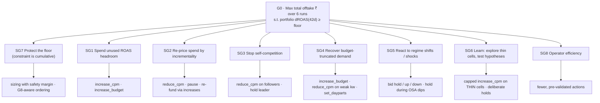
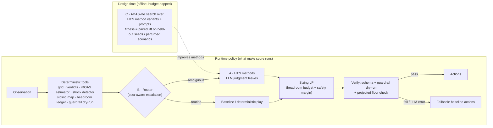

# Grid Path Challenge: problem map and recommended approach

> **What this folder holds**
>
> | File | What it covers |
> |---|---|
> | `00-problem-map-and-recommendation.md` (this file) | The problem restated. Goal ↔ subgoal ↔ lever ↔ metric ↔ entity mapping. Why the baseline falls short, with evidence from the dev data. A comparison of the three approaches and the recommended combination. |
> | `A-procllm-htn-harness.md` | **Approach A.** Procedural knowledge / HTN (Hsiao, Roberts, Smith 2025), mapped to a runtime harness |
> | `B-maas-cost-aware-router.md` | **Approach B.** MaAS agentic supernet (Zhang et al., ICML 2025), mapped to a cost-aware router that sends each decision unit to the right operator |
> | `C-adas-meta-agent-search.md` | **Approach C.** ADAS / Meta Agent Search (Hu, Lu, Clune, ICLR 2025), mapped to a design-time search over harness programs |
>
> Each approach report follows the same outline: paper in brief → gaps we see in the paper → concept mapping → architecture (flowchart) → components and schemas → pseudocode → scenario walk-throughs → hard-rule compliance → ablation → cost model → risks → build plan → verdict.

Sources read: `grid_path_challenge_brief.html`, the `sidnuti/grid-path-challenge` repo (README, CALIBRATION, `gpc/engine/*`, `gpc/guardrails.py`, `gpc/runner.py`, `gpc/score.py`, `gpc/policy.py`, plus `gpc/market.py` and `gpc/world.py` read only to understand the mechanics). We also read `approaches-papers/*.md` and both reproduction-notes files, and ran a quick analysis of `data/observed/*` and `data/runs/*` (the baseline's own trajectory on the dev scenario).

> ⚠️ **Hard-rule note on how we used the repo.** We read `market.py` and `world.py` only to understand the mechanics an analyst should look for. Their docstrings and `CALIBRATION.md` describe the same mechanics publicly. **No harness design below reads the simulator, the scenario files or `World.truth`, and no prompt contains scenario values.** That includes `CALIBRATION.md`'s dev incrementality ranges, which belong to the dev scenario and are not priors we may encode. Every number a harness uses must be computed from `Observation` at run time.

---

## 1. The problem in one screen

| | |
|---|---|
| **Decision** | Each week (6 runs), turn the observed data into a list of actions on 110 cells (campaign × keyword) across 25 campaigns (SKU × city) |
| **Levers** | `increase_cpm` / `reduce_cpm` / `pause_keyword` (per cell); `increase_budget` / `reduce_budget`; `set_dayparts` (per campaign) |
| **Objective** | Maximise **total offtake ₹** (ad + organic units × ASP, all 5 SKUs) over the 42 run days |
| **Hard constraint** | Portfolio **direct** ROAS over the 42 days ≥ warm-up dROAS × 0.98. On dev: floor **4.54×** (warm-up 4.63×) |
| **Gate** | Every action passes guardrails G0–G8. G8 trims increases, worst projected marginal first, until projected portfolio ROAS ≥ floor |
| **Baseline (dev)** | Offtake ₹4,09,517/day (+0.1% vs no-op), dROAS 4.97×. That leaves **~9% ROAS headroom unused** |
| **Naive scale-up** | +3.3% offtake but 3.99× dROAS, so it **fails** the floor and scores zero |
| **Judged on** | (1) Lift on a **private eval scenario** with a different seed, different true parameters and different shocks. (2) Diagnosis of why the baseline falls short. (3) Cost analysis. Also efficiency (block rate) and LLM contribution (ablation) |
| **Hard rules** | Observation only · guardrails on · validated LLM output · reproducible over ≥3 replicates · fail soft to the baseline |
| **Budget** | $150 LLM key, metered |

**Business frame (from Sid):** Gobblecube earns about **1% of ad spend**. Profit share is possible only with consistent **>20–30% better returns than baseline**. The auction space is bounded, so per-cell optimisation has limited alpha. The durable edge is **adapting strategy to different goals**. Two consequences shape every approach below:

1. **LLM cost per run has to be tiny.** Aurel spends ~₹18–19K/day, so Gobblecube earns ~₹190/day (~₹1,300/week ≈ $15/week at ₹88/$). A harness costing $1/run takes ~7% of that revenue. Costs must scale with *what changed*, not with *how many cells exist*.
2. **The objective is a re-weighting, not more optimisation.** The baseline optimises a proxy (cell direct ROAS vs plan goals). The brief's objective is offtake under a portfolio constraint. Most of the available lift comes from re-pricing cells by *incremental* value and from spending the unused ROAS headroom. Per-cell bid precision adds much less.

---

## 2. Goal ↔ subgoal ↔ lever ↔ metric ↔ entity map

This is the mapping Arnab is building, written to be approach-neutral. Approach A encodes it as an HTN. Approach B treats its leaves as operators. Approach C treats it as the seed archive.



| Subgoal | Why it matters for offtake | Levers | Metrics (observable) | Entity | Baseline does it? |
|---|---|---|---|---|---|
| **SG1 Spend headroom** | Floor 4.54× vs baseline 4.97×. Each ₹ of headroom can buy incremental units | `increase_cpm`, `increase_budget` | Portfolio dROAS-to-date vs floor; projected Δspend/Δrev (grid) | Portfolio → cell / campaign | Barely. Growth pool ≤ 15% of spend, opens only at ≥ floor × 1.05, gated by κ = 0.2 and P > 0.8 |
| **SG2 Re-price by incrementality** | Offtake counts an ad order only if it would not have happened organically. **iROAS = dROAS × incrementality** | Cut low-iROAS spend, re-fund high-iROAS | Organic-vs-ad cannibalisation coefficient per keyword type / cell; public `organic_rank`; dROAS | Cell, keyword type | **No.** Ranks by direct ROAS against plan goals |
| **SG3 Stop self-competition** | Two Aurel campaigns on one city × keyword: clearing prices come from external competitor bids only, so the lower-bidding sibling is simply displaced a slot down (it loses impressions, it is never charged more, and it never raises the leader's price) — not "paying to outbid yourself". The real cost is a futile follower raise that cannot win a slot a sibling already holds, plus a possibly-wrong leader when the SKU holding slot 1 is not the one with the best value per impression | `reduce_cpm`/hold on followers; leader holds/raises | Sibling count per market; slot mix; conversion × relevance × incrementality per SKU | **Market = city × keyword** (an entity the baseline does not model) | **No.** Cells are independent |
| **SG4 Recover truncated demand** | Run-outs happen in the **evening/afternoon** (the evening holds ~30% of searches) | `increase_budget` (G5 needs ≥ 2 run-out days); cut weak keyword bids inside the campaign so budget lasts | `ran_out_days`, `ran_out_daypart`, absorption | Campaign | Partly. Only budget-bound **and** clearing goal, via the transport LP |
| **SG5 React to shocks** | Demand surges, competitor price shocks and OSA drops move the curves. A 28-day grid and a 3/5/7-day patience ladder lag | Hold / raise / cut bids; hold through OSA dips | Week-over-week z-scores of slot-1-equivalent reach, CPM, OSA | Keyword × city, SKU × city | **Slow.** No regime detection. Misreads an OSA dip as a miss streak |
| **SG6 Learn** | THIN cells (22–27 of 110 per run) are held forever and never generate evidence. Kids SKU S5 launched 45 days before the start | Capped bid raises on THIN cells with strong public priors | Evidence tier, value of information | Cell | **No.** "Thin → hold", "tier C → hold" |
| **SG7 Protect floor** | Failing the floor scores **zero** | Size with a safety margin. Use high-dROAS cells as the ROAS anchor. Budget the headroom across runs | Cumulative realised dROAS vs floor; projected dROAS after G8 | Portfolio | Yes, conservatively (ends 9% above the floor) |
| **SG8 Efficiency** | Brief: "800 proposed to ship 300 wastes attention" | Pre-check G0–G7 before proposing | Shipped ÷ proposed; actions per run | Action list | Mostly. 27 G3 blocks over 6 runs (~15% of proposals) |

### The constraint is cumulative, so treat headroom as a budget

The floor applies to **42-day** portfolio dROAS. That makes "ROAS headroom" a quantity the harness can **budget across runs**:

```
H_t = Σ_{days so far} (ad_rev − floor × spend)          # banked headroom (₹ of revenue above floor)
Spending ₹x at marginal dROAS m consumes (floor − m) · x of headroom when m < floor,
and adds (m − floor) · x when m > floor.
```

So the per-₹ offtake trade-off has a clean Lagrangian form. This is a **deterministic tool** every approach can share:

```
maximise   Σ_i  ι_i · m_i · x_i                    (incremental offtake ₹)
subject to Σ_i (m_i − floor) · x_i ≥ −(H_t + H_future_reserve)
           guardrail bounds on x_i (bid ±50%, budget +50/−30%, G3/G4/G5/G7)
ι_i = incrementality estimate (from data), m_i = marginal dROAS (from grid / bid options)
```

Cells with marginal m ≥ floor are free: they add headroom and offtake. Below-floor cells are ranked by `ι·m / (floor − m)`. Brand cells, which have very high dROAS and low incrementality, act mainly as a **ROAS anchor**. They are worth keeping because they *fund* generic spend, not because they add offtake.

---

## 3. Why the baseline falls short (diagnosis, with evidence)

Evidence comes from the provided baseline trajectory (`data/`, dev scenario, seed 7). These are observations about **dev**. The harness must re-derive them from data on any scenario.

| # | Shortfall | Evidence in the dev data | Observable signal a harness can use |
|---|---|---|---|
| D1 | **Proxy objective.** Optimises direct ROAS against plan goals. The objective is offtake (ad + organic) | Regressing daily organic units on ad orders by keyword type (SKU × city fixed effects + day-of-week): **brand −0.88, generic −0.50, competitor ≈ 0.0**. Each brand ad order displaces ~0.9 organic units | `sku_city_daily.organic_units` vs `daily_facts.ad_orders`, using budget run-outs and bid changes as natural variation |
| D2 | **Direct ROAS ranks cells wrongly for offtake** | dROAS in runs: brand 18.4×, generic 4.1×, competitor 1.1×. Implied iROAS ≈ brand 2.2, generic 2.1, competitor 1.1. Brand looks 4.5× better than generic on dROAS but about the same on offtake per ₹ | iROAS = dROAS × (1 − cannibalisation) |
| D3 | **Unused headroom** | Baseline ends at 4.97× vs floor 4.54×. Action mix over 6 runs: **114 `reduce_cpm`, 25 `increase_cpm`, 9 `increase_budget`**. Spend falls from ₹18.9K/day (warm-up) to ₹17.8K/day | Realised dROAS-to-date vs `obs.roas_floor` |
| D4 | **Plan goals treated as truth** | `goal_droas` is drawn as type-base × exp(N(0, 0.25)), "deliberately approximate, like a real MMM read". A cell "misses" a noisy goal and gets cut | Compare the cell's goal with its keyword-type peers. Treat goals as soft |
| D5 | **Self-competition ignored** | **40 of 50** city × keyword markets have ≥ 2 Aurel campaigns, covering **100 of 110 cells**. K01 "aurel" has all 5 SKUs bidding in every city | `campaign_keywords` × `campaigns.city_id`. Slot mix per sibling |
| D6 | **Step-function grid** | The grid maps a bid to one slot (`bid ≥ median clearing CPM`). The real auction is a *share* of slots that changes smoothly with the bid, so small steps often read as "no better option on the grid" | Realised slot-share mix in `daily_facts` vs the grid's predicted slot |
| D7 | **Slow to react to shocks** | Slot-1-equivalent reach for some generic keywords rose 25–36% from about week 5–6 (a demand rise). One SKU × city fell below 60% OSA for 7 days in run 3. A 28-day grid plus the patience ladder lag both | Week-over-week z-scores. OSA in `sku_city_daily` |
| D8 | **No exploration** | THIN verdicts: 22–27 cells every run, all held. Tier-C CLEARS cells are held too | `verdicts`-equivalent computed by the harness. Public relevance / organic rank as priors |
| D9 | **Lost evening demand** | Run-outs: 30% of campaign-days in warm-up. 360 run-out events, 215 in the evening and 134 in the afternoon. The baseline cut run-outs to 13% mostly by **cutting bids**, not by raising budgets | `campaign_daily.ran_out_daypart` |
| D10 | **Wasted proposals** | 27 G3 (top-slot) blocks over 6 runs. Raises proposed on cells already at slot 1 | Pre-check G3 from the last 7 days of `daily_facts` |

**One-line diagnosis:** the baseline is a careful **ROAS keeper** that optimises the wrong quantity (direct ROAS against noisy goals), cell by cell, with slow detectors. The lift is in **re-weighting by incrementality, coordinating siblings, spending banked headroom deliberately, and reacting faster to shocks**. This matches Sid's point: "the delta comes from continuing to adapt strategy to different goals."

**Realistic size of the prize.** Offtake is ₹4.1L/day and ad spend ~₹18K/day. Moving ₹3–4K/day of spend to iROAS ~2 cells, plus redirecting ₹2–3K/day away from brand/sibling waste, is worth roughly ₹6–12K/day. That is **+1.5–3% offtake**. A +20–30% "better returns" claim (Sid's profit-share bar) is plausible only on *incremental* return per ₹ spent, not on total offtake. Say this explicitly in the memo.

---

## 4. The three approaches in one table

| | **A · ProcLLM / HTN** | **B · MaAS cost-aware router** | **C · ADAS meta-agent search** |
|---|---|---|---|
| Core idea | Encode the goal → subgoal → lever map as an HTN. The LLM fills judgment leaves. Deterministic code verifies | Route each decision unit (market / campaign / cell) to the cheapest operator that handles it: accept baseline, deterministic re-rank, single LLM judge, LLM debate, explore, exit | An LLM writes candidate harness programs. They are scored on simulations and archived, and the next design builds on the archive |
| When it works | Expert knowledge exists and is decomposable (it does: Sid's 6 months plus the mapping above) | Decision difficulty varies a lot across units (it does: ~70% of cells are routine CLEARS/hold) | Cheap, faithful fitness evaluation on held-out tasks (**weak here**: one dev scenario, LLM-in-the-loop evaluations cost money) |
| LLM's role at run time | Hypotheses, incrementality adjudication, shock attribution, sibling arbitration, exploration choice, review | Same judgments, but only for units the router escalates | Whatever the discovered program does. It may be little (ablation risk) |
| Generalisation to eval | Good if methods reason from data. Bounded by the HTN's coverage ("limited alpha") | Good. The router uses scenario-free features | **Riskiest.** The search optimises dev fitness, which is the overfitting the brief penalises |
| Cost per run (est.) | ~$0.06 (Haiku) · ~$0.12 (Sonnet 5) · ~$0.30 (Opus 5); 8–12 calls | ~$0.00–0.15 on Sonnet 5 (0–12 calls, scales with escalations) | Search: ~$55–70 one-off. Run time = whatever spec it ships (≈ A or B) |
| Build effort | 2–3 engineer-weeks (prototype); 6–8 to production | +1 week on top of A (router plus cost penalty) | +1–2 weeks on top of A/B (sandbox, evaluator, archive) |
| Ablation story | Clear: replace LLM leaves with deterministic defaults | Clear: router with LLM operators disabled | Muddy: the "LLM as designer" contribution differs from the "LLM at run time" contribution |
| Biggest risk | Encodes what we already believe, so the LLM adds little over the HTN plus tools | Training signal is thin (6 runs × 1 scenario). Credit assignment across coupled cells | Overfits dev. Generated code could break the observation-only rule |

---

## 5. Recommendation: converge on A, take B's router, use C sparingly

The plan follows Discussion-2's "diverge, then converge, validated by experts and dataset":



1. **Build A first.** It is the spine. It makes the diagnosis (D1–D10) explicit and testable, gives the cleanest ablation, and has a defensible cost profile. It also matches Sid's view that "HTN encoding the above mapping is the natural next step."
2. **Add B's router** to answer the cost and scale questions. The LLM is called only for markets/campaigns flagged as ambiguous, shocked, contested or near the floor. Cost then scales with *change*, not with portfolio size, which is the key argument for 100+ campaigns at a 1% revenue model.
3. **Use C only as an offline tuner** over a constrained space: HTN method parameters, prompt variants and which method fires when. Score it against **held-out seeds and perturbed scenarios we author ourselves**, never dev alone, and gate it with a static import checker. It is the source of divergent ideas Arnab wants. A and B are where we converge.
4. **Mitigate the "limited alpha" risk** (Sid). Give the LLM the jobs where deterministic code is weakest and the data is ambiguous: which incrementality estimate to trust, whether a CPM/reach jump is a shock or noise, which sibling should lead, and which thin cells are worth exploring. Then **measure it** with the ablation. If the LLM adds nothing, say so. The brief explicitly allows it.

### Phased plan against the $150 key

| Phase | Work | LLM $ | Exit criterion |
|---|---|---|---|
| P0 (no LLM) | Shared deterministic tools: iROAS estimator, sibling map, shock detector, headroom ledger, sizing LP, guardrail dry-run, fallback wrapper. Run "tools-only" policy | $0 | Tools-only beats baseline on dev **and** on ≥ 4 extra seeds without breaking the floor. This is the *ablation arm* |
| P1 | Approach A harness with LLM leaves (Sonnet-class model, record/replay cache) | ~$25 | LLM arm > tools-only arm on paired lift, ≥ 3 replicates |
| P2 | Approach B router plus cost penalty λ. Escalation budget per run | ~$15 | Same lift at ≤ 50% of P1's tokens |
| P3 | Approach C-lite search over method/prompt variants on held-out seeds and perturbed scenarios | ~$50 | Improvement holds on a held-out set never used in search |
| P4 | Final replicates (dev + seeds), fail-soft demo, cost memo | ~$25 | `make score` reproducible from the cache |
| Reserve | | ~$35 | |

### Questions to send Gobblecube (answers go to all candidates)

1. May the policy **call `gpc.guardrails.apply_guardrails` as a read-only dry-run** before emitting actions? It reads only `obs`, and we would not modify it.
2. For replicates, is a **record/replay LLM response cache** committed to the repo an acceptable way to make `make score` reproducible? Newer Claude models removed `temperature`, so sampling is not seedable.
3. Are **self-authored perturbed scenario files** (used only for our offline validation, never read by the harness) acceptable for robustness testing?
4. Which model/provider does the key serve? This affects the cost model and the structured-output features available.

---

## 6. Shared scenario catalogue (used in all three reports)

| ID | Scenario | What the baseline does | What a good harness does |
|---|---|---|---|
| **S1** | Brand cell (e.g. "aurel" for the lead soap in a tier-1 city) clears its goal at ~17× dROAS | Proposes a raise. G3 blocks it (already at slot 1) | Holds. Books the cell as a **ROAS anchor**. Uses its surplus to fund generic cells. Does not chase |
| **S2** | Competitor keyword misses its 1.6× goal at ~1.1× dROAS | Patience ladder cuts 10% → 25% → 50% over weeks | Fully incremental but low iROAS (~1.1 vs ~2 for generic). Cuts faster and moves the money to generic. Keeps a sliver only if late-run headroom is unspendable elsewhere |
| **S3** | Three own SKUs bid on "soap" in one city | Each cell optimised alone. The lower bids drop a slot | Picks a **leader** by conv × relevance × ι. Followers step down. Saves spend at the same slot-1 coverage |
| **S4** | Generic-heavy campaign runs out in the evening 4/7 days | Raise only if the transport LP funds it and the campaign clears its goal | Raise budget (G5 met). If G7 would block, first trim the campaign's weakest keyword so budget lasts into the evening |
| **S5** | Reach on two generic keywords jumps 25%+ week-over-week | 28-day grid under-reads new demand. Little response | Detects the regime shift. Raises bids/budgets on clearing cells in the affected markets. Watches for mean reversion |
| **S6** | One SKU × city OSA falls below 60% for a week | G4 blocks increases. Next week the dip reads as a MISS streak and triggers cuts | Holds bids through the dip. Moves headroom to other cities. Avoids post-dip cuts by masking OSA-affected days |
| **S7** | New kids SKU on its exact-match keyword is THIN | Holds indefinitely | Small capped raise as an **exploration** bet (relevance 1.0, generic type). Reviews after one run |
| **S8** | Competitor bids up on one keyword in one city (CPM ↑, slot ↓) | Lags, then cuts on the ladder | Recognises a price shock. Does not chase. Moves money to unaffected keywords |
| **S9** | LLM errors, times out, returns malformed JSON or exceeds budget | n/a | Validated parse fails, so **fallback to baseline actions** for that run (or that unit). The event is logged |
| **S10** | Run 6, cumulative dROAS 4.85× vs floor 4.54× | Leaves headroom unspent | Spends remaining headroom (minus a safety margin) on the highest-iROAS cells. There is no future learning value left |
