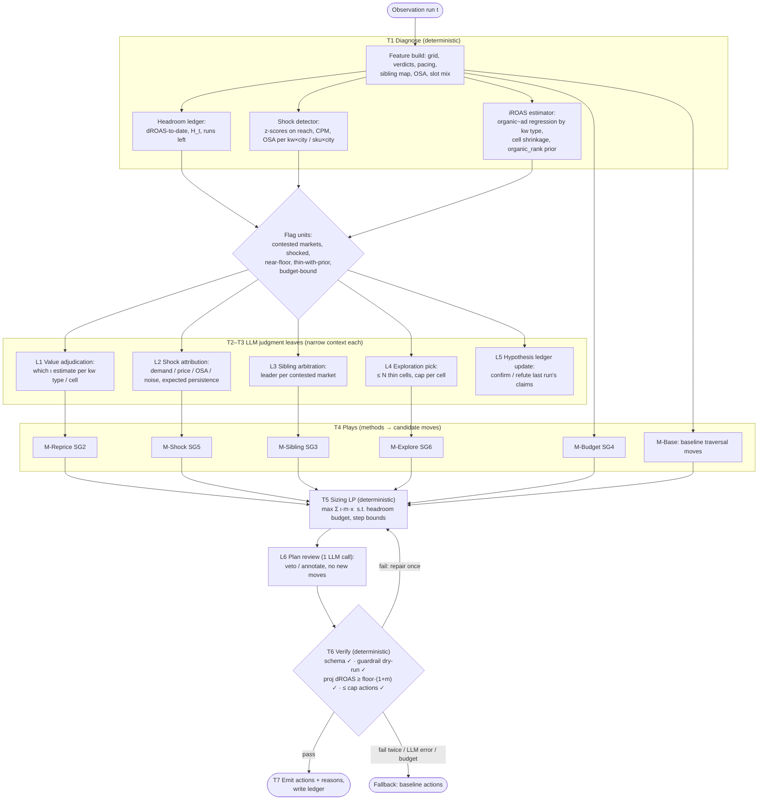

# Approach A: Procedural knowledge (HTN) harness, after ProcLLM

> Paper: *Procedural Knowledge Improves Agentic LLM Workflows*, Hsiao, Roberts & Smith (NRL), arXiv 2511.07568, Nov 2025.
> Local: `approaches-papers/procedural-knowledge-improves-agentic-llm-workflows.md`, `procedural_knowledge_improves_agentic_llm_workflows/` (our reproduction, `REPRODUCTION_NOTES.md`).
> Shared context (problem, goal map, diagnosis D1–D10, scenarios S1–S10): `00-problem-map-and-recommendation.md`.

---

## 1. The paper in brief

**Problem.** LLM agents fail on long-horizon tasks because they track the plan, the world state and the execution all at once in one context.

**Mechanism (ProcLLM).** A hierarchical task network (HTN) is embedded in the agent loop:

- a task queue **K**; methods **M** that decompose a complex task into ordered subtasks (`UpdateTask` / `FindFirstRelevantMethod`);
- an **action-LLM** that sees only the head task, the relevant state and the last trace, and emits one of `verify | read | write | append`;
- a **verify-LLM** that checks the head task's *effect conditions* on a narrow context before the queue advances;
- a file-system environment (`ProblemSpec`, `Request`, `ToolsSpec` read-only; `Notes`, `Solver`, `Answer` writable). Writing `Solver` executes it.

**Claim.** Decomposition raises per-subtask success more than the extra steps compound failure. With an HTN, 20B/70B models beat a 120B model without one (Travel Planner, Recipe Generator, Blocks World, Unit Movement). Hand-written HTNs (Human-TN) beat LLM-generated ones (LLM-TN), and both beat no HTN.

```text
procedure ProcLLM(K, M, H)
  UpdateTask(K, M)
  for i in 1..H:
    if K empty: break
    κ ← head(K);  a ← action-LLM(assemble(state, trace, κ))
    if a == verify:
      verified, feedback ← verify-LLM(assemble_verify(state, κ))
      if verified: pop(K); UpdateTask(K, M)
    else: apply read/write/append; if file == Solver: trace ← exec(Solver)
```

---

## 2. Gaps we see in the paper (general, then for our setting)

| # | Gap | Where it shows | Consequence for us |
|---|---|---|---|
| P1 | **`UpdateTask` does not terminate as written.** It prepends subtasks without marking the parent as expanded, so a parent re-expands forever once its children finish | Our reproduction hit the infinite loop. Fixed with a per-occurrence `decomposed` flag (`src/htn.py::TaskItem`) | Copy the fix. Better still, use a **static, acyclic task graph per run**. Our HTN is shallow and known in advance |
| P2 | **Verification is done by an LLM** on effect conditions | verify-LLM reads files and says true/false | Our effects are numeric and checkable: schema valid, guardrail dry-run passes, projected ROAS ≥ floor + margin. **Verify deterministically.** An LLM verifier would be slower, cost money and be less reliable here |
| P3 | **Subtasks are assumed roughly independent.** The success-product argument (§3) multiplies per-subtask probabilities | Benchmarks are mostly sequential puzzles | Our subtasks are **coupled** through the shared ROAS constraint and sibling auctions. Separate decisions cannot just be concatenated. We need a final **portfolio reconciliation** task (sizing LP) that sees everything |
| P4 | **Single-episode planning, no learning across episodes** | Each benchmark instance is solved once | We run 6 sequential runs. Week *t*'s outcome is evidence for week *t+1*. We add a **hypothesis ledger / memory** task that the paper lacks |
| P5 | **No cost or latency accounting.** H = 100 steps, many LLM calls | Paper reports success rate only | The brief scores cost and Gobblecube earns 1% of spend. We cap LLM calls per run and route only flagged units to the LLM (borrowing Approach B) |
| P6 | **Human-TN > LLM-TN, so the knowledge-authoring burden is real** | Ablation in §5 | Our HTN is Sid's and Arnab's domain knowledge. It is only as good as that knowledge: **"limited alpha"** if it encodes only what we already believe |
| P7 | **Preconditions unused, totally ordered subtasks only** | "No preconditions are specified" | We need preconditions (e.g. *only run M-Sibling if the market has ≥ 2 active own campaigns*), so we implement them as deterministic predicates |
| P8 | **Prompts and domain specs are image-only in the PDF** (Appendix B/C) | Reproduction had to reconstruct them | No transferable prompt templates. We write ours from scratch |
| P9 | **Action space is file I/O** (`read/write/append`) | Generic but indirect | Our action space should be **typed tools** returning structured data, and the LLM's output a **typed decision schema**. File I/O adds failure modes without benefit |
| P10 | **Evaluation counts success, not degradation** | Binary success | Our risk is *worse than baseline* and *floor failure*. Every method needs a "do nothing / defer to baseline" branch |

**Takeaway:** keep the **idea** (explicit procedural knowledge, a narrow LLM context per subtask, verification gates before advancing) and replace the **machinery** (file system, LLM verifier, unbounded loop) with typed tools, deterministic verification and a fixed-depth task graph.

---

## 3. Concept mapping: paper → grid path

| ProcLLM concept | Grid-path equivalent | Notes |
|---|---|---|
| Task queue K | Per-run task graph: `WeeklyDecision(run)` → Diagnose → Value → Hypothesise → Plays → Size → Verify → Emit | Fixed depth (≤ 3). No recursion beyond the method library |
| Complex task | A subgoal SG1–SG8 (see 00 §2) | e.g. `ResolveSelfCompetition(market)` |
| Method m | A **play**: a decomposition of a subgoal into tool calls + one LLM judgment + a proposal | e.g. M-Sibling = sibling map → leader judgment → step-down proposals |
| Primitive task | A tool call, or an LLM leaf judgment with a typed output | |
| Preconditions | Deterministic predicates on Observation-derived features | e.g. `osa3 < 0.6` → skip increases (mirrors G4) |
| Effects / verify conditions | Numeric checks: schema, guardrail dry-run, projected portfolio dROAS ≥ floor × (1 + margin), action count ≤ cap | **Deterministic**, not LLM |
| `ProblemSpec` / `ToolsSpec` (read-only) | `obs.public` (base tables, plan, priors) + tool catalogue | |
| `Notes` (writable) | **Hypothesis ledger**: per-run memory of claims, evidence, predicted effect, realised effect | Persists across runs inside one simulation (policy instance state) |
| `Solver` exec | Deterministic engines: grid, `predict_cell`, sizing LP, guardrail dry-run | Code we own (the `gpc/engine` is editable baseline code) |
| `Answer` | Final action DataFrame (`campaign_id, keyword_id, action_type, new_value, reason`) | |
| action-LLM | **Judgment leaves**: incrementality adjudication, shock attribution, sibling leader choice, exploration pick, plan review | 4–6 leaf types, each with a narrow context |
| verify-LLM | Replaced by deterministic verifier. Optional cheap LLM *critic* only for the final review | |
| Horizon H | Max LLM calls per run (e.g. 12) + wall-clock cap (e.g. 5 min) | Exceeded → fall back to baseline |
| Reward (+1 / −0.1 per step) | Paired offtake lift vs baseline (CRN), gated by the floor, minus cost | Scored offline, not used online |

---

## 4. Architecture



**Design rules**

1. **The LLM never sizes moves.** It chooses *which* estimate, *which* leader, *which* cells, and *whether* a shock persists. Sizing and verification are deterministic. This follows the brief's third shape ("LLM forms hypotheses while deterministic code sizes the moves") and keeps the floor safe.
2. **Each leaf sees only its unit's context**: ~1–4K tokens of tables, not the full observation. This is the paper's main lever (smaller context per subtask).
3. **Every method has a "defer to baseline" branch.** The worst case is the baseline, not a novel failure.
4. **Fail soft at three levels:** leaf → method default; run → baseline actions; harness exception → baseline actions (wrapped in `try/except`).

---

## 5. Components

### 5.1 Deterministic tools (shared with B and C; also the ablation arm)

| Tool | Input | Output | Notes |
|---|---|---|---|
| `features(obs)` | Observation | per-cell / campaign / market feature frames | Reuses `build_grid`, `cell_verdicts`, `campaign_pacing` |
| `headroom_ledger(obs, memory)` | daily facts since day 28 | `dROAS_to_date`, `H_t` (₹ above floor), runs left, per-run headroom allowance | Plans the headroom spend across runs: conservative early (estimates are weak), full in run 6 (S10) |
| `iroas_estimates(obs)` | `sku_city_daily`, `daily_facts` | ι per keyword type (and per SKU × type when identified) with standard errors. Also ι prior from public `organic_rank` (top-3 → lower) | Regression: organic_units ~ FE(sku×city) + dow + Σ_type β_type·ad_orders_type. ι = 1 + β, clipped [0.05, 1]. Identification comes from run-outs and bid changes |
| `shock_scan(obs)` | last 7d vs prior 21d | z-scores: slot-1-equiv reach (kw × city), CPM (kw × city), OSA (sku × city) | Flags |z| > 2.5 with persistence ≥ 3 days |
| `sibling_map(obs)` | `campaign_keywords`, `campaigns`, `daily_facts` | per market: siblings, bids, slot mix, conv, relevance, ι | 40/50 markets contested on dev |
| `bid_curve(cell, bids)` | grid rows | predicted spend/rev per candidate bid | Wrapper over `predict_cell`. Optionally smoothed with an empirical slot-share correction (D6) |
| `size_moves(candidates, ledger)` | candidate moves with (Δs, Δr, ι) | chosen moves + amounts | LP: max Σ ι·Δr s.t. Σ(Δr − floor·Δs) ≥ −allowance; bounds mirror G1/G2/G6 |
| `guardrail_dryrun(obs, actions)` | actions | kept / blocked / clamped + projected dROAS | Calls `apply_guardrails` read-only (**confirm with Gobblecube**). Otherwise re-implement the G0–G7 checks in our code |
| `fallback(obs)` | Observation | baseline actions | `DeterministicTraversal().recommend(obs)` |

### 5.2 LLM judgment leaves (typed I/O)

| Leaf | Fires when (precondition) | Context (≈ tokens) | Output schema (validated) |
|---|---|---|---|
| **L1 Value adjudication** | Every run (once) | ι estimates + SEs per type, public priors (`organic_rank`, relevance), last run's ledger (~3K) | `{kw_type → {iota: float∈[0.05,1], source: "regression"\|"prior"\|"blend", confidence: low\|med\|high}}` + per-cell overrides ≤ 10 |
| **L2 Shock attribution** | `shock_scan` flags ≥ 1 unit | flagged series (8–14 days), sibling bids, OSA (~2K per unit, batched) | `[{unit, kind: demand_up\|demand_down\|price_up\|price_down\|osa\|noise, persist_runs: 0..3, stance: chase\|hold\|retreat}]` |
| **L3 Sibling arbitration** | market has ≥ 2 active own campaigns **and** spend > ₹X/day | per-sibling: bid, slot mix, conv, relevance, ι, campaign budget state (~1.5K per market, batched by city) | `[{market, leader_campaign, follower_actions: [{campaign, stance: step_down\|hold\|pause}]}]` |
| **L4 Exploration pick** | ≥ 1 THIN / tier-C cell with relevance ≥ 0.8 and OSA ≥ 0.8 | candidate list + priors + exploration budget (~2K) | `[{cell, max_raise_pct ≤ 20, reason}]`, ≤ N_explore |
| **L5 Ledger update** | run ≥ 2 | last run's claims + realised deltas (~2K) | `[{claim_id, status: confirmed\|refuted\|inconclusive, note}]` |
| **L6 Plan review** | after sizing | top-30 moves with reasons + portfolio projection (~4K) | `{veto: [move_id], flags: [text]}`. **Veto only, never add** |

Total: ~8–12 calls per run, mostly parallel (L2/L3 batched by city).

### 5.3 Hypothesis ledger (memory; fills gap P4)

```json
{"claim_id": "r3-h2", "run": 3, "unit": "market:MUM:K03",
 "claim": "S3 should lead; S1/S5 step down saves ≥ ₹300/day at equal slot-1 share",
 "predicted": {"delta_spend": -320, "delta_slot1_share": -0.02},
 "realised": null, "status": "open"}
```

The ledger feeds L5 and gives the memo an audit trail of why each decision was made.

---

## 6. Pseudocode

```python
class HTNHarness(Policy):
    name = "htn_harness"
    MAX_CALLS, MAX_WALL_S, MAX_USD = 12, 300, 1.00
    SAFETY_MARGIN = 0.03                      # target ≥ floor × 1.03 on projection

    def __init__(self, llm: LLMClient | None = None):
        self.llm = llm                         # None → ablation arm (tools-only)
        self.ledger = []                       # persists across runs in one simulation
        self.meter = Meter()

    def recommend(self, obs):
        try:
            with self.meter.run_budget(self.MAX_CALLS, self.MAX_WALL_S, self.MAX_USD):
                acts = self._decide(obs)
            self.last_trace = {"mode": "harness", **self.meter.summary()}
            return acts
        except (LLMError, BudgetExceeded, ValidationError, Exception) as e:   # fail soft (rule 5)
            base = DeterministicTraversal().recommend(obs)
            self.last_trace = {"mode": "fallback", "error": repr(e), **self.meter.summary()}
            return base

    def _decide(self, obs):
        # T1 Diagnose (deterministic)
        X       = features(obs)
        ledger  = headroom_ledger(obs, runs_left=6 - obs.run + 1)
        iota    = iroas_estimates(obs)
        shocks  = shock_scan(obs)
        sibs    = sibling_map(obs, X)
        flagged = flag_units(X, shocks, sibs, ledger)

        # T2–T3 LLM leaves (each: narrow context → typed JSON → validate → default on failure)
        val   = leaf(self.llm, "L1_value",   ctx_value(iota, obs.public, self.ledger),    default=iota.as_judgment())
        shk   = leaf(self.llm, "L2_shock",   ctx_shock(shocks, X),                         default=shocks.default_stance(),  when=len(shocks))
        sib   = leaf(self.llm, "L3_sibling", ctx_sibling(sibs.contested(min_spend=200)),   default=sibs.rule_leader(val))
        expl  = leaf(self.llm, "L4_explore", ctx_explore(X.thin_with_prior(), ledger),     default=[])
        if obs.run > 1:
            self.ledger = leaf(self.llm, "L5_ledger", ctx_ledger(self.ledger, obs), default=self.ledger)

        # T4 Plays → candidate moves (each carries Δspend, Δrev, ι, reason, claim_id)
        cands  = []
        cands += m_reprice(X, val, ledger)            # SG2: cut low-iROAS, propose raises on high-iROAS clearing cells
        cands += m_sibling(X, sib)                    # SG3: follower step-downs, leader holds
        cands += m_budget(X, val)                     # SG4: budget-bound + evening run-out; trim weak kw if G7 would block
        cands += m_shock(X, shk)                      # SG5: hold/raise/retreat per attribution; mask OSA days
        cands += m_explore(X, expl)                   # SG6: capped raises
        cands += m_base(obs)                          # baseline traversal moves as candidates (keeps its good cuts)
        cands  = dedupe_one_per_lever(cands)          # G0: one action per lever
        cands  = precheck_g3_g4_g5_g7(obs, cands)     # SG8: don't propose what will be blocked

        # T5 Size (deterministic LP over headroom allowance)
        plan = size_moves(cands, allowance=ledger.allowance(self.SAFETY_MARGIN))

        # L6 review: veto-only
        rev  = leaf(self.llm, "L6_review", ctx_review(plan, ledger), default={"veto": []})
        plan = plan.drop_ids(rev["veto"])

        # T6 Verify (deterministic, ≤ 1 repair)
        for attempt in range(2):
            kept, log, summ = guardrail_dryrun(obs, plan.to_actions())
            ok = (validate_schema(kept)
                  and summ["projected_droas_after"] >= obs.roas_floor * (1 + self.SAFETY_MARGIN)
                  and len(plan) <= 60 and blocked_share(log) <= 0.10)
            if ok: break
            plan = plan.shrink_increases(by=0.5)      # repair: halve increases, keep cuts
        else:
            raise ValidationError("verify failed twice")

        # T7 Emit + memory
        self.ledger += plan.claims(run=obs.run)
        return plan.to_actions()[["campaign_id", "keyword_id", "action_type", "new_value", "reason"]]


def leaf(llm, name, ctx, default, when=True):
    """One judgment. Narrow context, strict JSON schema, validation, default on any failure."""
    if not when or llm is None:
        return default
    try:
        raw = llm.structured(prompt=PROMPTS[name], context=ctx, schema=SCHEMAS[name], timeout=60)
        return SCHEMAS[name].validate_and_clip(raw)    # out-of-range values clipped or dropped (rule 3)
    except Exception as e:
        METER.log_leaf_failure(name, e)
        return default
```

### Method sketch: M-Sibling (SG3)

```python
def m_sibling(X, sib_judgment):
    moves = []
    for mkt in sib_judgment:                         # market = (city, keyword)
        lead = mkt.leader_campaign
        for f in mkt.follower_actions:
            cell = X.cell(f.campaign, mkt.keyword)
            if f.stance == "step_down":
                # target: the slot below the leader's dominant slot, at the cheapest bid that still clears it
                b = cheapest_bid_for_slot(cell, target_slot=next_slot(X.cell(lead, mkt.keyword).slot_mode))
                moves.append(Move(cell, "reduce_cpm", b, reason=f"sibling of {lead} on {mkt.keyword}: step down"))
            elif f.stance == "pause" and cell.iota * cell.droas < 1.0:
                moves.append(Move(cell, "pause_keyword", None, reason="sibling, low iROAS"))
    return moves
```

---

## 7. Scenario walk-throughs (S1–S10 from 00 §6)

| ID | Path through the HTN | Expected effect |
|---|---|---|
| **S1** brand anchor | T1: brand ι low (L1 confirms "regression, high confidence"). M-Reprice gives no raise (already at slot 1, pre-check G3). The ledger books the brand surplus as allowance | No wasted G3 proposal. Headroom stays available for generic |
| **S2** competitor misses | M-Reprice: iROAS ≈ ι·m ≈ 1.1 < generic ≈ 2. Cuts up to −30% now (not 10% → 25% → 50% over weeks). Freed ₹ go to the LP | Same direction as the baseline but ~2 runs earlier. Money re-deployed, not released |
| **S3** sibling soap | `sibling_map` flags the market. L3 picks a leader: highest conv × relevance × ι. Note the leader is *not* necessarily the highest bidder. Followers step down to slot 5/9 | Spend saved at near-equal slot-1 coverage for the brand |
| **S4** evening run-out | M-Budget: G5 met (≥ 2 run-outs). If G7 would block (campaign < 90% of goal), trim that campaign's lowest-iROAS keyword first and raise the budget next run | Evening demand recovered without a G7 block |
| **S5** demand surge | `shock_scan`: reach z > 2.5 for ≥ 3 days. L2 says `demand_up, persist 2 runs, chase`. M-Shock raises bids/budget on clearing cells there, sized by the LP | Captures the surge 1–2 runs earlier than the 28-day grid would |
| **S6** OSA dip | Precondition `osa3 < 0.6` → no increases (mirrors G4). L2 says `osa, hold`. M-Shock **masks OSA-dip days** in that SKU × city's streak and verdict inputs for the next run | Avoids the post-dip cut the baseline makes |
| **S7** thin kids SKU | L4 picks it (relevance 1.0, generic, OSA fine), capped at +15%. The ledger opens claim `r2-h4` | Evidence generated. Review next run via L5 |
| **S8** price shock | `shock_scan`: CPM z > 2.5 on one kw × city. L2 says `price_up, retreat`. M-Shock steps down, and the LP moves money to unaffected keywords | Avoids overpaying in a shocked auction |
| **S9** LLM failure | `leaf()` returns defaults per leaf. If the whole run raises → `fallback(obs)`. The meter logs it | The run completes with baseline-equivalent or tools-only actions |
| **S10** final run | `headroom_ledger.allowance` = full remaining H minus margin. The LP spends it on the highest ι·m moves | Converts banked headroom into offtake |

---

## 8. Hard-rule compliance checklist

| Rule | How A satisfies it |
|---|---|
| 1. Observation only | All tools take `obs`. A CI test greps the harness package for `gpc.market`, `gpc.scenarios`, `truth`, `world`. Prompts are built only from `obs`-derived frames. No CALIBRATION dev values appear in any prompt |
| 2. Guardrails on | We emit actions. The runner applies the official guardrails. The dry-run is read-only (or our own reimplementation). Nothing in `gpc/{market,guardrails,runner,score}.py` is modified |
| 3. Validated output | Every leaf uses a strict JSON schema (structured outputs / `strict: true` tool) **plus** our validator, which clips ranges, drops unknown IDs and enforces one action per lever. A bad leaf returns its default |
| 4. Reproducible | Record/replay cache keyed by `(prompt_version, leaf, ctx_hash, replicate_id)`. `make score POLICY=harness:HTNHarness` replays from the committed cache; `LIVE=1` re-queries. ≥ 3 replicates = 3 cache namespaces |
| 5. Fail soft | Three levels (leaf default → run fallback → exception fallback). Demo: set `FAULT_INJECT=timeout\|malformed\|budget` and show the run completes with baseline actions and a logged reason |

---

## 9. Ablation design (does the LLM help?)

| Arm | Description | Purpose |
|---|---|---|
| **A0** baseline | `DeterministicTraversal` | Reference |
| **A1** tools-only | Same HTN, `llm=None`: every leaf returns its deterministic default (regression ι, rule leader, rule shock stance, no exploration, no review) | **The required ablation** ("same harness, LLM step removed") |
| **A2** full | LLM leaves on | Headline |
| **A3** leave-one-out | A2 minus one leaf (L1…L6) | Attribute lift to specific judgments. Drop leaves that add nothing (cost) |
| **A4** oracle-free stress | A2 on perturbed scenarios (shock timing/location moved, incrementality shifted) | Generalisation proxy for the private eval |

Statistic: **paired** offtake difference vs A0 on the same world (the market uses common random numbers indexed by day and entity), over dev + ≥ 4 extra seeds × 3 LLM replicates. Report mean, min and P(lift < 0) as the risk line. **If A2 − A1 is not significantly positive, say so.** The memo then claims the value is in the procedural decomposition, and the LLM is optional.

---

## 10. Cost model

Assumptions: ~10 calls/run; average 3K input + 0.6K output tokens per leaf, with L6 ~5K/1K. Prompt caching on stable system prompts and schemas (~40% of input). ₹88/$.

| Model tier | $/run | $/week (1 run) | $ for 6 runs × 3 reps × 5 worlds |
|---|---:|---:|---:|
| Claude Haiku 4.5 ($1 / $5 per MTok) | ~$0.06 | $0.06 | ~$5 |
| Claude Sonnet 5 ($2 / $10) | ~$0.12 | $0.12 | ~$11 |
| Claude Opus 5 ($5 / $25) | ~$0.30 | $0.30 | ~$27 |

Wall-clock: leaves are parallel per city, so 3 sequential waves × ~20–40 s, plus ~15 s of deterministic tools. That is **~1.5–3 min/run**, well inside a 15-minute production stage.

| Cost line | Low | Mid | High |
|---|---|---|---|
| Value (Δ offtake vs baseline) | +0.5% ≈ ₹2.0K/day | +1.5% ≈ ₹6.1K/day | +3% ≈ ₹12.3K/day |
| Run cost | $0.06/wk | $0.30/wk | $1.20/wk (Opus + retries) |
| Build | 2 eng-wk prototype | 4 eng-wk | 8 eng-wk incl. monitoring + eval harness |
| Ongoing | 0.1 eng-wk/month | 0.25 | 0.5 (re-validating methods per brand) |
| Risk | P(worse than baseline per run) target < 15%, max loss bounded by the safety margin and fallback | | |

**Scaling to 100+ campaigns:** leaf count scales with *flagged* units (contested markets, shocks, thin-with-prior), not with cells. At 4× the portfolio, expect ~2–3× the calls (~$0.3–0.9/run on Sonnet). **Break-even** is dominated by engineering, not tokens (tokens are < ₹30/week per brand). Assume a 4-eng-week build plus first-year upkeep of ~₹6–8L loaded:

- **Fee-only (1% of spend).** The harness earns Gobblecube only the fee on spend it *unlocks*. Headroom use is ≈ +5–8% spend, so the fee gain is ≈ 0.05–0.08% of managed spend. One-year payback then needs **~₹75–160 Cr/yr of managed spend across the book**. That is a weak case on its own.
- **Profit share on offtake lift.** At +1.5%, an Aurel-sized brand gains ≈ ₹22L/yr of offtake. A 10% share is ≈ ₹2.2L/yr per brand, so **~3–4 Aurel-sized brands** pay back the build.
- **Retention / win-rate.** This is hard to quantify but is likely the real reason to build it. Name it as a scenario, not a number.

Present all three. This is Sid's point made concrete: the harness pays when it changes the commercial model, not under 1%-of-spend alone.

---

## 11. Risks and mitigations

| Risk | Mitigation |
|---|---|
| **Limited alpha.** The HTN encodes only known plays; the LLM adds little over tools | A3 leave-one-out ablation. Put the LLM where data is ambiguous (L1–L4). Use Approach C offline to propose new methods |
| Incrementality regression is noisy per cell | Estimate per keyword type, shrink cells toward type, expose SEs to L1. Only act on high-confidence differences |
| Over-spending headroom early, then failing the floor | Ledger allowance schedule (e.g. 40% of H by run 3). Safety margin on projection. Track the realised ROAS-to-date gap each run |
| Sibling step-downs lose slot share to competitors, not to the leader | Verify with the slot mix next run (L5). Revert if leader slot-1 share fell |
| Eval scenario has shocks of kinds or in places dev doesn't | The detector is generic (z-scores on all units). Stances are judged per instance by L2, not hardcoded |
| LLM non-determinism | Record/replay cache. Report variance across replicates |

---

## 12. Build plan (A only)

1. **Week 1:** deterministic tools + tools-only arm (A1). Validate the iROAS estimator on dev and 4 seeds. Unit tests for the headroom ledger and sizing LP.
2. **Week 2:** leaves L1–L4 with schemas, validator, record/replay, meter, fault injection. First A2 vs A1 comparison.
3. **Week 3:** L5/L6, leave-one-out ablation, perturbed-scenario stress, cost memo.

## 13. Verdict

**Recommended as the spine.** It gives the most direct encoding of the goal ↔ lever map, the most legible diagnosis, a clean ablation and a defensible cost. Its weakness (bounded by our knowledge) is what B's routing and C's offline search address.
